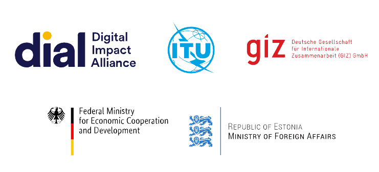

# Governance model

The GovStack initiative is a multi-stakeholder initiative led by the Federal Ministry for Economic Cooperation and Development, Gesellschaft für Internationale Zusammenarbeit (GIZ), Estonia, the International Telecommunication Union (ITU) and the Digital Impact Alliance.&#x20;

The initiative [actively seeks partnerships with governments, agencies, private sector organizations and the open source community.](https://www.govstack.global/join-the-community/)

<figure><figcaption>
GovStack Partner Agencies
</figcaption></figure>

Learn more about govStack by visiting our [website](https://www.govstack.global/).
