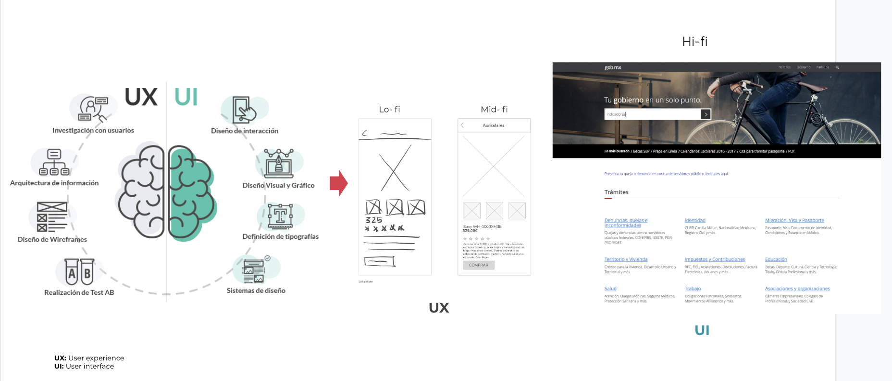

# GovStack Overview

## What is it?&#x20;

GovStack initiative is an expert community-driven multistakeholder effort aimed at deriving common technical practice and understanding of the Building Blocks approach as seen in implemented countries.&#x20;

## What does it aim to achieve?&#x20;

By unpacking and simplifying the technical approach that goes into building holistic digital government, GovStack aims to accelerate countries’ ownership of e-gov. solutions and in doing so improve services for social well-being.&#x20;

## Where did it come from?&#x20;

GovStack model is an extension of the [SDG Digital Investment Framework](https://www.itu.int/pub/D-STR-DIGITAL.02-2019), an earlier effort by the International Telecommunication Union (ITU) and the Digital Impact Alliance (DIAL) at the UN Foundation.&#x20;

## What is the SDG Digital Investment Framework?

The SDG Digital Investment Framework helps governments and their partners to take a whole-of-government approach to invest in shared digital infrastructure to strengthen SDG programming across sectors. The framework accomplishes this by defining four interrelated layers:&#x20;

* **SDG Targets** define high-level objectives to which governments systematically align their development goals.&#x20;
* **Use Cases** define the steps necessary to achieve a business objective contributing to one or more SDG Targets.&#x20;
* **WorkFlows** are generic business processes, such as "client communication" or "procurement", that support the delivery of a Use Case.&#x20;
* **ICT Building Blocks** are reusable software components that enable WorkFlows and Use Cases across multiple sectors.

<figure><figcaption>
<em>Example architectural map using the SDG Digital Investment Framework (ITU, DIAL, 2019)</em>
</figcaption></figure>

A primary aim of this framework is to assist decision-makers and enterprise planners in the identification of common business processes and ICT solutions that can serve as the basis for a shared information architecture. A Use Case is an effective starting point for this analysis, because each step in a Use Case is comprised of one or more business processes, each of which may be supported by ICT solutions.&#x20;

The example below illustrates the business processes and supporting technologies for an illustrative **Rural Advisory Service Use Case.**

<figure><figcaption>
Rural Advisory Service Use Case (ITU, DIAL, 2019)
</figcaption></figure>

## What is the relationship between Digital Public Goods and building blocks?

GovStack building blocks are interoperable, generic Digital Public Goods that enable digital public infrastructure.

<figure><figcaption>
Source: https://digitalpublicgoods.net/blog/unpacking-concepts-definitions-digital-public-infrastructure-building-blocks-and-their-relation-to-digital-public-goods/
</figcaption></figure>
