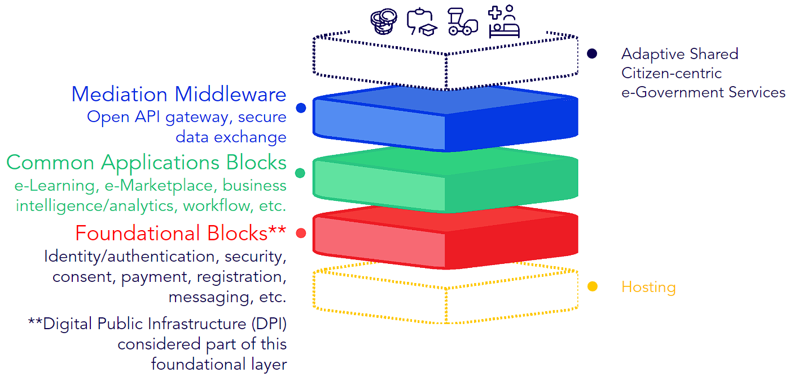

# Building block approach

There is an existing logical approach practiced by leading e-gov to create a common shared platform to deliver various government services digitally.

A holistic (Whole-of-Government) digital platform that can be used by any government agency across sectors to build new e-government services without the need to redesign, test, and operate the underlying systems and infrastructure themselves every time.

Instead of creating unique and disparate solutions, use a common reusable stack of Building Blocks to form the core platform engine and contextualize various e-government services on top.&#x20;

<figure><figcaption>
[Recommended reading: <a href="https://www.newamerica.org/digital-impact-governance-initiative/reports/digital-government-mapping-project/key-findings">Key findings on digital government “stacks” by New America]</a>
</figcaption></figure>

## How to make a BB approach sustainable over time?

To maximize ROI, a government must be able to draw a line connecting its national development goals to the programmes it is implementing to achieve those strategic goals, and to connect each programme to the reusable software components which help deliver them.&#x20;

Common ICT Building Blocks enable generic business processes, or WorkFlows, that can be combined and repurposed in multiple ways to deliver priority Use Cases that contribute to SDG Targets. National governments can prioritize Use Cases according to citizens’ needs (eg improve neonatal outcomes), map functionality across sectors, and then invest in shared infrastructure comprising ICT Building Blocks.

The illustration below describes **savings through a reusable digital investment approach**:

<figure><figcaption>
Illustration of Savings Through Reusable Digital Investment Approach (ITU, DIAL, 2019)
</figcaption></figure>

## What are the benefits of the BB approach?

A whole-of-government approach to digital investment to help achieve the SDGs stands to benefit the entire value chain: citizens, businesses, governments, and their partners, and the supporting ecosystem of ICT developers and implementers.

<figure><figcaption>
Framework benefits by stakeholder type
</figcaption></figure>

