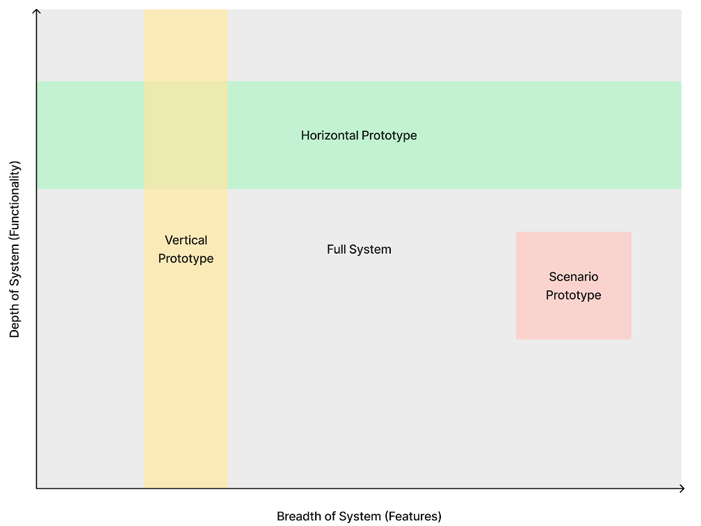

# Prototype

## Develop, test, and iterate a functional prototype.

Once the [wireframe ](https://govstack.gitbook.io/implementation-playbook/govstack-implementation-playbook/design-and-delivery/wireframes)[and/or voice command flow](https://govstack.gitbook.io/implementation-playbook/govstack-implementation-playbook/design-and-delivery/wireframes) is approved, we are ready to start developing and orchestrating a functional prototype of the service. The prototype is iteratively developed. Each successive iteration adds new functionalities and refines the prototype based on user feedback. This results in a service that meets the desired level of functionality and usability.

What are the benefits of protoyping?

Prototyping an e-service allows:

* Pre-procurement testing of software solutions
* Technical feasibility check
* Requirement gathering (e.g.BPMs) for procurement
* Transparency of the inner functioning of the Building Block approach
* Reference set-up for development, deployment, and operating life cycle
* Testing the Frontend with Users/Citizens



* Develop Product and Technical specifications for the service.
* Develop the front end and back end of the service according to the Product and Technical specifications and approved wireframes and/or voice command flow. &#x20;
* Develop a test script considering all the branches of "To-Be" user journey. &#x20;
* Prepare
  * test scripts
  * security and quality assurance checklist &#x20;
  * digital service release plan &#x20;
  * stabilization and maintenance routine &#x20;
* Launch α, β versions to a limited set of citizens/business users, admins, and public officials.&#x20;
* Collect their feedback on the functional prototype and identify concrete steps to improve it.
* Iteratively developed and deliver the launch version that meets the requirements and needs of citizens/business users, admins, and public officials.
* Prepare the plan for migration of the prototype to the production environment.&#x20;
* Prepare the launch of the service.



Who does what

* [Service designer](https://govstack.gitbook.io/implementation-playbook/govstack-implementation-playbook/annex/govstack-user-profiles-taxonomy#service-designer) – Lead the service co-design journey&#x20;
* [Product Owner](http://127.0.0.1:5000/o/pxmRWOPoaU8fUAbbcrus/s/zdXe8NbIMZIv5sydPBf6/) – Lead software product development according  to the service blueprint &#x20;
* [Front-end developer](https://govstack.gitbook.io/implementation-playbook/govstack-implementation-playbook/annex/govstack-user-profiles-taxonomy#front-end-developer) – Develops front-end applications following UX/UI style guide &#x20;
* [Solution architect](https://govstack.gitbook.io/implementation-playbook/govstack-implementation-playbook/annex/govstack-user-profiles-taxonomy#solution-architect) – Architects the service according to the BB integration plan &#x20;
* [Back-end developer](https://govstack.gitbook.io/implementation-playbook/govstack-implementation-playbook/annex/govstack-user-profiles-taxonomy#back-end-developers) –  Adjust BB, connects legacy systems, and test the application&#x20;
* [Digital security manager](https://govstack.gitbook.io/implementation-playbook/govstack-implementation-playbook/annex/govstack-user-profiles-taxonomy#digital-security-manager) - validates compliance with digital security policy
* [Cloud architect](https://govstack.gitbook.io/implementation-playbook/govstack-implementation-playbook/annex/govstack-user-profiles-taxonomy#cloud-architect) - Designs cloud strategy and microservices architecture that supports the digitalization of government services



Deliver a functional prototype of the service which:

* Complies with the approved 'To-be user journey' and wireframe and/or voice command flow
* Complies to Country digital service design standards. This includes standards for:&#x20;
  * [Service information sheet](https://govstack.gitbook.io/implementation-playbook/govstack-implementation-playbook/learning-and-exchange/artefacts#information-service-sheets)
  * [Downloadable forms](broken-reference)
  * [Web forms](broken-reference)
  * [Electronic documents](broken-reference)
  * [Notifications](broken-reference)
  * [Performance analytics](broken-reference)
  * [Citizen satisfaction survey](broken-reference)
  * [Accessibility ](broken-reference)
* Complies with Country enterprise architecture, including digital security protocols approved by the country technical team&#x20;



About GovStack Sandbox

The Sandbox will contribute to the GovStack vision by providing a demonstration environment to learn, and a technical environment to test more effective and cost-efficient digital government services.

It will support multiple viewpoints on the same use case being demonstrated. As shown in the following image, the central blue circle represents the implementation of the demonstration showcasing the interaction between various Building Blocks. The outer green ring contains the various user personas that interact with the e-service being demonstrated. Ultimately, we have the actual viewer of the use case, the decision maker, who can choose from the various personas interacting with the service, to view their user experience, and understand the integration between building blocks involved in each step for each step within the e-service being demonstrated.&#x20;

*

    <figure><figcaption>
GovStack Sandbox overview
</figcaption></figure>

To support the uses of sandbox in the development and demonstration of the aforementioned use cases, four Building Blocks that comply with the GovStack Building Block Technical Specifications will be integrated:

1. Identity Building Block
2. Information Mediator Building
3. Payment Building Block
4. Registration Building Block
5. Registries Building Block

Depending on the requirements and scope of a prototype, GovStack Sandbox could be used to develop a:

* Vertical prototype: This prototype is developed to demonstrate only a select set of steps within a use case. This prototype may utilize all the Building Block in the stack&#x20;
* Horizontal prototype: This prototype concentrates on one aspect of the use case. For example, in order to gather use feedback on their experience with an e-service, you can prototype only the front end.
* Scenario prototype: This prototype concentrates on demonstrating a limited set of scenarios.
* Full system prototype: This prototype covers every step and scenario within a use case and utilizes the entire stack available to demonstrate a complete e-service.&#x20;
*

    <figure><figcaption>
Types of prototypes in GovStack sandbox
</figcaption></figure>

Iterative prototyping

Following are the stages of prototyping a digital government service, from α version to the Launch version:

* α version prototype: α version is a rough functional prototype used to test the initial concept and get feedback from a limited number of users and stakeholders. The duration for the α version must be agreed upon between service owners and stakeholders. It usually lasts between a few weeks and months. α version can be hosted in a testing environment that may or may not be the GovStack Sandbox.
*   β version prototype: Once the α version is tested and feedback is collected, the β version is developed. This prototype is more refined and is closer to the final digital service. It includes more features and functionalities and is tested by a larger group of users or stakeholders to identify any final issues before launching the next iteration.

    In case the β version is hosted on GovStack Sandbox, preparations must be made to deploy it on the country's cloud infrastructure/ production environment.
* Launch version: The launch version is the first version of the service that is released to the public. It includes the core features and functionalities that meet the needs of the users and are further iterated based on future user feedback.&#x20;
*

    <figure><figcaption>
Iterative prototyping
</figcaption></figure>

