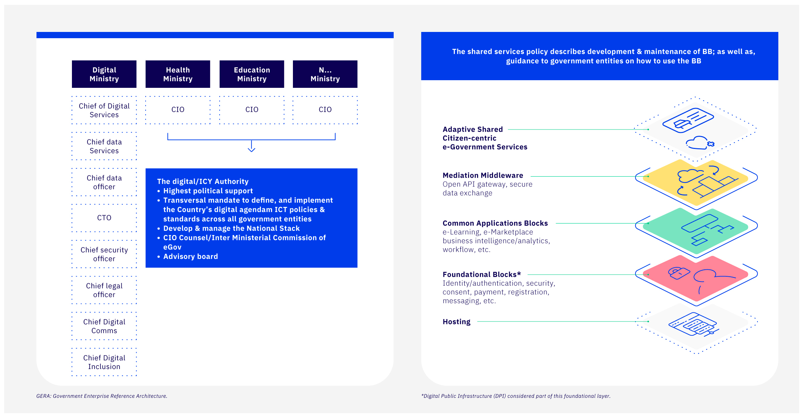

# Reference architecture

Reference architecture is the blueprint used to put the pieces of the organizational & systems puzzle together. Digital teams use reference architecture to promote the reuse of common assets and identify capability gaps. It:&#x20;

* Defines a common language for consistent communication within the organization&#x20;
* Outlines all capabilities needed to achieve the best outcome&#x20;
* Provides the ability of systems or software to exchange and make use of information &#x20;
* Establishes standard systems, and a common way to exchange information

<figure><figcaption>
Example: Enterprise Architecture from Abu Dabhi, Finalist of GovStack WSIS Special Prize 2023
</figcaption></figure>

<figure><figcaption>
Government Ecosystem Reference Architecture (GERA)
</figcaption></figure>



* Develop the systems/software/platform catalog to identify reusable software components/Building Blocks that can support the digitization of services.
* Identify additional Building Blocks/ reusable software components that are critical in building a national stack that can facilitate the development of prioritized citizen-centric digital services.&#x20;
* Define the approach to adding new/updated Building Blocks within the national stack, either through tendering, developing indigenously, or re-using existing Building Blocks. [GovExchange ](https://exchange.dial.global/)provides a catalog of digital public goods that can be used as a reference.

**Examples of Reference Architectures:**

* In Australia, their [reference architecture document](https://www.architecture.dta.gov.au/sp\_aga2?id=aga2\_how\_to\_use) provides digital teams the guidance they need to align current and emerging tech into a sound orchestration of solutions to enable digital government service design and delivery

<figure><figcaption>
Source: Australian <a href="https://www.architecture.dta.gov.au/sys_attachment.do?sys_id=280cffba1b3ced10b46264ab274bcb2c">Reference Architecture</a>
</figcaption></figure>


Australian Whole of Government Architecture &#x20;


* [GovStack Architecture and non-functional requirements](broken-reference)
* [GovStack Ecosystem Reference Architecture and Business Guide for Public Digital Platforms](https://docs.google.com/document/d/1Qa31kAy\_Kz9MsphXunS0UqRJpoQ2i8HV/edit?usp=sharing\&ouid=107531587157017296326\&rtpof=true\&sd=true),  [The Open Group Standard](https://www.opengroup.org/)



Who does what:

* Chief government architects - Coordinate the work around the reference architecture&#x20;
* [Solutions architects](https://app.gitbook.com/o/pxmRWOPoaU8fUAbbcrus/s/4D3oEcPGpYoKnwkQmCzJ/\~/changes/389/govstack-implementation-playbook/sample-digital-team-composition/govstack-user-profiles-taxonomy#solution-architect) from government entities - Actively participate in the co-design of the document, the reference architecture working group, and the training program&#x20;
* [Service designers](http://127.0.0.1:5000/o/pxmRWOPoaU8fUAbbcrus/s/zdXe8NbIMZIv5sydPBf6/) - Actively participate in co-design sessions, the reference architecture working groups, and the training program&#x20;



* Government Enterprise Architecture
* Implementation guidelines
* e-learning courses for stakeholders (public servants and ICT service providers)


