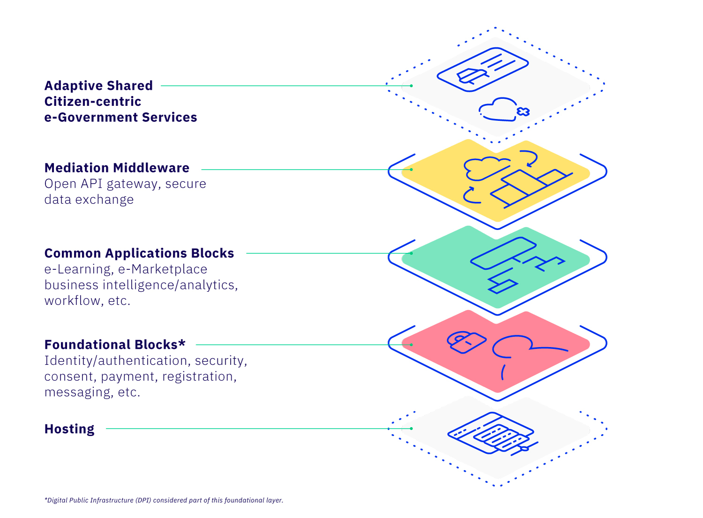

# Building block approach

There is an existing logical approach practiced by leading e-gov to create a common shared platform to deliver various government services digitally.

A holistic (Whole-of-Government) digital platform that can be used by any government agency across sectors to build new e-government services without the need to redesign, test, and operate the underlying systems and infrastructure themselves every time.

Instead of creating unique and disparate solutions, use a common reusable stack of Building Blocks to form the core platform engine and contextualize various e-government services on top.&#x20;

<figure><figcaption><p>[Recommended reading: <a href="https://www.newamerica.org/digital-impact-governance-initiative/reports/digital-government-mapping-project/key-findings">Key findings on digital government “stacks” by New America]</a></p></figcaption></figure>



**Building blocks** (BBs) are software modules that can be deployed and combined in a standardized manner. Each building block is capable of working independently, but they can be combined to do much more.

Building blocks are composable, interoperable software modules that can be used across a variety of use cases. They are standards-based, preferably open-source, and designed for scale.

Each building block exposes a set of services in the form of REST APIs that can be consumed by other building blocks or applications.



A whole-of-government approach to digital investment to help achieve the SDGs stands to benefit the entire value chain: citizens, businesses, governments, and their partners, and the supporting ecosystem of ICT developers and implementers.

<figure><figcaption><p>Framework benefits by stakeholder type</p></figcaption></figure>



To maximize ROI, a government must be able to draw a line connecting its national development goals to the programs it is implementing to achieve those strategic goals and to connect each program to the reusable software components that help deliver them.&#x20;

Common ICT Building Blocks enable generic business processes, or WorkFlows, that can be combined and repurposed in multiple ways to deliver priority Use Cases that contribute to SDG Targets. National governments can prioritize Use Cases according to citizens’ needs (eg improve neonatal outcomes), map functionality across sectors, and then invest in shared infrastructure comprising ICT Building Blocks.

The illustration below describes **savings through a reusable digital investment approach**:

<figure><figcaption><p>Illustration of Savings Through Reusable Digital Investment Approach (ITU, DIAL, 2019)</p></figcaption></figure>



GovStack has developed technical specifications for the following Building Block (BB). Additionally, you will find corresponding FAQs for each BB linked below:

<details>

<summary><a href="https://govstack.gitbook.io/bb-information-mediation/">Information Mediation</a></summary>

**Specifications**

The [Information Mediator](https://govstack.gitbook.io/bb-information-mediation) provides a gateway between external digital applications and other ICT Building Blocks, thereby ensuring interoperability and implementation of standards, which is essential for integrating various ICT Building Blocks and applications.

**Policy recommendations**&#x20;

* Interoperability should be a transversal mandate that applies to all government entities (with no exceptions). These types of mandates can be implemented using General laws and/or presidential/secretarial decrees regulating the following principles:
  * 'Only one principle' states that citizens should be required to provide information once to the government.
  * No government entity can request information from a citizen or interested party that other government entity already has.
  * Citizens or interested parties should give consent for their information to be exchanged and/or consulted in order to access government services according to data protection law applicable in the country.
* Examples of regulations:
  * [Estonia](https://www.stat.ee/sites/default/files/2022-11/Estonian%20IT%20Interoperability%20Framework%20-%20Abridgement%20of%20Version%203.0.pdf)
  * [Mexico](https://www.gob.mx/wikiguias/articulos/decreto-por-el-que-se-establece-la-ventanilla-unica-nacional-para-los-tramites-e-informacion-del-gobierno-173691?state=published)

&#x20;**Governance recommendations**&#x20;

* Digital authorities should have the transversal mandate to coordinate the implementation of the aforementioned policy at the political, organizational, and technical levels ensuring service-level agreements that can guarantee continuity in service provision across all government entities.
* Digital authorities are encouraged to have a shared service team to support the development, maintenance, and update of APIs as with any other Building Block within the government stack.

**FAQ**

**Do we need separate BB for mediation?**

Key question in interaction between governmental bodies is security. Consumer and provider of service must be sure that service is legitimate, confidential, complete, and not changed on the way. Implementation of security is the main task of the IM BB. Place for IM BB is on boundaries or organizations.

**Does IM BB fit for large countries?**

IM BB is implementing distributed approach. Only service provider and service consumer are engaged in every interaction. There is no single point of failure in design of the IM BB. Due to this approach the IM BB is easily scalable and can be used in big countries also.

**Can different GovStack ecosystems talk to each other?**

Yes. The IM BB is designed to be able to consume services from another instance of the GovStack. It means that if two countries are using GovStack, then they can consume services of each other. This also enables to use GovStack in smaller scale. One can build up country ecosystem as federation of smaller GovStack instances organized on basis of specific functional domains or territorial division.

**Does every communication between Building Blocks go through Information Mediator?**

No. If Building Blocks are within the same software system, then they can communicate directly. Only communication between different parties or organizations must use IM BB.

\


</details>

<details>

<summary><a href="https://govstack.gitbook.io/bb-registration">Registration</a></summary>

Records identifiers and other general information about a person, place or other entity, typically for the purpose of registration or enrollment in specific services or programs and tracking of that entity over time.

**FAQ**

**What is the GovStack Registration Building Block, and how does it benefit the government?**

GovStack Registration BB  specifications offer a streamlined pathway for governments to advance their digital transformation initiatives efficiently. These specifications facilitate the creation and administration of seamless e-services for citizens and businesses, expediting their engagement with government processes.

Registration, in this context, is the procedure by which an applicant, whether a citizen or a businessperson, submits information for inclusion in a registry and receives an official credential as confirmation of their registration. This process may involve the provision of information, with or without associated fees. The information submitted by the applicant comprises a range of data and/or credentials issued by either public or private entities. In cases involving fees, these payments cover registration expenses.

A registration operation involves a minimum of two participants:

* The applicant, seeking to enroll something or someone within the registry.
* An authorized representative from the registry is responsible for recording the provided data and issuing the corresponding credential.

In certain instances, simultaneous registration processes can occur. This scenario entails a single applicant having their information registered across multiple registries, consequently obtaining diverse credentials. Remarkably known as "single window," "simultaneous registrations," or "integrated registrations," this approach promotes the development of user-centric solutions. Specifically, Registration BB mandates the creation of user-friendly single-window solutions, empowering government officials to effortlessly construct next-generation e-services, even without coding expertise.

**What is the purpose and scope of the GovStack Registration BB specifications?**

The GovStack Registration BB specifications aim to provide practical solutions for the Government's registration needs. Covering three key digital functionalities, including:

* Online registration: e-services for a citizen/operator to register with an entity for any number of services.
* Processing of registrations: a back office system to validate registration requests through human or automated operators.
* Development platform for online registration and processing: to set up the interfaces, rules, and workflows for the above-mentioned capabilities.

Specific use cases covered are Postpartum and Infant Care and Unconditional Social Cash Transfer registration and processing. However, the GovStack Registration BB specifications support various other sectors, including business facilitation, local government, law enforcement, natural resources, planning, agriculture, business, construction, energy, environment, healthcare, transportation, and utilities. The requirements in this BB specification are designed to be agnostic and not related to any domain or use case.

**What examples of use cases do the GovStack Registration BB specifications support?**

The Registration Building Block specifications are designed to cater to a wide array of use cases, addressing the diverse needs of eGovernment, ministries, and municipalities. Beyond its comprehensive functionalities, Registration BB specifications offer substantial support for various sectors, enhancing governance, citizen services, and operational efficiency. Here are a few examples:

* Citizen Registration and Identification: Efficiently enroll and identify citizens within government systems, providing them with official identification for accessing services and participating in civic activities.
* Business and Organization Registration: Streamline the process of registering businesses and organizations, ensuring accurate documentation and facilitating their interaction with regulatory bodies.
* License and Permit Application: Enable citizens and businesses to apply for licenses, permits, and certifications through a centralized registration system.
* Property Ownership and Title Registration: Establish a comprehensive system for recording and managing property ownership and land titles, reducing disputes and enabling transparent transactions.
* Healthcare and Patient Records: Facilitate the registration of patients within healthcare systems, allowing for efficient record-keeping and seamless access to medical services.
* Educational Enrollment and Records: Simplify student enrollment processes and maintain accurate educational records, from kindergarten to higher education institutions.&#x20;
* Social Welfare Programs: Register individuals for social welfare programs, ensuring that eligible recipients have access to the necessary support and benefits.
* Immigration and Travel Records: Record and manage the entry and exit of individuals at borders, tracking visa and immigration status for security and administrative purposes.
* E-Government Services Portal Access: Enable citizens to create accounts for accessing various government services through a centralized e-government portal.

These use cases showcase the versatility and importance of the Registration Building Block in modernizing and enhancing government services across a wide range of sectors.

**What future enhancements are planned for GovStack Registration BB?**

The future scope of GovStack Registration BB specifications may evolve into the following domains:

* AI-Powered Data Validation: Using artificial intelligence, the platform could automatically validate submitted data to reduce errors, enhance accuracy, and speed up the registration process.
* AI-Powered service building wizards: Using artificial intelligence, the platform could automatically generate user screens and process flows for Use Case specific e-services using best practices available information from specific country to reduce time of service building.
* Automated Document Verification: Integrating with document verification services could allow users to submit documents digitally and have them automatically verified, reducing the need for manual document checks.
* Blockchain Integration for Data Security: Leveraging blockchain technology could provide an immutable and secure way to store registration data, ensuring data integrity and reducing the risk of unauthorized access or tampering.
* Stronger and guided integration with other building blocks via API interfaces.&#x20;

**How does GovStack Registration BB address challenges in storing data of variety  of domain-specific nature?**

GovStack Registration BB internal databases are dynamic and flexible to store any type of data from any type of domain. However, it integrates also with other databases and Digital Registries BB where the important registration data can be stored in a more structured style.&#x20;

**How does GovStack Registration BB contribute to the government's vision for efficient governance?**

The GovStack Registration Building Block empowers the government by enabling efficient e-governance through better decision-making based on once-only insights. Specifications once implemented can foster the single window services and enable service building by non-programmers as fast as 15 minutes. Moreover, it enables government workers to take power of the service design process and prototype, build and redesign their processes with ease. Digital transformation will be swift and efficient.&#x20;

</details>

<details>

<summary><a href="https://govstack.gitbook.io/bb-digital-registries">Digital Registries</a></summary>

Registries are centrally managed databases that uniquely identify persons, vendors, facilities, procedures, products and sites related to an organization, industry or activity.

**FAQ**

**What is the GovStack Digital Registries Building Block, and how does it benefit the government?**

GovStack Digital Registries BB  specifications offer a streamlined pathway for governments to advance their digital transformation initiatives efficiently. These specifications facilitate the creation and administration of registry databases for government officials to store data and claims registered in the Registration process.&#x20;

The Digital Registries Building Block provides services to other Building Blocks and to external systems, to store and manage data/claims on any entity (persons, places, and things) in forms of uniquely identifiable records in a database.

For example, these records could contain health and medical information, ownership of property, vehicles, money, qualifications, birth/expiry of people and entities, land surveys, manufacturing information of vehicles and equipment, banking and commercial transactions, etc. Given the diversity of such information, this Building Block provides services useful to abstract the structure, linkages, and grouping of information into various records and collections such as financial, legal, medical, social, educational, commercial, etc., as needed.

**What is the purpose and scope of the GovStack Digital Registries BB specifications?**

GovStack Digital Registries BB specifications forge a streamlined avenue through which governments can propel their digital transformation endeavors with unparalleled efficiency. These specifications are tailored to facilitate the establishment and management of registry databases, catering to both registry service owners, who curate essential data, and citizens and businesses, who find a secure channel to engage with government processes.

The Digital Registries Building Block functions as a cornerstone, catering not only to other Building Blocks but also to external systems, acting as a repository for the storage and oversight of data/claims pertaining to various entities—be it individuals, locations, or objects. This is executed through the creation of uniquely identifiable records within a database structure.

Within this context, a "registry" embodies the capacity to capture, retain, search, distribute, and present data, all with minimal to no requirement for software development (NO-CODE). Moreover, it serves as a custodian of transaction logs, meticulously chronicling all activities transpiring within database schemas and datasets. Diverse functional components and data resources coalesce to abstract the intricate intricacies, presenting capabilities as service APIs to external Building Blocks and applications.

Current Scope of GovStack Digital Registries BB specification:

Covering key digital functionalities for data owner/ citizen or businessperson:

* Search data from the register;
* Read data from the register;
* Create data in the register;
* Update data in the register;
* Delete data in the register;
* Validate if given content exists in specified register;
* Read statistics.

For service owner (government entity) the key functions of the Building Block are:

* Create a new register/database; Create and configure the schema of the register;
* Change schema configuration and publish the new version of the database and API service;
* Enter data to the register; View data records in the register;  Update data in the register;
* Import/export data from/to external files;
* Import/export registry database schema;
* Create API services;
* View statistics;
* Inspect transaction log of registry data operations;
* Manage access to registry data. Authorize users to see and edit registry records or data fields (Attribute-Based Access Control management);

**What examples of use cases do the GovStack Digital Registries BB specifications support?**

Specific use cases piloted are Postpartum and Infant Care and Unconditional Social Cash Transfer data storing in a registry. However, the GovStack Digital Registries BB specifications support various other sectors, including business facilitation, local government, law enforcement, natural resources, planning, agriculture, business, construction, energy, environment, healthcare, transportation, and utilities. The requirements in this BB are designed to be agnostic and not related to any domain or use case.

**What future enhancements are planned for GovStack Digital Registries BB?**

The future scope of GovStack Digital Registries BB specifications may evolve into the following domains:

1. Data sharing via blockchain and wallets.&#x20;
2. Registry data quality management and integration to data evaluation tools.&#x20;
3. Additional focus is on advanced integration of other building blocks.&#x20;

**How does GovStack Digital Registries BB address challenges in storing data of variety  of domain specific nature?**

GovStack Digital Registries BB databases are dynamic and flexible to store any type of data from any type of domain. The core architecture design of the Digital Registries is to be agnostic and flexible to store any information needed in government processes. The NO-CODE principles integrated into the specification is enforcing the user to design the data architecture as needed.&#x20;

**How does GovStack Digital Registries BB contribute to the government's vision for efficient governance?**

The GovStack Digital Registries Building Block empowers the government by enabling efficient e-governance through agile and flexible information management. Specifications once implemented can foster the e-services and registration processes. For example, disaster recovery and unexpected disrupting situations (Earth quake, flood, pandemic) requires immediate action from government. Digital registries is the perfect tool for helping to recover faster as registries can be created by non-programmers as fast as 15 minutes. Moreover, it enables government workers to take power of the service design process and prototype, build and redesign their processes with ease. Digital transformation will be swift and efficient.

</details>

<details>

<summary><a href="https://govstack.gitbook.io/bb-identity">Identity</a></summary>

Enables unique identification and authentication of users, organizations and other entities.

**FAQ**

**What is the GovStack ID Building Block, and how does it benefit the government?**

The ID Building Block is an innovative framework to facilitate tools and processes to the government and its citizens for managing identity information and digital credentials seamlessly. The specifications are designed to address challenges related to nation-wide digital identity rollout, including:&#x20;

* Creating a Foundational Identity database as a single source of truth
* Authentication through Foundational Identity for Functional Identity, and third parties/partners
* Lack of user security and privacy
* Digital ID-led development and transformation​
* Providing Citizen-centric service​s digitally in a fast, secure, and privacy-prserving manner
* Standards-driven identity and credentials management solutions​
* Notifications to other relying parties and partners for identity-related events

By harmonizing existing identity standards, this framework becomes applicable to real-world scenarios spanning government bodies, citizens, and citizen services. Embracing open ID standards alongside their associated APIs introduces a realm of possibilities. This strategic move enhances interoperability among identity systems, fosters the reusability of ID applications, and greatly streamlines the efficient delivery of citizen-centered services. The ID BB APIs are vital connectors, facilitating smooth communication and data sharing among diverse digital identity applications. This harmonious interaction not only simplifies identity management and authentication processes but also sparks innovation, empowering developers to craft cutting-edge applications that harness the full potential of identity information while maintaining security and preserving privacy of citizens.&#x20;

**What is the purpose and scope of the GovStack ID BB specifications?**

The GovStack ID BB specifications aim to provide practical solutions for the government's national identity management requirements. They are versatile and adaptable by various existing and new national identity systems. They can be applied to sectors such as education, banking, healthcare, voting, driving license, passport, legal, etc. The specifications cater to diverse identity system needs, promoting effective identity management while providing security and preserving privacy. The ID BB Specs cover five key digital functionalities, including authentication, identity management, lifecycle management of credentials, identity-related event notifications, and administration of identity systems.&#x20;

**What examples of use cases do the GovStack ID BB specifications support?**

The GovStack ID Building Block specifications are designed to cater to a wide array of use cases, addressing the diverse needs of digital identity within the legal framework of eGovernance. Beyond its comprehensive functionalities, GovStack ID BB specifications offer substantial support for various sectors, enhancing governance, citizen services, and operational efficiency. Here are a few examples:

A. Identity Use Cases

* ID Proof​
* KYC​
* Proof of life and presence assurance​
* Online, offline and decentralized identity verification​

B. Service Delivery Use Cases​

* Single sign on credentials​
* Link ID to sectoral applications – health, education, agriculture​
* Link ID to key registries – SPR, Voter, Tax​, Education
* Enable private sector usage​

C. Benefits Delivery Use Cases​

* Beneficiary enrolment to schemes​
* Payments​
* Proof of delivery for other benefits: food, clothes, medicine, etc.​

**What future enhancements are planned for GovStack ID BB?**

The future scope of GovStack ID BB includes multi-step enrollment, lifecycle management of credentials, subscription for identity-related events (birth, death, identity registration, disappearance, fraud, etc.), and administration of identity systems from a central place.&#x20;

**How does GovStack ID BB address challenges related to security and privacy?**

GovStack ID BB specifications provides security and preserves privacy while authentication through the foundational identity of a citizen. The specifications follow the secure and open-source standards and protocols, secure biometric interfaces, and widely recognized formats to facilitate creating, sharing, updating, and revoking (temporarily/permanently) the identity related information and credentials of citizen. Citizen information is only shared with prior consent of the citizen while adopting to the country’s legal framework.

**How does GovStack ID BB contribute to the government's vision for digital identity?**

The GovStack ID Building Block empowers the government by enabling efficient identity management through secure, established, and widely adopted standards while ensuring the best-known practices for security and privacy. It promotes interoperability, reusability of ID applications, and effective digital service delivery to citizens. Additionally, the planned enhancements ensure that the government stays at the forefront of identity system advancements. In addition, by embracing open standards and APIs, the government taps into the innovation potential of developers and experts, fostering a collaborative environment. This results in developing cutting-edge applications and services that leverage digital ID and authentication, ultimately enhancing the country's reputation as a tech-savvy and forward-thinking nation.

</details>

<details>

<summary><a href="https://govstack.gitbook.io/bb-payments">Payments</a></summary>

Implements financial transactions such as remittances, insurance claims, product purchases and payments of service fees, along with the logging of related transactional information. It also provides utilities for tracking costs and extracting audit trials.

</details>

<details>

<summary><a href="https://govstack.gitbook.io/bb-consent">Consent</a></summary>

Manages a set of policies allowing users to determine the information that will be accessible to specific potential information consumers, for which purpose, for how long and whether this information can be shared further.

**FAQ**

**Can Consent BB handle generic agreements?**

The short answer is - no, Consent BB is not intended/designed for that. GovStack specifications, use-cases and training resources should not encourage using Consent software for generic agreements.

Elaborated answer: It’s quite possible for an organization to assess and evaluate if their Consent software can handle agreements and satisfy legal obligations. But this is not encouraged since there are fundamental differences between binding agreements and revocable consent.

Using a consent system for an agreement, would most likely mean that the agreement can be recalled at any point in time by the individual who has given the consent. This is not a desirable property for most generic agreements.

Read more about how consent is defined by the building block: [https://govstack.gitbook.io/bb-consent/2-description#2.1-what-consent-is](https://govstack.gitbook.io/bb-consent/2-description#2.1-what-consent-is)&#x20;

**Can I query if a specific operation requires consent?**&#x20;

No. The Consent BB is not aware of special data properties or APIs in other systems. It does not manage access nor permissions.

A given system needs to configure the Consent BB with an Agreement and a Policy. It is the knowledge of the Agreement ID that a privileged system can query if a Consent Record exists for a given Individual.

**How does a BB/service query if consent exists?**

A given system needs to configure the Consent BB with an Agreement and a Policy. It is the knowledge of the Agreement ID that a privileged system can query if a Consent Record exists for a given Individual.

**What is the responsibility of another Buiding Block or service?**

Any service outside Consent BB is responsible for ID-handling of the queries. Consent BB validates the source and the given request (via authorisation token) and assumes any request to be valid, if it: 1) validates to be called from a trusted source; 2) via a trusted service/request; 3) as part of a valid session.&#x20;

ID-token must be obtained and provided by the outside service; Consent BB verifies if the ID is valid (via an external independent ID BB/service) and provides relevant response. Consent BB does verify the individual ID authorization profile (for example, if a given individual has authorised the request) - this is the responsibility of the outside service.&#x20;

**Can consent be collected without the Consent BB?**

It’s GovStack’s policy to promote Consent collection through the Consent BB as a foundation of good public governance.

Other building blocks or processes are not advised to handle consent, since this implies questions like withdrawal, multi-party consent, auditing, and not least the life-cycle of consent agreements and policies.

</details>

<details>

<summary><a href="https://govstack.gitbook.io/bb-workflow">Workflow</a></summary>

Helps to optimize business processes by specifying rules that govern the sequence of activities to be executed as well as the type of information exchanged in order to orchestrate the process flow from its initiation to completion.

**FAQ**

**Can you provide practical insights on the GovStack Workflow Building Block applications?**

The GovStack Workflow Building Block (BB) is a specialized framework for the automation of core and support processes in a public administration organization. The implementation of the BB specification-based component will bring:

* Improved process quality
* Reduced cycle times
* Automation of boring tasks
* Ability to scale.
* Reduction of operational cost

**What kind of problems does the workflow BB help solve?**

There are several typical situations where the Workflow BB becomes very instrumental. Following is a list of some examples.&#x20;

* The Workflow BB helps to standardize business process quality across different geographical branches of an organization ensuring high-quality service delivery everywhere across the country.
* The Workflow BB helps ensure consistency of service delivery in case of complex processes enabling automation and information flow between different steps of the process.
* The Workflow BB helps to overcome situations with the sudden growth of workload providing the capability to seamlessly engage more resources.
* The Workflow BB automates complex processes and generates valuable insights for process analysis, enabling organizations to adapt to new conditions and achieve higher quality.

**Are there any prerequisites for the implementation of Workflow BB?**

The Workflow BB helps to automate processes and those processes are normally specific for an organisation. Therefore, there should be internal capability for process design and change management.

It is very beneficial to have a no-code building block for creating form-based data entry or data-processing workplaces, which will be integrated using Workflow BB into a comprehensive automation solution.

Combining the Workflow BB with standard components for Scheduling, Case Management, and Document Management will enable to automate almost anything in public administration.&#x20;

**What is the long-term strategy of the Workflow BB specification?**

We plan to accomplish the following:

* Decouple design-time and run-time functionalities and establish interoperability requirements between those parts. That will enable to use Business Process designer from one vendor and a business process management engine from another vendor.
* Add Decision Model and Notation (DMN) standard requirements.
* Add Case Management Model and Notation (CMMN) standard requirements.

**What are the current limitations of the Workflow BB specification?**

The current specification does not provide internal requirements for defining the process and leaves it up to the vendor.

**Please, provide example use cases where Workflow BB is particularly useful.**

Applicability of Workflow BB is ubiquitous. Whenever organization is engaged in service delivery to customers there will be workflows at least with the following steps:

1. The customer applies for service delivery.
2. The line manager reviews the application and allocates it to an available staff member.
3. The officer processes the request and makes a decision draft and sends it to a manager for review and approval.
4. The system sends a notification to the customer to pick up the ready decision.

Another very typical scenario in tax administration. After the deadline for submitting tax returns has passed, the system scans the taxpayer registry and selects all taxpayers who failed to submit their tax returns on time. The system sends to all non-fillers soft notifications with reminders. The system creates an enforcement task and assigns it to an available officer with the appropriate competency when dealing with recurrent non-filers. After submitting tax returns, the system sends them to the risk assessment component. If a tax return is deemed high risk, the system creates tasks for auditors to conduct a field audit of the taxpayer. All those steps are configured in the Workflow BB and implemented automatically.

There are similar examples can be presented for every area of public administration.

**What is the potential impact of Workflow BB on digital transformation?**

Adoption of Workflow BB in public administration organisations will enable following:

* Support for microservice-oriented architecture design, which improves the maintainability of IT solutions.
* Increase time-to-market for automation initiatives.
* Support the establishment of transparency for customers over administration proceedings.

</details>

<details>

<summary><a href="https://govstack.gitbook.io/bb-messaging/">Messaging</a></summary>

Facilitates notifications, alerts and two-way communications between applications and communications services, including short message service (SMS), unstructured supplementary service data (USSD), interactive voice response (IVR), email and social media platforms.

**FAQ**

**What is the GovStack Messaging Building Block, and how does it benefit the government?**&#x20;

The Messaging Building Block is an integrated and interoperable microservice that opens up a two-way communication channel between the government and its citizens. For the government, the Messaging Building block is an easy-to-adopt microservice that can add value to the existing digital services by giving them outreach channels to reach their clients, citizens and businesses for providing them various information services. For the citizens, the Messaging Building Block makes it easy to reach Government services through their mobile devices, enabling them to sign up for a doctor’s appointment or reclaim their social benefits, enroll into social programs or file applications for documents.

The specifications are designed to address challenges related to nation-wide digital communication channel rollout, including:&#x20;

* Lack of a trusted contact channel between the government service providers and the citizens
* Lack of secure communication channel. This is provided through GovStack certified Security Server (Information Mediator) and existing or new authentication methods, tokens.
* No access to the third parties/partners (WhatsApp etc). Access to third party apps is lessening the UX/UI friction and increasing the speed of adoption.
* Lack of citizen-centric digital services, information service​s.

By harmonizing existing communication standards, this framework becomes applicable to real-world scenarios spanning government bodies, citizens, and citizen services. Embracing GovStack standards alongside their associated APIs introduces a realm of possibilities. This strategic move enhances interoperability among Government Services, fosters the reusability of applications, and greatly streamlines the efficient delivery of citizen-centered services. The APIs are vital connectors, facilitating smooth communication and data sharing among diverse digital applications. This harmonious interaction not only simplifies information management, but also sparks innovation, empowering developers to craft cutting-edge applications that harness the full potential of information services, while maintaining security and preserving privacy of citizens.&#x20;

**What is the purpose and scope of the GovStack Messaging BB specifications?**

* The GovStack Messaging BB specifications aim to provide practical solutions for the government's national communication management requirements. They are versatile and adaptable by various existing and new national communication systems. They can be applied to sectors such as education, banking, healthcare, driving license, passport, legal, etc. The specifications cater to diverse communication system needs, promoting effective information management while providing security and preserving privacy. The Messaging BB Specs cover the following key digital functionalities:&#x20;

```
POST. Send a single message/email/SMS. 
SEND BATCH. Send a batch of messages.
CALLBACK. An optional custom service to provide an endpoint for client-specific functionality to accept replied messages etc
STATUS. Get an overview of sent message statuses.
```

In addition to the basic functionalities, Messaging BB can relay the messages over any available/existing communication channels, such as the 3rd party providers WhatsApp etc. The functionality is called BRIDGE-TO.

**What examples of use cases do the GovStack ID BB specifications support?**

The GovStack Messaging Building Block specifications are designed to cater to a wide array of use cases, addressing the diverse needs of communication within the Public sector. Beyond its functionalities, GovStack BB specifications offer substantial support for various sectors, enhancing governance, citizen services, and operational efficiency. Here is an example of a simple workflow:

Messaging BB listens to the incoming message from a Government service, identifies the sender, selects a proper channel for outgoing message and delivers that message through that particular channel / endpoint

* Use Cases
  * single message between Government service and Citizen
  * multicast message to a group of citizens, belonging to a specific target group
  * broadcast message to a large group of citizens, in a geographic area or a specific target group
* Service Delivery Use Cases​
  * Link the Messaging service to sectoral applications – health, education, agriculture
  * Link the Messaging service to key registries – SPR, Voter, Tax​, Education
  * Enable private sector usage in order to communicate a problem in the local infrastructure or to file for a permit​
* Benefits Delivery Use Cases​
  * Beneficiary enrolment to schemes​
  * Notify of payments​
  * Proof of delivery or feedback for other benefits: food, clothes, medicine, etc.​

**What future enhancements are planned for GovStack Messaging BB?**

The future scope of GovStack Messaging BB includes integration and delivery of messages to several third party apps; enabling publish and subscribe services through Information Mediator BB; administration of messaging BB.&#x20;

**How does GovStack Messaging BB address challenges related to security and privacy?**

GovStack Messaging BB specifications provides security and preserves privacy by design. This means that the messages are accepted in an appropriate format only from a trusted sender, specified in the GovStack requirements. The specifications follow the secure and open-source standards and protocols, and widely recognized formats to facilitate sharing of information and content. All information is encrypted while being transmitted between the services.

**How can GovStack Messaging BB contribute to the government's vision for information services management and delivery?**

The GovStack Messaging Building Block empowers the government by enabling efficient information delivery through secure, established, and widely adopted standards while ensuring the best-known practices for security and privacy. It promotes interoperability, reusability of existing applications and 3rd party applications, and facilitates effective digital service delivery to citizens. In addition, by embracing open standards and APIs, the government taps into the innovation potential of developers and experts, fostering a collaborative environment. This results in developing cutting-edge applications and services that further enhances country's reputation as a tech-savvy and forward-thinking nation.\


</details>

<details>

<summary><a href="https://govstack.gitbook.io/bb-scheduler/">Scheduling</a></summary>

Provides an engine for setting up events based on regular intervals or specific combinations of status of several parameters in order to trigger specific tasks in an automated business process.

</details>

<details>

<summary><a href="https://govstack.gitbook.io/bb-esignature">e-Signature</a></summary>

eSignature building block provides the necessary functionality to bring handwritten signatures to the digital world. Handwritten signatures have served as a way to agree/witness a given document. But in today's digital world, most of the documents are in digital form. The digital form varies between structured (XML, JSON ) and unstructured documents(PDF, Word, Image, CSV, Spreadsheet).  eSignatures can be added to digital documents similar to handwritten signatures achieving the same functionality.

Also, eSignatures improve user experience in managing the signing process as the same can be embedded directly in e-Services, leaving out the need to print out forms, sign on paper, scan & upload/send.

eSignature provides a huge advantage over handwritten signatures. They offer verification at any point in time. This allows for remote validation of signatures, content (Content same as that during signing), identity and time.

**FAQ**

**What is the GovStack eSignature Building Block, and how does it benefit the government?**

The GovStack eSignature Building Block is a technical specification providing the government with an interoperable, secure, robust & inclusive digital service enablement. The specification is designed to address known challenges when it comes to adopting & implementing nationwide eSignature, including:

* Digital Divide
* Limited Interoperability
* Complex Application Development
* Literacy & language barrier
* Data Security and Privacy
* Connected services

By addressing these challenges the specification lets the government create a faceless digital service delivery that enables trust between the citizens and the service delivery organizations.

**What is the purpose and scope of the GovStack eSignature BB specifications?**

The specification aims to provide an inclusive approach to government electronic signature needs. It also reduces the overall cost and overhead. The specification is unique and lets it be applied across the people at country scale. It caters to government needs from self signed documents to business agreements. The remote model of the digital signature enables trust and transparency. This lets the government, Corporates & Startups to work towards a faceless digital service enablement covering every citizen & aliens in the country.&#x20;

**What examples of use cases do the GovStack GIS BB specifications support?**

The GovStack eSignature Building Block specifications are designed to cater to a wide array of use cases, addressing the diverse needs of eGovernment, ministries, corporates & startups. Beyond its comprehensive functionalities, GovStack eSignature  BB specifications offer substantial support for various sectors, enhancing governance, citizen services, and operational efficiency. Here are a few examples:

* eSignature Based Proof Management: The specifications provide a robust framework for eSignature-Based Agreement Management. Most of the government services today need a physical  document as a proof for a service registration or delivery. With eSignature at hand we could use the scanned copy of an existing physical document with assurance from the user.&#x20;
* eSignature based Land record transfer: GovStack eSignature BB is particularly adept at managing complex multi party land record transfer. With accurate identification and signature it lets the authorities establish transparent land ownership, streamline property registration processes, and prevent land disputes. This ensures a fair and accountable system for land management, contributing to sustainable urban development and efficient land-use planning. Combining this with the Govstack GIS block would result in transparent & trust worthy transaction records.
* Public Health and Insurance: The specifications play a vital role in national level insurance and claim management. By integrating digital signatures with claim management, the governments can track claims, monitor leakages and manage effective public health interventions with less fraud. This contributes to citizens' overall well-being.
* Income tax: GovStack eSignature BB enables trust for all the parties involved in a transaction. In a digital world providing people with tools to trust them in turn delivers better accessibility to services. Also helps the government to create more law-abiding societies. Usage of eSignature BB in filing income tax lets the government move to a faceless tax assessment regime with more trust and transparency.

**What future enhancements are planned for GovStack eSignature BB?**

The future scope of GovStack eSignature BB includes expanding capabilities to process bulk signatures, standardizing the revocation model to reduce user complexity and support signatures at organization levels, making a B2B transaction easier.

**How does GovStack eSignaure BB contribute to the government's vision for efficient governance?**

The GovStack eSignature Building Block empowers the government by enabling efficient governance through trust and transparency. The BB reduces fraud and enables the government to build layers that could help in faceless digital transactions. It promotes interoperability across multiple applications, and effective service delivery to citizens and businesses. In addition, by embracing open standards and APIs, the government taps into the innovation potential of developers and experts, fostering a collaborative environment. This results in developing cutting-edge applications and services that leverage the underlying trust and reduces fraud, ultimately enhancing country's reputation as a tech-savvy and forward-thinking nation.

</details>

<details>

<summary><a href="https://govstack.gitbook.io/bb-gis/">GIS</a></summary>

The GIS (geographic information services) building block enables various applications with location-based capabilities. By integrating a wide range of spatial data, such as maps, imagery, and location-based services, users can access and process geospatial data from different sources and link geographic locations to various "objects" within an open information technology environment. For example, users can link geographic locations to people, such as patients, doctors, farmers, and agricultural extension practitioners. They can also link geographic locations to hospitals, ambulances, labs, seed production facilities, and more. Additionally, equipment such as ventilators and vaccine containers can be linked to geographic locations, as can sites like water sources and agricultural fields. This geographic association can also be tagged with a unique digital identifier and a timestamp of when it was acquired.

**FAQ**

**What is the GovStack GIS Building Block, and how does it benefit the government?**

The GovStack GIS Building Block is a specialized framework providing the government with robust tools for managing geospatial information seamlessly. The specifications are designed to address known challenges when it comes to implementing nationwide GIS initiatives, including:

* Data Silos and Fragmentation
* Limited Interoperability
* Complex Application Development
* Inefficient Service Delivery
* Lack of Citizen-Centric Services
* Data Security and Privacy
* Rapid Technological Changes

By harmonizing existing GIS standards, this framework becomes applicable to real-world scenarios spanning government bodies, ministries, and municipalities. Embracing open GIS standards alongside their associated APIs introduces a realm of possibilities. This strategic move enhances data interoperability, fosters the reusability of GIS applications, and greatly streamlines the efficient delivery of geo-enabled services to citizens and businesses. The GIS BB APIs are vital connectors, facilitating smooth communication and data sharing among diverse software applications. This harmonious interaction not only simplifies intricate processes but also sparks innovation, empowering developers to craft cutting-edge applications that harness the full potential of geospatial data.

**What is the purpose and scope of the GovStack GIS BB specifications?**

The GovStack GIS BB specifications aim to provide practical solutions for the government's geospatial needs. They are versatile and adaptable to various sectors. They can be applied to sectors such as natural resources, planning, business, construction, energy, environment, transportation, and utilities. The specifications cater to diverse governmental needs, promoting effective governance across a wide range of domains. The GIS BB Specs cover eight key digital functionalities, including GIS map display, query operations, data management, geocoding, spatial analysis, reporting, geofencing, and routing. These functionalities support various sectors such as local government, law enforcement, agriculture, healthcare, and more. The specifications facilitate efficient governance, better decision-making, and improved services.

&#x20;**What examples of use cases do the GovStack GIS BB specifications support?**

The GovStack GIS Building Block specifications are designed to cater to a wide array of use cases, addressing the diverse needs of eGovernment, ministries, and municipalities. Beyond its comprehensive functionalities, GovStack GIS BB specifications offer substantial support for various sectors, enhancing governance, citizen services, and operational efficiency. Here are a few examples:

* GIS-Based Incident Management: The specifications provide a robust framework for GIS-Based Incident Management. This encompasses scenarios such as disaster response, emergency services coordination, and crisis management. By leveraging real-time geospatial data, authorities can swiftly track incidents, allocate resources effectively, and make informed decisions that mitigate risks and safeguard citizens' lives and property.
* Land Records and Cadastral Management: GovStack GIS BB is particularly adept at managing complex land records and cadastral data. With accurate geospatial information, authorities can establish transparent land ownership, streamline property registration processes, and prevent land disputes. This ensures a fair and accountable system for land management, contributing to sustainable urban development and efficient land-use planning.
* Urban Planning and Infrastructure Development: The specifications support urban planning by offering insights into infrastructure requirements, zoning regulations, and population distribution. Government agencies can optimize land utilization, design sustainable urban spaces, and strategize infrastructure development based on geospatial analysis. This results in well-planned, resilient cities that cater to the evolving needs of their residents.
* Transportation and Mobility Management: GovStack GIS BB facilitates transportation planning and mobility management by analyzing traffic patterns, optimizing routes, and enhancing public transportation systems. It aids in reducing congestion, improving public transportation accessibility, and creating efficient transportation networks that reduce environmental impact.
* Public Health and Environmental Monitoring: The specifications play a vital role in public health initiatives and environmental monitoring. By integrating geospatial data with health information, governments can track disease outbreaks, monitor air and water quality, and strategize effective public health interventions. This contributes to citizens' overall well-being and the environment's preservation.
* Agriculture and Natural Resource Management: GovStack GIS BB supports precision agriculture, allowing farmers to make data-driven decisions for crop management. It aids in optimizing irrigation, monitoring soil quality, and predicting crop yields. Additionally, the specifications enable effective natural resource management by tracking deforestation, managing water resources, and preserving biodiversity.
* Smart City Initiatives: As cities strive to become smarter and more sustainable, GovStack GIS BB offers a foundation for various smart city applications. From smart waste management to energy optimization, the specifications empower cities to integrate geospatial data into their initiatives, enhancing overall quality of life for residents.
* Emergency Response and Preparedness: In times of crisis, the specifications enable efficient emergency response and preparedness. By visualizing real-time data on maps, authorities can quickly identify vulnerable areas, plan evacuation routes, and allocate resources where they are needed most, ensuring the safety of citizens during emergencies.

**What future enhancements are planned for GovStack GIS BB?**

The future scope of GovStack GIS BB includes expanding capabilities to process raster data, enabling complex geospatial analysis, handling geometric networks, sharing and analyzing 3D data models, and implementing time-based dynamic tracking. These enhancements will further empower the government to leverage advanced geospatial technologies.

&#x20;**How does GovStack GIS BB address challenges related to GIS data management?**

GovStack GIS BB specifications provide functionalities like GIS data management, allowing users to access and perform operations on remote GIS databases. This includes publishing metadata descriptions, querying data, replicating schemas, and managing feature data. These capabilities streamline data management and facilitate better decision-making based on accurate and up-to-date geospatial information.

&#x20;**How does GovStack GIS BB contribute to the government's vision for efficient governance?**

The GovStack GIS Building Block empowers the government by enabling efficient governance through better decision-making based on geospatial insights. It promotes interoperability, reusability of GIS applications, and effective service delivery to citizens and businesses. Additionally, the planned enhancements ensure that the government stays at the forefront of geospatial technology advancements. In addition, by embracing open standards and APIs, the government taps into the innovation potential of developers and experts, fostering a collaborative environment. This results in developing cutting-edge applications and services that leverage geospatial data, ultimately enhancing the country's reputation as a tech-savvy and forward-thinking nation.\


</details>

