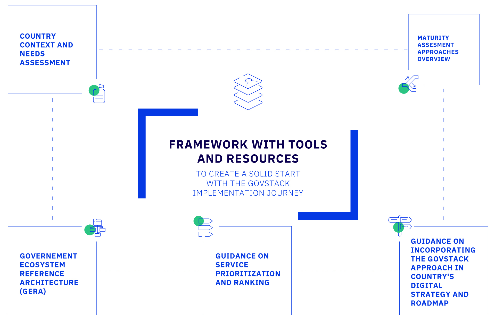

# Building Block specifications

**Building blocks** (BBs) are software modules that can be deployed and combined in a standardized manner. Each building block is capable of working independently, but they can be combined to do much more.

Building blocks are composable, interoperable software modules that can be used across a variety of use cases. They are standards-based, preferably open-source, and designed for scale.

Each building block exposes a set of services in the form of REST APIs that can be consumed by other building blocks or applications.

In this release of the GovStack specification, the following building blocks are specified:

<figure><figcaption></figcaption></figure>

<figure><figcaption></figcaption></figure>

<a href="https://govstack.gitbook.io/bb-information-mediation">Information Mediation</a>

Provides a gateway between external digital applications and other ICT Building Blocks, thereby ensuring interoperability and implementation of standards, which is essential for integrating various ICT Building Blocks and applications.

<a href="https://govstack.gitbook.io/bb-registration">Registration</a>

Records identifiers and other general information about a person, place or other entity, typically for the purpose of registration or enrollment in specific services or programmes and tracking of that entity over time.

<a href="https://govstack.gitbook.io/bb-digital-registries">Digital Registries</a>

Registries are centrally managed databases that uniquely identify persons, vendors, facilities, procedures, products and sites related to an organization, industry or activity.

<a href="https://govstack.gitbook.io/bb-identity">Identity</a>

Enables unique identification and authentication of users, organizations and other entities.

<a href="https://govstack.gitbook.io/bb-payments">Payments</a>

Implements financial transactions such as remittances, insurance claims, product purchases and payments of service fees, along with the logging of related transactional information. It also provides utilities for tracking costs and extracting audit trials.

<a href="https://govstack.gitbook.io/bb-consent">Consent</a>

Manages a set of policies allowing users to determine the information that will be accessible to specific potential information consumers, for which purpose, for how long and whether this information can be shared further.

<a href="https://govstack.gitbook.io/bb-workflow">Workflow</a>

Helps to optimize business processes by specifying rules that govern the sequence of activities to be executed as well as the type of information exchanged in order to orchestrate the process flow from its initiation to completion.

<a href="https://govstack.gitbook.io/bb-messaging/">Messaging</a>

Facilitates notifications, alerts and two-way communications between applications and communications services, including short message service (SMS), unstructured supplementary service data (USSD), interactive voice response (IVR), email and social media platforms.

<a href="https://govstack.gitbook.io/bb-scheduler/">Scheduling</a>

Provides an engine for setting up events based on regular intervals or specific combinations of status of several parameters in order to trigger specific tasks in an automated business process.

