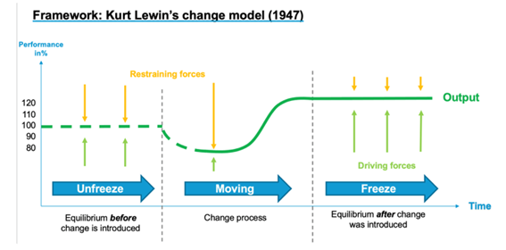

# Change Management Models

## Change models and digital change

At a conceptual level there is little that is truly new about how governments adopt digital change, as compared with other kinds of change. Various theoretical models have been developed to understand different types of change, from Kurt Lewin's change model (1947) through to Mark Moore's strategic triangle (1995) and John Kotter's (1995) model. The study of change management began between 1900 to 1945, and from 1945 to 1990, studies improved to understand the mechanisms associated with change. Between 1990 and 2000 change management was established as an academic discipline. This discipline progressed to deepening and modelling concepts and tools from 2000 to 2010, and currently, the focus is on improving the internal capacities of individuals, teams and organizations.

Numerous studies have examined attempts to introduce digital era change in governments around the world. As of today, there are powerful tools that can be deployed as an attempt to overcome the range of barriers to change. However, the effective use of these tools necessitates competencies for the [digital team](../annex/sample-digital-team-composition.md), especially for those in managerial, innovation, and change management roles.

There is no universal model for implementing significant digital change in governments.  Even though there are competing ideas about 'what matters most', we are still away from having clarity on the 'winners'. Nonetheless, some generalizable insights such as geographic, cultural, or sectorial interests, can always be applied in similar contexts,&#x20;

Digital era government is not just about developing new practices and capabilities. It involves a larger question of whether new practices and technologies will lead to a rethinking of how government institutions are structured and managed. The theories of change towards a 'digital government as a platform' approach are relevant to the digital transformation that governments seek to implement, and this approach is an integral part of the digitization journey.

### Models of strategic change management

Various theories have been developed regarding change management, including those proposed by Kotter, Prosci, and Lewis, among others. These theories have been instrumental in providing a comprehensive understanding of the nature of change and in enabling organizations to manage change effectively without disrupting their operations. They help organizations identify the need for change and assess the driving factors behind it.



Lewin's program for planned change and improved performance involves a three-phase process of behavior modification.&#x20;

The framework proposes that organizations and their routines need to be "**unfrozen**" in the first phase, which involves reducing the forces that maintain the behavior in its present form and recognizing the need for change and improvement.&#x20;

The second phase, **Movement**, entails the development of new attitudes or behavior and the implementation of change. However, there may be restraining forces that work against the driving forces for change.&#x20;

In the final phase, after the change process has been implemented, the new routines and procedures are frozen again, ideally stabilizing the change at the new level and reinforcing it (Hardy, 1996).

<figure><figcaption>
<em>Kurt Lewin's change model (1947)</em>
</figcaption></figure>



The second change framework refers to the three phases of change (prepare, manage and reinforce change). This framework is closely aligned with the previous framework and is oftentimes used in practice:

<figure><figcaption>
<em>Implementing organizational change: preparing, managing, and reinforcing change</em>
</figcaption></figure>



Kotter’s research presented a novel approach to change management. He suggested that organizations should create a new culture where managers view change as an opportunity and modify their business systems to meet continuously emerging conditions [(Hussey, D.E. (2000). How to Manage Organisational Change (Vol. 28). Kogan Page Publishers: London).](https://books.google.ee/books?hl=en\&lr=\&id=vpJLQHlN-BQC\&oi=fnd\&pg=PA108\&dq=\(Hussey,+D.E.+\(2000\).+How+to+Manage+Organisational+Change+\(Vol.+28\).+Kogan+Page+Publishers:+London\).\&ots=ma7aLM5GH\_\&sig=BpXyijIiHFIyaR\_EWlZSvsHGKfw\&redir\_esc=y#v=onepage\&q\&f=false)

The following eight steps in the change process are his contribution.

> * Establishing a sense of urgency
> * Forming a powerful guiding coalition
> * Creating a vision
> * Communicating the vision
> * Empowering others to act on the vision
> * Planning and creating short term wins
> * Consolidating improvements and producing still more change
> * Institutionalizing new approaches



Effective change management demands five key goals to form the basic ADKAR model:

> * Awareness of the need to change
> * Desire to participate and support the change
> * Knowledge of how to change (and what change looks like)
> * Ability to implement the change on a day-to-day basis
> * Reinforcement to keep the change in place (Hiatt 2003)

5 tenets emerge from the Prosci´s ADKAR model and assessment tools:

> * Tenet 1: We change for a reason
> * Tenet 2: Organizational change requires individual change
> * Tenet 3: Organizational outcomes are the collective result of individual change
> * Tenet 4: Change management is an enabling framework for managing the people side of change
> * Tenet 5: We apply change management to realize the benefits and desired outcomes of change



As practical result, our GovStack model approach to Change Management includes 6 key stages:

> 1. Set goals
> 2. Make a diagnosis
> 3. Identify profiles
> 4. Defining the strategy
> 5. Driving the change
> 6. Consolidate change



