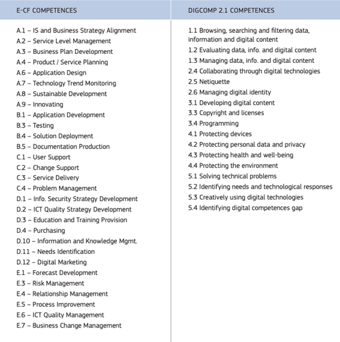

# Skills and Competences

As detailed in the [GovStack Competence Building Module](../learning-and-exchange/capacity-development/academic-support-to-capacity-development.md), the successful implementation of the GovStack Approach requires countries to consider a long-term strategy that accounts for the kind of academic support that is needed to achieve digitalization goals.&#x20;

The latest publication of [DigComp 2.2](https://publications.jrc.ec.europa.eu/repository/handle/JRC128415), presents the consolidated framework of reference in Europe concerning digital competencias, with examples of knowledge, skills and attitudes (Dimension 4) and Use cases (Dimension 5) addressing Change Management. There are equivalent to [e-CF](../learning-and-exchange/capacity-development/academic-support-to-capacity-development.md) E7 Business Change Management L.4-5, and (almost generalised) Change support

<figure><figcaption></figcaption></figure>

<table data-view="cards"><thead><tr><th></th><th></th><th></th></tr></thead><tbody><tr><td>
Learning to learn attitude

Collaboration skills

Communication skills

Business knowledge

Situation Awareness

Innovation skills

Critical thinking

Global understanding Leadership/persuasion
</td><td></td><td></td></tr><tr><td></td><td>
Digital Consultant

Tertiary education, preferably Business School Graduate

</td><td></td></tr><tr><td></td><td>
Technology watching - L.5 Business Plan Development - L.4 Product or Project Planning - L.3 Risk Management - L.3

Business Change Management L.4-5
</td><td></td></tr></tbody></table>

<figure><figcaption>
E-CF - DIGCOMP 2.1 Competences Comparision Table
</figcaption></figure>

CEN/CENELC e-Competences Framework

