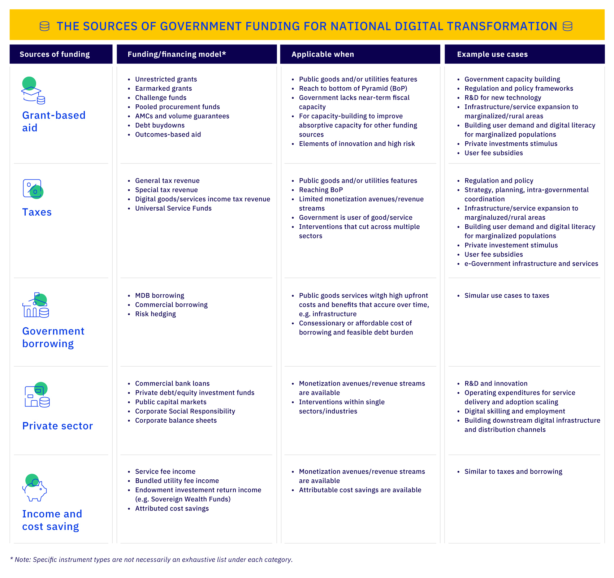

# Financial analysis

To give a comprehensive view of the financial analysis needed for the GovStack implementation, this chapter will look first at the **budgetary approach** covering the sources of government funding for national digital transformation and will then cover the **cost-effectiveness of digital government**.&#x20;



**The sources of government funding for national digital transformation are:**

* **Grant-based aid:** Official/public foreign aid sources, as well as private philanthropic aid sources (grant or non-return-seeking capital providers)&#x20;
* **Taxes:** A country’s own sovereign tax resource base, raised through general or special taxation schemes&#x20;
* **Government borrowing:** Sovereign or municipal/local borrowing, either from commercial capital markets or concessionary sources like multilateral development banks&#x20;
* **Private-sector capital:** Private capital sources including corporates, development finance institutions, and impact investors that provide concessionary but return-seeking capital, and commercial lenders and investors that seek market-rate returns&#x20;
* **Income streams and cost savings:** Operating revenues, income streams, and attributed cost savings generated by an endowment of funds or by an initiative’s operating activities

<figure><figcaption></figcaption></figure>

<figure><figcaption></figcaption></figure>

<figure><figcaption></figcaption></figure>



In June 2019, 284 websites and 91 agencies from across the Australian government were united for the first time under the same content management system, GovCMS ([ITU 2021](https://www.itu.int/en/ITU-D/Regional-Presence/Europe/Documents/Events/2021/Scalable%20e-government%20solutions%20for%20developing%20countries/GovStack\_General%20Info\_v20210705\_ET4C.pdf)). Hosted independently, these websites would have cost A$73 million to operate every year  ([Idem](https://www.itu.int/en/ITU-D/Regional-Presence/Europe/Documents/Events/2021/Scalable%20e-government%20solutions%20for%20developing%20countries/GovStack\_General%20Info\_v20210705\_ET4C.pdf)). Integrated with GovCMS, they cost just A$5.9 million, a cost saving of A$67.1 million  ([Idem](https://www.itu.int/en/ITU-D/Regional-Presence/Europe/Documents/Events/2021/Scalable%20e-government%20solutions%20for%20developing%20countries/GovStack\_General%20Info\_v20210705\_ET4C.pdf)).

One of the key value-adds that GovStack offers is cost efficiency, both in terms of providing a digital government solution and an open source one. According to global consulting firm McKinsey, government digitization “could free up $1 trillion annually in economic value worldwide, through improved cost and operational performance”, with potential cost savings of 60-75% on administrative tasks ([Dilmegani, Korkmaz and Lundqvist, 2014](https://www.mckinsey.com/business-functions/mckinsey-digital/our-insights/public-sector-digitization-the-trillion-dollar-challenge)).

Such economic opportunities are both direct and indirect. On the one hand, government digitisation is associated with resource sharing; improved fraud management; and productivity enhancements. Indirectly, in saving users time (and money), they can also contribute positively to much more wide-ranging economic ramifications. As former Permanent Secretary for the UK Cabinet Office Sir John Manzoni noted back in 2015: **** Changes beneath the surface show themselves in changes to physical locations: fewer, more efficient courtrooms, fewer tax offices, and fewer, bigger, service centres hosting the back offices  [(Govtech Leaders, 2018).](https://www.govtechleaders.com/2018/07/03/government-digital-transformation-saving-costs-through-effective-digital-change/)&#x20;

It is sometimes difficult to compare the costs saved in digital government against a counterfactual baseline. After all, a baseline alternative is not the same as doing nothing. But certainly, it is possible to track the value-add in cost savings of digital government by measuring the change in costs over time for a particular government department. &#x20;

The UK’s Government Digital Service (GDS), a unit of the British Government tasked with transforming the provision of online public services, was launched in 2011 [(Foreshew-Cain 2015).](https://gds.blog.gov.uk/2015/10/23/how-digital-and-technology-transformation-saved-1-7bn-last-year/) Five years on, a GDS blog measured the savings provided to the UK by the digital government, finding a cumulative saving of almost £3.6 billion [(Idem).](https://gds.blog.gov.uk/2015/10/23/how-digital-and-technology-transformation-saved-1-7bn-last-year/) What’s more, these savings were increasing year-on-year, as infrastructure continued to pay increasing dividends [(Idem).](https://gds.blog.gov.uk/2015/10/23/how-digital-and-technology-transformation-saved-1-7bn-last-year/) Compared to a 2009/2010 baseline, £891 million was saved in 2012/13; £978 million in 2013/14; and £1.7 billion in 2014/15 [(Idem). ](https://gds.blog.gov.uk/2015/10/23/how-digital-and-technology-transformation-saved-1-7bn-last-year/)&#x20;

Around a similar time, a report commissioned by Deloitte Australia found that a 20% increase in the number of interactions between government and citizen via digital means could provide “productivity, efficiency and other benefits to government” of almost A$18 billion in real terms [(Deloitte, 2015)](https://www2.deloitte.com/content/dam/Deloitte/au/Documents/Economics/deloitte-au-economics-digital-government-transformation-230715.pdf). Even taking into account additional costs provided by these digital government projects, the report found that “digital transformation deliver\[s] benefits worth around four times as much as they cost” [(Idem).](https://www2.deloitte.com/content/dam/Deloitte/au/Documents/Economics/deloitte-au-economics-digital-government-transformation-230715.pdf)&#x20;

The principle savings for governments from digitalisation projects come from savings in efficiency. A report from the European Union details how “in Denmark, electronic invoicing saves taxpayers €150 million a year and businesses €50 million a year” and how “in Italy e-procurement systems cut over €3 billion in costs”  [(European Commission n.d.).](https://digital-strategy.ec.europa.eu/en/policies/egovernment) It is worth noting that the savings in Denmark are both for governments (and by proxy taxpayers) and end users. Aside from the more intangible benefit of increased trust in public services, the economic value of which is more difficult to consider, there are clear value-adds for end users as well as governments. They shall be detailed below.&#x20;

The cost savings in the context of Denmark and Italy are largely borne out of increased efficiency in services. One crucial differentiator is speed. In Estonia, home to some of the world’s most advanced digital government projects, registering a business online is 14 times faster than the paper-based alternative [(e-Estonia, 2020).](https://e-estonia.com/e-governance-saves-money-and-working-hours/) Fewer manual activities; a lack of duplicated data; and better information sharing through cloud computing all contribute to these increased efficiencies. &#x20;

According to the fact sheet of X-Road, an Estonian digital government project which ensures confidentiality, integrity and interoperability between data exchange parties, there were 2.79 billion queries made to the system last year [(Idem).](https://e-estonia.com/e-governance-saves-money-and-working-hours/) 3% of these were made by citizens  [(Idem).](https://e-estonia.com/e-governance-saves-money-and-working-hours/) Working on the assumption that every request saves 15 minutes (as the factsheet does), this equates to some 2,391 working years saved during 2021 [(Idem).](https://e-estonia.com/e-governance-saves-money-and-working-hours/)The average civil service pay in Estonia last year was €1,851, meaning that through the 3% of citizen queries alone the incremental value of X-Road efficiency was approximately  €53 million [(Idem).](https://e-estonia.com/e-governance-saves-money-and-working-hours/) Elsewhere, a study of e-voting in the country in 2017 found that processing an e-vote could provide close to a 10-fold saving compared to processing paper-based votes [(Idem).](https://e-estonia.com/e-governance-saves-money-and-working-hours/) &#x20;

Of course, X-Road and e-voting are advanced digital government projects. Similar projects would require large amounts of investment, a barrier for those who lack existing digital government infrastructure (especially developing countries). However, simple digital government projects can also provide substantial efficiency savings for governments. In the UK, the shift to electronically produced official papers in the House of Commons led to a 35% reduction on printing costs over the first three years of implementation [(UK Parliament n.d.).](https://www.parliament.uk/site-information/foi/foi-and-eir/commons-foi-disclosures/official-expenditure-/printing-costs-2019/) A report from the Boston Consulting Group found that the average cost of a digital transaction is just 3% of a face-to-face interaction, while a phone interaction is 33% (equivalent studies, such as Norway’s 2012 e-Government program report, reached similar conclusions) [(BCG and Salesforce 2021).](https://web-assets.bcg.com/bf/de/d2a310054cd8891fd7f8cd95452b/the-global-trust-imperative-salesforce-bcg-whitepaper.pdf)&#x20;



A further economic risk associated with digital government is so-called “vendor lock-in”, whereby governments build their systems around a particular vendor to such an extent that the costs of switching to another product or supplier are extremely high. As such, governments are unable to avoid the effects of price increases from vendors. Using open-source software (OSS) like GovStack vastly reduces the risks of vendor lock-in. Though a government could feasibly still be “locked-in” to a system, the risk of a government suffering economically from any increases in price to the solutions that they are using are drastically decreased (since it is a public good, not a for-profit product). The table below indicates areas of cost savings that OSS provides compared to regular digital government projects:&#x20;

| Cost                            | OSS Solutions                                                                                                                                                           |
| ------------------------------- | ----------------------------------------------------------------------------------------------------------------------------------------------------------------------- |
| Research and Development Costs  | Reduced compared to proprietary digital government solutions. Research and Development is required only to consider applying GovStack to specific local circumstances.  |
| Implementation Costs            | Implementation costs remain, though a bank of case studies and tests from other governments will reduce the likelihood of compatibility and integration headaches.      |
| Maintenance Costs               | Reduced compared to proprietary digital government solutions.                                                                                                           |
| Staff Training Costs            | Staff training costs remain.                                                                                                                                            |
| Staff Training Costs            | Switching costs remain.                                                                                                                                                 |

In 2019, an Indian government report found that a business-as-usual approach to digital services in the country would create $500-650 billion in economic value by 2025 ([Idem)](https://www.itu.int/en/ITU-D/Regional-Presence/Europe/Documents/Events/2021/Scalable%20e-government%20solutions%20for%20developing%20countries/GovStack\_General%20Info\_v20210705\_ET4C.pdf). However, in considering a cross-sector collaboration, it said, this number would increase to a potential $1 trillion ([Idem)](https://www.itu.int/en/ITU-D/Regional-Presence/Europe/Documents/Events/2021/Scalable%20e-government%20solutions%20for%20developing%20countries/GovStack\_General%20Info\_v20210705\_ET4C.pdf). Open-source software (OSS), when compared against traditional digital government services, reduces costs in development and maintenance, and further enhances savings borne out of data sharing efficiencies.&#x20;

In fact, the European Commission estimated last year that a 10% increase of OSS contributions in Europe would generate an annual additional 0.4% to 0.6% GDP [(European Commission 2022).](https://digital-strategy.ec.europa.eu/en/library/study-about-impact-open-source-software-and-hardware-technological-independence-competitiveness-and) According to the report, companies invested approximately €1 billion into OSS in 2018, resulting in an impact on the European economy of between €65 and €95 billion [(Idem).](https://digital-strategy.ec.europa.eu/en/library/study-about-impact-open-source-software-and-hardware-technological-independence-competitiveness-and) Even accounting for costs, the cost-benefit ratio of such projects stood above 1:4 [(Idem).](https://digital-strategy.ec.europa.eu/en/library/study-about-impact-open-source-software-and-hardware-technological-independence-competitiveness-and)&#x20;



Despite the savings provided by the increased efficiency of digital government, there are a number of costs associated with such projects.&#x20;

As well as research and development (R\&D) and implementation costs, digital government also requires system maintenance and for staff to be trained in how to use and manage the new systems. While staff retraining may help prevent redundancies and will ensure a digitally skilled workforce, both the direct costs of training and the opportunity costs of work that could have been done during the training time will be incurred. &#x20;

Ensuring a digitally literate population is also an indirect cost of implementing government services. Several high-profile digital government projects, often to do with welfare or tax payments, have been criticized for excluding those not digitally literate. In implementing digital government services, costs will be incurred through organizing either casual educational programs; professional training; teaching in schools; or night classes to produce a digitally literate population. &#x20;

There are further economic risks associated with the implementation of digital government projects. A joint study by McKinsey and Oxford University found that public-sector IT projects were six times more likely to experience cost overruns and 20 percent more likely to run over schedule than private-sector equivalents [(Dilmegani, Korkmaz and Lundqvist 2014).](https://www.mckinsey.com/business-functions/mckinsey-digital/our-insights/public-sector-digitization-the-trillion-dollar-challenge) &#x20;



The costs associated with the implementation of digital governments are offset by a significant increase in efficiency and concomitant reduction of costs across different contexts, especially in the long run. To estimate increases in efficiency and time savings for both governments and citizens, it is crucial to have an appropriate **framework for performing cost efficiency and effectiveness measurements** in place.&#x20;

The three-phase process below – inspired by the UK Government Digital Service’s good practices, can be used for that purpose:

<strong>Discovery Phase: Establishing the Baseline</strong>

1.  **Assessing the Current State of Play.**

    It is first necessary to define the specific problem that is aimed to be solved within your local and/or national community. It could be, for example:

    * poor user experiences that cause people to use less cost-effective channels
    * inefficient or time-consuming processes
    * legacy systems that need replacing&#x20;
2. **Estimating current costs, or deficit in benefits that you are attempting to do.** Despite their importance, contextual considerations and performance measurement are only indirectly associated with “estimating current costs, or deficit in benefits that you are attempting to do”.&#x20;

Pre-Project Phase: Estimations of the cost-effectiveness (<a href="https://www.gov.uk/service-manual/measuring-success/measuring-service-benefits">GOV.UK Service Manual</a>)

1. **Estimating Potential Benefit.**&#x20;

It can be helpful to break down these benefits into direct, indirect, and wider economic benefits and answer the following questions.&#x20;

* How much money do you expect to save?&#x20;
* Where are your direct savings? Direct savings include cashable benefits, or those changes that will directly result in your organization having more money to spend (through savings or additional revenues).&#x20;
* Where are your indirect savings? Indirect savings don’t necessarily lead to any immediate benefits, but instead prevent additional costs later down the lines (like additional procurement costs).&#x20;
* What are the wider economic benefits generated from the project? Wider benefits, often harder to quantify, include things like saving users time or increased user satisfaction.&#x20;

**2. Quantifying and Calculating Costs**&#x20;

When you’re estimating costs, think about the number of people you might need and their salary costs, whether you’ll need any non-civil servant support and any implementation costs, any additional infrastructure equipment (office space, for instance), training costs, overheads, research and development, and other relevant costs.

However, there are also indirect costs of implementing government services, like ensuring a digitally literate population. In implementing digital government services, costs will be incurred through organizing either casual educational programs, professional training, teaching in schools, or night classes to increase digital literacy rates.&#x20;

A good total estimation of total costs will allow you to work out the cost per transaction by dividing the total cost by the number of transactions.&#x20;

&#x20;**3. Performing a Sensitivity Analysis**&#x20;

Sensitivity Analysis relates to the human nature to overestimate things: a so-called “optimism bias”. It is important to be realistic about what benefits you can deliver given your budget and the amount of time you have.&#x20;

* In performing a sensitivity analysis, you should think about all possible outcomes. What would happen, for example, if take up of your service was as high or as low as it could conceivably be?&#x20;
* The second part of the analysis is challenging your assumptions. Estimating current costs and wider benefits might involve several assumptions. What contexts are they grounded in? What predictions do they make about the future, and what would happen if the future was actually different?&#x20;

Monitoring and Evaluation Phase

Work out the difference between the baseline figure that you identified during discovery and the estimate of how much you have been able to improve things by. &#x20;

The Digital Impact Alliance has[ developed a framework](https://procurement.dial.global/category-framework/) that can be adopted for this purpose. On a basic level:

1. Calculate the actual costs and benefits. From this figure, you can work out a cost-benefit ratio, return on investment, internal rate of return, net present value, and payback period.
2. Identify strengths and weaknesses of your implementation and iterate accordingly

