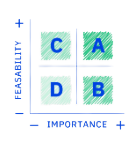

# CMS, Somalia

## The problem

Currently, multiple government websites provide an inconsistent user experience when accessing information about government services. Somalia wanted a one-stop-shop for citizens to access all digital government services in one place allowing its users to navigate to service information sheets in a user-friendly, easy-to-understand, and consistent manner.

## GovStack approach

* Perform a digital readiness assessment
* Identify priority e-government services based on the country's context and needs.
* Co-design the digital service based on user needs, journeys, and business life events
* Identify a DPG/digital product that meets the business requirements of Somalia to integrate it with the national tech stack of Somalia
* Train the Djibouti digital team on [GovStack Building Block approach](https://govstack.gitbook.io/implementation-playbook/govstack-implementation-playbook/2-description/building-block-approach).

## Roadmap

<table><thead><tr><th width="105"></th><th></th></tr></thead><tbody><tr><td></td><td>Apr 2023: Prioritisation of government service: Content Management System</td></tr><tr><td></td><td>Apr 2023: Workshops to understand user needs</td></tr><tr><td></td><td>May 2023: Map As-Is user journey, life/business events and current stack</td></tr><tr><td></td><td>Aug 2023: Co-design w/user a To-Be user journey, future stack &#x26; wireframes</td></tr><tr><td></td><td>Sep 2023: Launch <a href="https://www.leverist.de/en/app/opportunities/call-for-digital-products-to-manage-issuance-of-construction-permits-in-djibouti-using-the-govstack-building-block-approach?force_preview=1">Open call for digital product</a></td></tr><tr><td></td><td>Nov 2023: Select digital product and service provider to implement</td></tr><tr><td></td><td>Dec 2023 - Jun 2024: Integrate selected digital product with national stack (ID, Payment, IM) according to service design proposal &#x26; GovStack prototype</td></tr><tr><td></td><td>TBD : Launch the service &#x26; update iteratively with the user feedback</td></tr><tr><td></td><td>TBD : Prepare a scaling strategy</td></tr></tbody></table>

### Expected Results

* Digital readiness assessment&#x20;
* An operational CMS integrated with the Somalia national tech stack following the GovStack principles and approach.
* Train the Somalia Digital Team&#x20;
* Build a comprehensive capacity development and change management program
