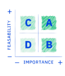

# Extended Producer Responsibility, Rwanda

## The problem

Improper disposal of e-waste poses numerous threats to the environment, economy, and health and well-being of citizens. Rwanda wanted to implement a legally transparent, digitally supported, and appropriately financed EPR digital service for the management of e-waste.

## GovStack approach

1. Completion of EPR regulatory framework for e-waste management in Rwanda
2. Co-design the [EPR digital service](https://govstack.gitbook.io/use-cases/readme/env-1-extended-producer-responsibility-epr) based on user needs, journeys and business life events
3. Co-design the financial mechanism that producers must pay on Electrical and Electronic Equipment (EEE) that is placed on the market in Rwanda to finance the sound management of e-waste.

## Roadmap

<table><thead><tr><th width="105"></th><th></th></tr></thead><tbody><tr><td></td><td>Apr 22 Prioritisation of government service: EPR</td></tr><tr><td></td><td>May - July 22 Workshops to understand user needs</td></tr><tr><td></td><td>July - Aug 22 Map As-Is user journey, life/business events and current stack</td></tr><tr><td></td><td>Nov 22 - Feb 23 Co-design w/user a To-Be user journey, future stack &#x26; wireframes <a href="https://docs.google.com/presentation/d/1ccGtd9eAQPtPZtgwCcCg3uk8lwbhHfEJ/edit?usp=sharing&#x26;ouid=107531587157017296326&#x26;rtpof=true&#x26;sd=true">(Validated service design)</a></td></tr><tr><td></td><td>Mar - Sept 23 Evaluation of possible Digital Public Goods (DPG) to digitize the service</td></tr><tr><td></td><td>Nov 7-8 23 EPR blueprint for electronics event</td></tr></tbody></table>

## Expected results

* A forward-looking e-waste regulation that will allow electronic producers to finance the collection, recycling, and end-of-life disposal of e-waste equipment/product streams.&#x20;
* Facilitate compliance with e-waste regulation through EPR digital service.&#x20;
* Contribute to the digitization roadmap by scaling the GovStack Building Block approach used in EPR for the rest of the services in the digitization roadmap of Rwanda.
