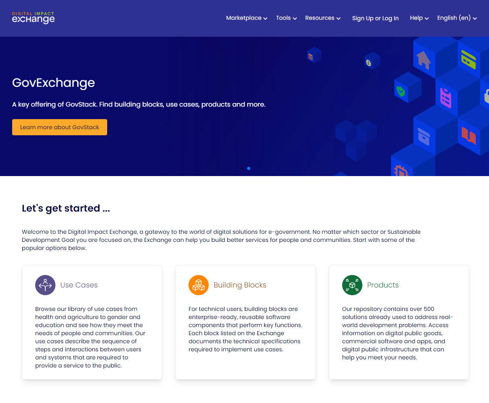

# GovExchange

GovExchange links organizations with opportunities, through features like:

* [RFP Radar](https://exchange-dev.dial.global/opportunities): Aggregates requests from organizations, allowing vendors to explore a wide range of opportunities in one convenient location. RFP Radar provides unprecedented visibility into the digital landscape and links vendors with opportunities that fit their expertise.&#x20;
* [Storefronts](https://exchange-dev.dial.global/storefronts): The online storefronts provide vendors with a dedicated marketing space to highlight their products and services. It enables them to engage with potential customers, establish credibility, and expand their reach.&#x20;
* [Comparison tool for platforms/software/solutions](https://exchange-dev.dial.global/): Allows organizations to make informed product decisions. This powerful product comparison tool enables the evaluation of multiple solutions side by side by Comparing their features, functionalities, and maturity scores to find the perfect match for requirements.

<figure><figcaption>
<a href="https://exchange.dial.global/">GovExchange</a>
</figcaption></figure>



* Browse the library of use cases from multiple sectors ranging from agriculture to education on GovExchange. Identify use cases that are most relevant to your service and get inspired by their sequence of steps, generic workflows, and Building Blocks utilized.
* Search the library of digital products/Digital Public Goods that meet the requirements of your use case/services. While reviewing, keep an eye on the alignment rating of the digital products/Digital Public Goods with the GovStack building Block Technical Specifications.
* Publish/share tenders for&#x20;
  * identification of Digital Public Goods/Digital Products to integrate into the national stack
  * implementation of services using the national stack



Who does what:

* [Procurement Manager](https://govstack.gitbook.io/implementation-playbook/govstack-implementation-playbook/sample-digital-team-composition/govstack-user-profiles-taxonomy#procurement-manager) - Publish/share RFPs/ToRs for&#x20;
  * digital products/Digital Public Goods to be integrated in the national stack, and
  * implementation of a digital service using the national stack
* Product owners - Review and make decisions on vendors that show interest and match the requirements as mentioned in RFPs/ToRs
* Vendors/implementors of digital products/Digital Public Goods - Review the RFQs/ToRs for projects that are relevant to your area of expertise and express interest/submit proposals
* Service designer - Find the reference use cases that are most relevant to your service (ease your search by filtering the use cases based on the SDG they target and the sector they belong to) and refer the steps, generic workflows and Building Blocks involved in the said use case



* Request for Proposals/Terms of References for:
  * digital products/Digital Public Goods
  * implementation of a digital service
* Expression of interest/submission of proposals for the aforementioned RFPs/ToRs



