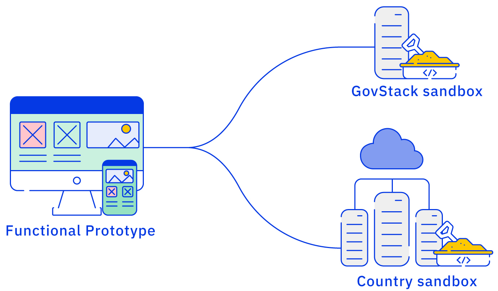

# Prototype

## Develop, test, and iterate a functional prototype.

Once the wireframe and/or voice command flow is approved, we are ready to start developing and orchestrating a functional prototype of the service. Digital teams can either use GovStack sandbox or their own infrastructure. Since GovStack is currently in the process of developing the sandbox, future versions of the playbook will describe the processes to use GovStack sandbox to deply the functional prototype.&#x20;

In case the functional prototype is decided to be deployed on the country sandbox the functional prototype can be configured following GovStack enterprise architecture. Additionally, resources such as the Test script template, QA templates, and more (these resources will be added in the playbook as and when they are developed) will be useful when deploying the functional prototype on GovStack or country sandbox.

<figure><figcaption>
Options for countries to delpoy the functional prototype.
</figcaption></figure>



A good functional prototype of the service …

* Complies with the approved 'To-be user journey' and wireframe and/or voice command flow
* Complies to Country digital service design standards. This includes standards for:&#x20;
  * [Service information sheet](https://govstack.gitbook.io/implementation-playbook/govstack-implementation-playbook/learning-and-exchange/artefacts#information-service-sheets)
  * [Downloadable forms](broken-reference)
  * [Web forms](broken-reference)
  * [Electronic documents](broken-reference)
  * [Notifications](broken-reference)
  * [Performance analytics](broken-reference)
  * [Citizen satisfaction survey](broken-reference)
  * [Accessibility ](broken-reference)
* Complies with Country enterprise architecture, including digital security protocols approved by the country technical team&#x20;



How to get there:

* Develop Product and Technical specifications for the service.
* Develop the front end and back end of the service according to the Product and Technical specifications and approved wireframes and/or voice command flow. &#x20;
* Develop a test script considering all the branches of "to-be" user journey. &#x20;
* Prepare the security and quality assurance checklist &#x20;
* Prepare the digital service release plan &#x20;
* Prepare the stabilization and maintenance routine &#x20;
* Launch the functional prototype to a limited set of citizens/business users, admins, and public officials.&#x20;
* Collect their feedback on the functional protoype and identify concreet steps to improve it.
* Go through a limited set of iterations to deliver a functional prototype that meets the requirements and needs of citizens/business users, admins, and public officials



Who does what

* [Service designer](https://govstack.gitbook.io/implementation-playbook/govstack-implementation-playbook/annex/govstack-user-profiles-taxonomy#service-designer) – Lead the service co-design journey&#x20;
* Product Owner – Lead software product development according  to the service blueprint &#x20;
* [Front-end developer](https://govstack.gitbook.io/implementation-playbook/govstack-implementation-playbook/annex/govstack-user-profiles-taxonomy#front-end-developer) – Develops front-end applications following UX/UI style guide &#x20;
* [Solution architect](https://govstack.gitbook.io/implementation-playbook/govstack-implementation-playbook/annex/govstack-user-profiles-taxonomy#solution-architect) – Architects the service according to the BB integration plan &#x20;
* [Back-end developer](https://govstack.gitbook.io/implementation-playbook/govstack-implementation-playbook/annex/govstack-user-profiles-taxonomy#back-end-developers) –  Adjust BB, connects legacy systems, and test the application&#x20;
* [Digital security manager](https://govstack.gitbook.io/implementation-playbook/govstack-implementation-playbook/annex/govstack-user-profiles-taxonomy#digital-security-manager) - validates compliance with digital security policy
* [Cloud architect](https://govstack.gitbook.io/implementation-playbook/govstack-implementation-playbook/annex/govstack-user-profiles-taxonomy#cloud-architect) - Designs cloud strategy and microservices architecture that supports the digitalisation of government services



Since GovStack is starting it's reference implementations in countries, the following resources will be linked as soon as they are generated:

* GitHub repository with code documented according to Country Digital Service Standard
* Front-end design manual &#x20;
* Admin manual &#x20;
* User manual &#x20;
* Solution architecture manual&#x20;
* Test plan & results report &#x20;
* Security & QA checklists & results report &#x20;
* Training plan and support strategy per role &#x20;
* Release plan &#x20;
* Stabilization and maintenance routine &#x20;



* Prepare the migration plan for the functional protoype into production environment&#x20;
* Prepare the launch of service.
* Stabalize the service



Since GovStack is starting it's reference implementations in countries, the following resources will be linked as soon as they are generated:

* LMS Modules: [1](../learning-and-exchange/govlearn.md#awareness-building-and-expression-of-interest),[2](../learning-and-exchange/govlearn.md#agreement-of-cooperation),[3](../learning-and-exchange/govlearn.md#govstack-internal-kick-off)   &#x20;
* Test scripts &#x20;
* QA sequence
* Cutover plan



