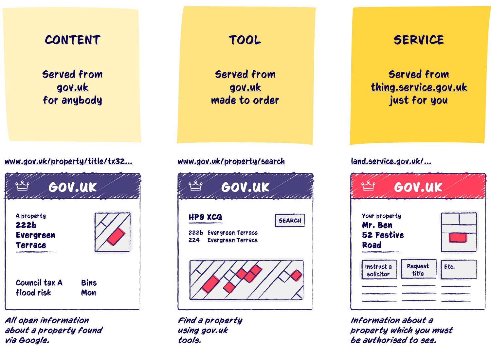

# Wireframes

## Make wireframes and/or voice command flow

Within this stage we create a testable design based on a thorough understadning of users’ expectations and ''to-be'' user journey. Sketching, wireframes and/or voice command flow will help you ensure your service reflects your users’ needs. It is a reprsentation of a realistic form and functional service.&#x20;

<figure><figcaption>
Gov.uk sketch example
</figcaption></figure>

Wireframes and/or voice command flow enables direct examination of a design concept’s viability with users. It is helpful for gaining feedback on users’ intentions and various design elements and observing users interaction with the product.&#x20;

The following are the wireframes developed for the Extended Producer Responsibility service in Rwanda.





A good wireframes and/or voice command flow requires:

* Building on preliminary Lo-Fi [wireframes and/or voice command flow ](../learning-and-exchange/artefacts.md#wireframes-and-or-voice-command-flow)that show structure, placement, and hierarchy for your service. &#x20;
* Steering clear of font choices, color, or other elements that would distract both the researcher and the reviewer. Lightweight designs are conceptually easier to reconfigure. Use this opportunity to start listing what UX/UI patterns you will need.&#x20;
* Reviewing [wireframes and/or voice command flows](../learning-and-exchange/artefacts.md#wireframes-and-or-voice-command-flow) according to the specific 'To-be' user journey to ensure users accomplish their goles and their needs are meet.&#x20;
* Using the [wireframes and/or voice command flow](../learning-and-exchange/artefacts.md#wireframes-and-or-voice-command-flow) to get the team’s feedback on feasibility and structure.&#x20;
* Using [wireframes and/or voice command flow](../learning-and-exchange/artefacts.md#wireframes-and-or-voice-command-flow) as a way of safely trying out more radical ideas.   &#x20;



The following actions are recomended in developing a prototype.&#x20;

* Create a preliminary version of the service using a [wireframes and/or voice command flow](../learning-and-exchange/artefacts.md#wireframes-and-or-voice-command-flow)
* Give the [wireframes and/or voice command flow ](../learning-and-exchange/artefacts.md#wireframes-and-or-voice-command-flow)to the user (Citizen/public servent /business) and public official user to observe their interactions without instruction.&#x20;
* After this observation, ask them to perform a specific task.&#x20;
* Ask clarifying questions about why they do what they do. Let the user’s behavior guide the questions you ask. It can be helpful to have them narrate their thought process as they go along.&#x20;



Who does what&#x20;

* [Service designers](../annex/govstack-user-profiles-taxonomy.md#service-designer)/ Design lead – Lead the activites within the 'Activities' Tab.
* [User needs researchers](broken-reference) – Prepare & apply user interviews, focus groups, facilitates user journey workshops &#x20;
* [Legal policy officer](../annex/govstack-user-profiles-taxonomy.md#legal-policy-officer)– Clarify regulations that apply to the service &#x20;
* [UX/IU Designers](broken-reference) – If the service under analysis is already online, UX/UI designers can join the co-design sessions to have firsthand interaction with the users &#x20;
* [Product/Tech experts](../annex/govstack-user-profiles-taxonomy.md#back-end-developers)  - If the service under analysis is already online, Product/Tech team members can participate in the iteration session with users to see reaction to white-frame prototype &#x20;



* [Wireframes and/or voice command flow](../learning-and-exchange/artefacts.md#wireframes-and-or-voice-command-flow) &#x20;
* Apply the country digital service design standards.This includes standards for:
  * [Service information sheet](https://govstack.gitbook.io/implementation-playbook/govstack-implementation-playbook/learning-and-exchange/artefacts#information-service-sheets)
  * [Downloadable forms](broken-reference)
  * [Web forms](broken-reference)
  * [Electronic documents](broken-reference)
  * [Notifications](broken-reference)
  * [Performance analytics](broken-reference)
  * [Citizen satisfaction survey](broken-reference)
  * [Accessibility ](broken-reference)



What to do next

* Iterate! Wireframes and/or voice command flow should be quick and painless to create, and even more quick and painless to discard.&#x20;
* Get service owner approval to proceed with the functional prototype &#x20;
* Start work on functional prototype.



* LMS Modules: [1](../learning-and-exchange/govlearn.md#awareness-building-and-expression-of-interest),[2](../learning-and-exchange/govlearn.md#agreement-of-cooperation),[3](../learning-and-exchange/govlearn.md#govstack-internal-kick-off) &#x20;
* [Gov.uk Design system](https://design-system.service.gov.uk/community/resources-and-tools/)&#x20;
* [Be creative and think out of the box. Feel free to use Gov.uk sketches template](https://designnotes.blog.gov.uk/2014/05/22/gov-uk-sketching-templates/)&#x20;
* [Beginner's Guide | Mockitt Tutorial](https://www.youtube.com/watch?v=X5HVZQ9Nii4)&#x20;


