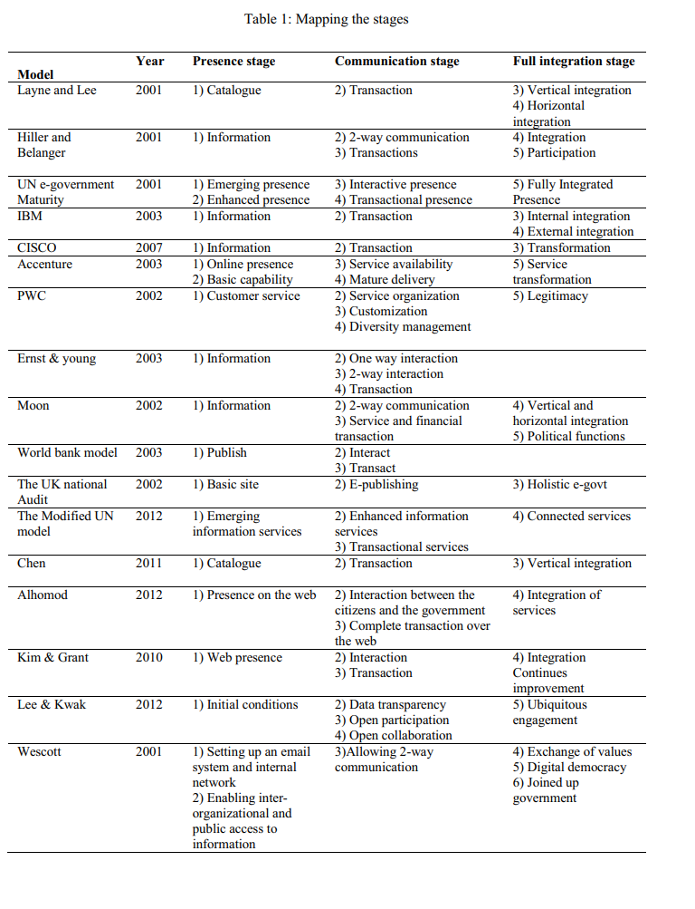
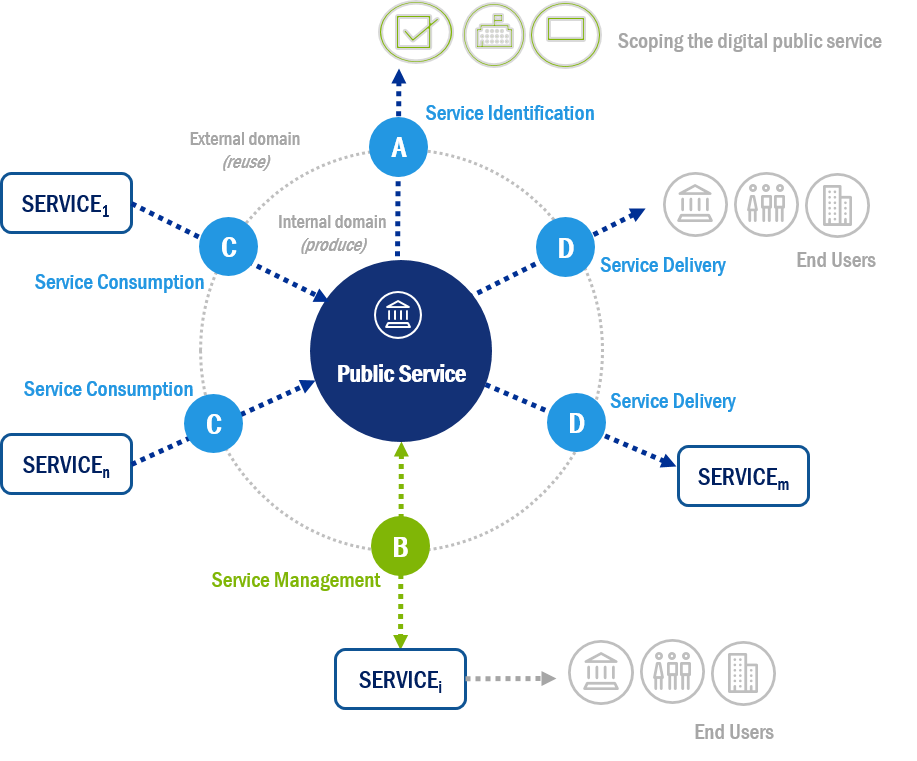

# Maturity assessment

1. There is an abundance of different approaches:  [https://bura.brunel.ac.uk/bitstream/2438/13415/1/Fulltext.pdf](https://bura.brunel.ac.uk/bitstream/2438/13415/1/Fulltext.pdf) Comparing and Contrasting e-Government Maturity Models: A Qualitative-Meta Synthesis, 2016&#x20;

<figure><figcaption></figcaption></figure>

2\. Probably the most suitable study for GovStack: E-Government Maturity Model for Sustainable E-Government Services from the Perspective of Developing Countries, [https://doi.org/10.3390/su10061882,](https://doi.org/10.3390/su10061882,) 2018&#x20;

One of the key differences between the proposed model and existing models was the inclusion of adoption stages to acquire participation from stakeholders. The figure below describes the importance of accommodating adoption stages in maturity models, and provides a roadmap for governments to achieve wider acceptance from stakeholders.&#x20;

<figure><figcaption></figcaption></figure>

This model considered four implementation stages and emphasized the integration of e-government systems before invoking the transaction stage. The stages and the tasks under those stages were identified and are discussed below to provide a detailed plan for e-government implementation.&#x20;

Stage 1: Basic Services&#x20;

The initial stage proposed by the maturity model was to introduce basic e-government services. Unlike existing e-government maturity models, the proposed model emphasized using social media and establishing a web presence to communicate with stakeholders. Use of social media (i.e., Facebook, Twitter, YouTube, LinkedIn, etc.) is great to reach out to masses of people. This stage explained how governments could gain trust from citizens by addressing their queries through a web presence. Furthermore, this stage supported governments in developing awareness among stakeholders in relation to e-government services. The activities needed to be performed to achieve this stage were identified by the maturity model and are listed below.&#x20;

Activity 1: Computerization of the government departments&#x20;

The first step of the initial stage of e-government implementation was to computerize government departments. Governments are to provide appropriate training to their employees in order to operate computers and basic computer applications used in government offices. Along with computers, other hardware devices, such as printers, scanners, and storage devices are also to be installed. Government departments and offices are also to connect to the internet.&#x20;

Activity 2: Cataloguing the information&#x20;

Once governments have computerized their departments, they are to start cataloguing data they hold in paper format. Governments are to then transfer hardcopies of the data held by government offices into a digital format.&#x20;

Activity 3: Website development & social media presence&#x20;

Along with the cataloguing of information, governments are to start developing websites and establishing social media presence. Social media, such as Facebook, Twitter, YouTube, and LinkedIn are suggested as effective approaches to reaching an increased number of stakeholders.&#x20;

Activity 4: Building awareness&#x20;

Along with all the above activities, governments are to emphasize a program for the development of awareness. Governments are to have the responsibility of developing the skill and expertise of government employees, and of educating stakeholders about e-government initiatives.&#x20;

Stage 2: Streamlined Services&#x20;

The maturity model emphasized streamlining e-government services for their sustainability. Streamlined services were defined as complete and integrated services, where stakeholders could acquire specific government services without having to visit relevant government offices. This would require the integration of e-government systems into various government departments. Integration is to be done along with the establishment of the electronic government infrastructure in order to save government resources, and to avoid the risk of data replication, as shown in figure. Without vertical integration, governments could end up with several individual fragmented electronic government applications and data repositories. Vertical integration would interconnect government departments that shared similar interests in order to avoid data replication, and to enhance service delivery. Furthermore, streamlined government services would eliminate the manual data processing layers from various government departments. This has high implications in the context of developing countries, where citizens have poor access to ICT tools, integrated databases, and authentication systems which would allow local government officials to better serve them. Therefore, we emphasized the integration of the disparate and individual databases and applications before moving to the transaction stage.&#x20;

<figure><figcaption></figcaption></figure>

The tasks required to achieve streamlined e-government services were identified by the maturity model and are listed below.&#x20;

Activity 1: Enhance networking and connectivity&#x20;

The primary task for the government to establish interconnection between government departments would be to build effective networking for reliable connectivity. Governments are to establish wired (fiber-optic or cable) and wireless connectivity to achieve this interconnection.&#x20;

Activity 2: Establish an interoperability framework&#x20;

An interoperability framework is to be developed allowing systems in various government departments to communicate effectively.&#x20;

Activity 3: Identify integration platforms&#x20;

It would be challenging for developing countries to achieve interconnectivity as it would require an excellent and reliable networking infrastructure. Therefore, developing countries could consider cloud-based integration as a potential solution of government integration at various levels without the need of a physical networking infrastructure.&#x20;

Stage 3: Transaction Services&#x20;

This maturity model proposed transaction services at the third stage. All existing e-government maturity models considered transactional services at the second stage. In contrast, we placed this stage after the integration stage. It can be argued that, without achieving integration, transactional services cannot be delivered efficiently. The integration of government departments and e-government services would allow various departments to communicate in real time, avoiding any delays in the processing of payments. At this stage, governments would establish a payment gateway, allowing stakeholders to acquire services online, and would also establish an effective communication mechanism, allowing governments to become more interactive. The tasks required to achieve the transactional stage were identified and are listed below.&#x20;

Activity 1: Government legislation for electronic data processing&#x20;

Governments are to introduce legislations and regulations in relation to electronic data processing and the validity of electronic transactions in order to make electronic transactions legitimate and to build trust among stakeholders.&#x20;

Activity 2: Establish a verification mechanism&#x20;

To provide real-time e-government services, governments are to have mechanisms in place verifying data and identities of users. Verification could be fully automated, or manually automated in the case of complex information. User identity documents (IDs), voter IDs, driving licenses, or passports could be used for identity verification.&#x20;

Activity 3: Establish a payment gateway&#x20;

This would be the most important activity required by governments to provide fully functional e-government services. Governments in developing countries could establish private business partnerships for payment processing, and could integrate online banking or mobile banking for government services so that users could make financial transactions.&#x20;

Activity 4: Roll out online services&#x20;

Once governments have established online documents, transaction verification services, and payment gateways, they are to offer the services online.&#x20;

Stage 4: Automated Services (One-Stop Shops and E-Democracy)&#x20;

Automation is the fully mature state of e-governments where users are proactively involved in government activities. In this state, government services are transformed from a push to a pull (demand-driven) format. E-government services also become smarter, synchronize with user accounts, and provide automated services, such as text reminders regarding unpaid bills, license and ID renewals, etc. The tasks required to achieve this stage were identified and are listed below.&#x20;

Activity 1: High-level integration&#x20;

Governments are to establish high-level integration where departments are vertically (same department at various levels) and horizontally (various departments at various levels) integrated. All government departments are to share data, avoiding any middle layers, making the system smarter.&#x20;

Activity 2: One-stop shop&#x20;

Governments are to develop single-window government portals, allowing stakeholders to access all available government services from one place. Governments are to provide unique IDs to registered users, which are to be used to access all e-government services.&#x20;

Activity 3: Synchronization&#x20;

Governments are to synchronize user data with government systems to provide tailored services to stakeholders. User accounts are to be synchronized with calendars to provide important dates that users are to act on (e.g., permit renewals, tax payments, social security payments, etc.).&#x20;

3\. Also see, how Gartner describes the levels of maturity: Gartner [https://www.gartner.com/smarterwithgartner/5-levels-of-digital-government-maturity, ](https://www.gartner.com/smarterwithgartner/5-levels-of-digital-government-maturity,)2017 &#x20;

Level 1 — Initial (E-Government) \
At this level, the focus is on moving services online for user convenience and cost savings, but data and its uses are siloed and extremely limited. “If the organizational view is that a high percentage of online services or mobile access represents a modern digital government, then more education and advocacy is needed to show what real digital government looks like, and its benefits,” said Di Maio. “To make the case for advancement, create case studies explaining how digital transformation will ease or remove high-priority pain points for the organization.”&#x20;

Level 2 — Developing (Open) \
Level 2 is not necessarily subsequent to level 1. E-government and open government programs often coexist, with different leadership and priorities. Open government often takes the form of public-facing programs intended to promote transparency, citizen engagement and the data economy. Examples we see today are nascent open data initiatives, often in the context of [smart city programs](https://www.gartner.com/newsroom/id/3545018) such as the [Copenhagen Data Exchange](https://www.citydataexchange.com/#/home).&#x20;

Level 3 — Defined (Data-Centric) \
On this level the focus shifts from simply listening to citizen or user needs to proactively exploring the new possibilities inherent in strategically collecting and leveraging data. The key performance indicators here are “how much of our data is open?” and “how many of our applications are built on open data?” It’s tempting at this point to engage in vanity projects or skip ahead before the proper groundwork is laid; it’s paramount to remain focused on designing and implementing data-centric strategies and processes.&#x20;

Level 4 — Managed (Fully Digital) \
By this level, the organization, agency or department has fully committed to a data-centric approach to improving government, and the preferred approach to innovation is based on open data principles. Data flows regularly across organizational boundaries, leading to easier interactions and better services for constituents. It’s possible at this stage to encounter privacy-related backlashes, as citizens can be uncomfortable with how their data is being collected and used. Therefore, it is important to ensure that data is used within existing norms and regulations, and that this is clearly communicated.&#x20;

Level 5 — Optimizing (Smart) \
At this point, the process of digital innovation using open data is embedded deeply across the entire government, with buy in and leadership from the top tier of policymakers. The innovation process is predictable and repeatable, even in the face of disruptions or sudden events that require rapid responses.&#x20;

4\. Comparison of mainstream frameworks used in IT: The CMMI and ITIL frameworks use a 5-point maturity scale, and COBIT adds another step to the scale, also describing the 0-level in the model. A summary of the maturity scale of the frameworks examined and the keywords corresponding to the maturity levels is given in the Table below:

<figure><figcaption></figcaption></figure>

For  maturity models fod ITSM see also: [https://www.bmc.com/blogs/maturity-model-itsm/](https://www.bmc.com/blogs/maturity-model-itsm/)  (based on ITIL)&#x20;

5\. For interoperability Maturity Assessment of a Pubilic Service  see: [https://joinup.ec.europa.eu/collection/imaps-interoperability-maturity-assessment-public-service/about](https://joinup.ec.europa.eu/collection/imaps-interoperability-maturity-assessment-public-service/about)&#x20;

IMAPS is an online survey that helps public service owners evaluate, consider and improve all key interoperability aspects of their digital public service (legal, semantic, organisational, or technical). Ultimately, they can view and monitor the service’s compliance with the New [European Interoperability Framework (EIF)](https://ec.europa.eu/isa2/eif\_en).&#x20;

Not only can IMAPS be used to assess the interoperability of any public service – from open data portals, and e-voting platforms, to public procurement services, and much more – it is applicable to services at all levels of government (international, national, regional and local).&#x20;

IMAPS looks at three different service areas (see IMAPS conceptual model below):&#x20;

* Service Delivery (D) – Delivery of the digital public service;&#x20;
* Service Consumption (C) – Consumption of reusable machine-to-machine services from other public administrations and businesses. This can include the consumption of functionalities, base registry information and security services;
* Service Management (B) – Controlling and monitoring the process flow related to service interactions with the external domain from trigger to outcome. This area includes Service Management aspects such as enterprise architecture, procurement, and service level management.&#x20;

<figure><figcaption></figcaption></figure>

<figure><figcaption></figcaption></figure>

See also: UN https://publicadministration.un.org/en/Toolkits
