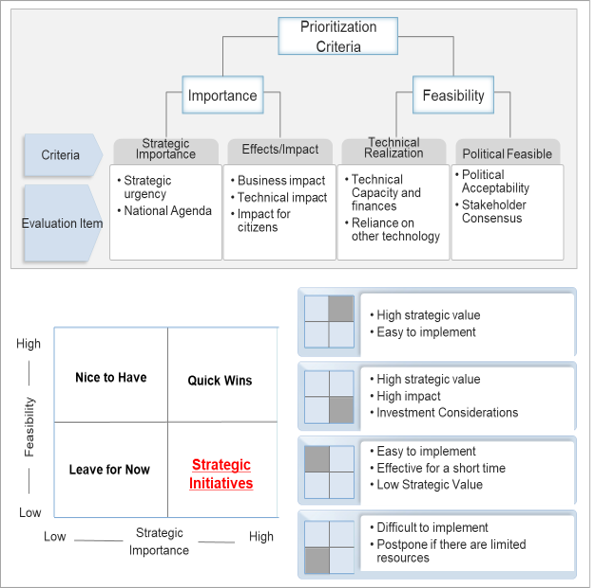

# Service prioritization and ranking

Definition of which services digitize first varies country from country. Prioritization criteria shall be based on data gathered through RFI I, II, III, & IV in order to rank services to work with, according to impact & feasibility.  Services that are simple, done in a single iteration within one Ministry outreach are good candidates for quick wins, build a case to adopt a GovStack approach to digital service co-design standard and delivery protocol using reusable building blocks.&#x20;

Once information has been gathered and validated with different service owners strategic services will be accommodated in a matrix format to facilitate clustering and ranking.&#x20;

Prioritization criteria shall be based on data gathered from Request for Information Forms (RFI) through RFI, II, III, & IV to rank services to work with according to the impact & feasibility of implementation.  Implementation will therefore be guided by the previous analysis, starting with services that are of the highest importance and highest feasibility, followed by those with high importance but low feasibility.&#x20;

The criteria presented in this playbook is a reference criteria. Each country can calibrate current criteria according to information availability, context & needs. &#x20;

<figure><figcaption>
Prioritization criteria matrix
</figcaption></figure>



A comprehensive prioritisation strategy...

* Defines prioritisation criteria that applies to all government services in the government service catalog
* Set one or two exemplar services to work with implementing the GovStack approach to digital service co-design and delivery
* Identify building blocks/shared services to be developed, or re-use from the Digital Public Goods Catalogue&#x20;
* Rank services according to the priotisation criteria defined
* Set a road map for digitization of services&#x20;











The criteria presented in this playbook is a reference criteria. Each digital team can calibrate current criteria according to information availability, context & needs:&#x20;

| Strategic importance    | Users demand                       | 

<ul><li>Number of transactions per month </li><li>Number of service users    </li><li>Is a cross-border service  </li></ul>                                                                                                                                                                                               |
| ----------------------- | ---------------------------------- | -------------------------------------------------------------------------------------------------------------------------------------------------------------------------------------------------------------------------------------------------------------------------------------------------------------------------------- |
| Impact                  | Complexity to access the service   | <ul><li>Number of in person visits to a government office (customer visits required to get the service) </li><li>Number of prerequisites and documents</li><li>Time to response from Government to get the service (days/months)</li><li>Steps for follow-up &#x26; tracking</li><li>Number of Govt agencies involved </li></ul> |
|                         | Government Impact                  | <ul><li>Environmental footprint (Documents, commutes.) </li></ul>                                                                                                                                                                                                                                                                |
|                         | Business impact                    | <ul><li>Public Private Partnership </li><li>Attraction of Foreign Direct Investment  </li></ul>                                                                                                                                                                                                                                  |
|                         | Technical impact                   | <ul><li>The service is a shared service, like Identity, payment, digital signature, among others that can be re-use and integrated with other government entities systems to enable digital services. </li></ul>                                                                                                                 |
| Technical feasibility   | Technical capacity                 | <ul><li>Digital skills required to enable the digital service </li></ul>                                                                                                                                                                                                                                                         |
|                         | Financial resources                | <ul><li>Degree of existing Building Blocks that can be reuse to enable the service </li></ul>                                                                                                                                                                                                                                    |
|                         | Reliance on other technologies     | <ul><li>Degree of existing infrastructure </li></ul>
 
                                                                                                                                                                                                                                                                     |
| Political feasibility   | Political acceptability            | <ul><li>Alignment with national digital agenda - Services that a presidential or ministerial commitment.</li></ul>
 
                                                                                                                                                                                                       |
|                         | Regional harmonization             | <ul><li>Data Taxonomy / Semantics </li><li>Regulatory synergies  </li></ul>                                                                                                                                                                                                                                                      |
|                         | Stakeholder consensus              | <ul><li>Number of Govt Agencies involved in the user journey that work well together </li></ul>                                                                                                                                                                                                                                  |




<figure><figcaption></figcaption></figure>

<figure><figcaption></figcaption></figure>
