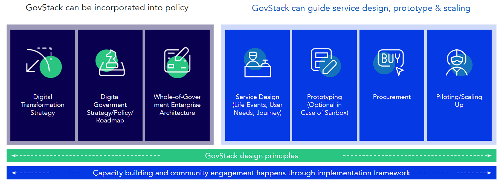

# Implementation framework

The GovStack implementation framework considers incorporating a BB approach at the level of digital institutional governance, ICT policy & citizen-centric co-design & delivery of government digital services. This Implementation framework is an extension of the [SDG Digital Investment Framework](https://www.itu.int/pub/D-STR-DIGITAL.02-2019).&#x20;

<figure><figcaption>
<em>GovStacl Implementation Framework</em> 
</figcaption></figure>

To further facilitate the implementation process, the **GovStack digital service co-design & delivery protocol** presents a sequence of tools and methods to understand user needs, map user journeys & life events, and integrate prototypes in an agile way using reusable software components from the GovStack sandbox. &#x20;

<figure><figcaption>
<em></em><a href="https://miro.com/app/board/uXjVPTpKFdo=/?share_link_id=663463010496"><em>GovStack digital service design and delivery journey</em> </a><em></em>
</figcaption></figure>

The aim of the GovStack digital service co-Design & delivery protocol is to facilitate digital teams around the world to build their own digital service design standard and government technology stack organically. Starting with one or two priority services that use a small set of reusable software components (BBs) that will have high utilization by other services in their service catalog.

<figure><figcaption>
GovStack scaling approach
</figcaption></figure>

