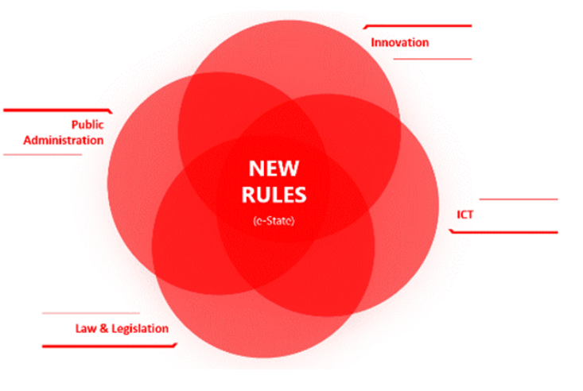

# Academic support to Capacity development

### How Academia can help to build capacity?

To understand the current state of education in the digital transformation domain, it is useful to take a look through the lens of established competences and qualifications frameworks. These frameworks help to identify the necessary skills in a certain career path related to GovStack Implementation journey. It is useful for education institutions in the process of designing curriculum and ensuring the students get the necessary skills to support GovStack approach. Additionally, when designing the curriculum, several issues need to be addressed, as a first step to supporting the long term development of capacity building in the country [Digital skills](onenote:https://gizonline.sharepoint.com/sites/ICTBuildingBlocks-CommondigitalSDGplatformwithguests/Freigegebene%20Dokumente/General/Country%20Engagement/Country%20Engagement%20Playbook/Chapter%201%20-%20Governance%20and%20Strategy/Chapter%201%20Governance%20and%20Strategy/Readiness%20assessment.one#Digital%20skills\&section-id=882b8633-13a3-4a26-bb96-b683c5fc3937\&page-id=95a6eeaa-8bfd-4cb6-97c7-d574d4e4fb0c\&end) ([Web view](https://gizonline.sharepoint.com/sites/ICTBuildingBlocks-CommondigitalSDGplatformwithguests/\_layouts/15/Doc.aspx?sourcedoc={9e9fdba0-3f52-4af6-8c3c-0bcf9e0b338e}\&action=edit\&wd=target%28Readiness%20assessment.one%7C882b8633-13a3-4a26-bb96-b683c5fc3937%2FDigital%20skills%7C95a6eeaa-8bfd-4cb6-97c7-d574d4e4fb0c%2F%29\&wdorigin=703\&wdpreservelink=1)).&#x20;

The multidisciplinary approach should be considered as it allows students to increase their strengths as well as fill in gaps in their knowledge in the areas of technical skills, service design, ethics, creative problem solving, the regulation of technologies, legislation, and generally in the digital transformation.&#x20;

The university education should help to improve knowledge of public services design with the use of new technologies. Through gaining an understanding of co-creation, the design process, creative problem solving, human-centric approach in public services, and prototyping the graduates should use to apply new ways to design and implement services with along the new technologies and process re-design.&#x20;

GovStack Approach supportive curricula are following the European Qualification framework based on the following stakeholder categories:&#x20;

e-1 Top Management/ Policy Makers&#x20;

e-2 Trainers&#x20;

e-3 Service Designers&#x20;

e-4 IT staff&#x20;

e-5 End Users&#x20;

Table showing the relevant e-competencies recommended for the five stakeholder groups&#x20;

&#x20;(Recommended Curriculum Skills Matrix based on [CEN e-CF Framework](https://itprofessionalism.org/about-it-professionalism/competences/the-e-competence-framework/))&#x20;

### Study Programs Structure

GovStack will be using a descriptive and e-learning approach i.e. module and LMS to train the stakeholders.&#x20;

The main learning outcomes to support the GovStack's approach will give &#x20;

* Understanding of the different competencies need for digital journey &#x20;
* help different co-design techniques and know how to use this knowledge in GovStack approach&#x20;

#### Learning Objectives

Within GovStack approach, it is very important to educate the future leaders of the digital transformation who are able to implement the GovStack vision. As GovStack requires various knowledge in the field of transformation the academic education path should follow the GovStack's standard users profiles:&#x20;

* IT specialist&#x20;
* Service Designers&#x20;
* Top management and Policy makers&#x20;
* Trainers&#x20;

The main areas which should be covered in the masters programmes are the follows:&#x20;

* **Digital Government** where the purpose to get students to recognize what is different about governing in an era filled with pervasive digital technologies.&#x20;
* **The building blocks of the digital government** which is about understanding that government digital systems are made up from components, and that the choice of which components to use is critical. It also lays out the idea of 'Government as a Platform'.&#x20;
* **Service orientation in the public sector** which is about using practices and technologies of the digital era to rapidly and continually improve government services and policies as well move towards proactive life event services.&#x20;
* **Service design** where students learn why public servants need to be focused on users and their needs. Instructors will help students understand when and why they will need to apply design methods to solve problems.
* **Interoperability and next generation government architecture** where students will learn about  single-source governance rules and security protocols to be implemented across all data assets, virtually eliminating the possibility of units within the same organization creating wrinkles in cyber defenses through varied processes&#x20;
* **Data management** is to help understand statistics as well identify opportunities to use data to solve real world government problems. The practical challenges related to data access and privacy/security&#x20;
* **Automatization and data** where purpose is to help students to be aware that digital era governments create and manage data as a function for every activity to allow participatory AI solutions for public service a&#x20;
* **Participatory governance** is to help students understand what it means to ‘work in the open’ in government, and to explain the many different interpretations and manifestations of ‘openness’ that are applied in modern governments.&#x20;
* **Legal framework** to help students to anticipate the most common barriers related to legal acts and standards which government encounter within real government functions &#x20;
* **Identity management and security in networked world** where students learn about identity management in data governance – how it to ensure data quality and security through access controls across critical data systems. The topic sums up the policies, processes, standards, metrics, and roles that ensure that data is used effectively to help an organization realize its objectives&#x20;

### Teaching Techniques

As GovStack approach is very focused on country engagement and involves much collaborative tools and techniques, a teaching strategy should follow a logic as listed below:&#x20;

* Design thinking approach, to stimulate creative problem solving, teamwork and action research, and guide participants to develop human-centered solutions;&#x20;
* Project-based learning and team-working on practical projects and real challenges across different types of public institutions, increasing the confidence of students in adopting/procuring the right technology for the relevant societal needs;&#x20;
* Active learning, encouraging peer exchange, dialogue and debate, to create an extensive ecosystem around the adoption of GovStack approach beyond the duration of the programme, thus aiming in the long run to contribute to a shift in the mindset of public officials and policy makers;&#x20;

The academic study programme should serve as an enabler of providing knowledge and skills at the intersection of technology, business and management, design thinking and policy sides. The reason for such an interdisciplinary approach lies in the needs of the labour market.&#x20;

<figure><figcaption>
An interdisciplinary approach of the study programme
</figcaption></figure>

The **expected learning outcomes** should ensure the programme meets the following: &#x20;

1. Knowing the current potential of technology and data and being able to critically assess their social and ethical impacts,&#x20;

a. Understanding technology that is used in the delivery of the digital state.&#x20;

b. Learning to operate with technology and how to create human centric government e-services. &#x20;

2\. **Understanding** what digital transformation is, what the different applicative domains are with a specific focus on governance and public service transformation, what features it can have and how to convey services to companies and experts, &#x20;

a. Understanding the state-of-the-art of digital transformation and the available market solutions with a level deep enough to start implementation, &#x20;

b. Learning to manage innovative procurement and public-private partnership in public services design and delivery.  &#x20;

3\. **Knowing** to design / plan / implement / evaluate a practical digital transformation project for an up-to-date range of public services, &#x20;

a. Developing strategic management abilities , &#x20;

b. Learning to analyze and propose  digital concepts for governance and public services.  &#x20;

4\. **Making judgements** - ability to think critically and analyze different use cases for digital transformation through public services in society; ability to create public value through innovative design and implement  projects; &#x20;

5\. **Project groupwork and communication skills** - autonomously and in groups, students develop the ability to present and discuss their ideas and the attitude to negotiate in teamwork.&#x20;

&#x20;

[https://www.coloradocollege.edu/other/assessment/how-to-assess-learning/learning-outcomes/blooms-revised-taxonomy.html](https://www.coloradocollege.edu/other/assessment/how-to-assess-learning/learning-outcomes/blooms-revised-taxonomy.html)&#x20;
