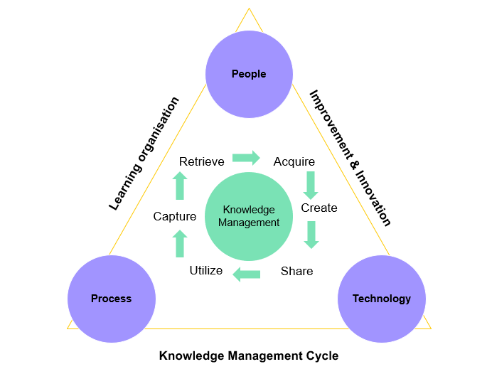
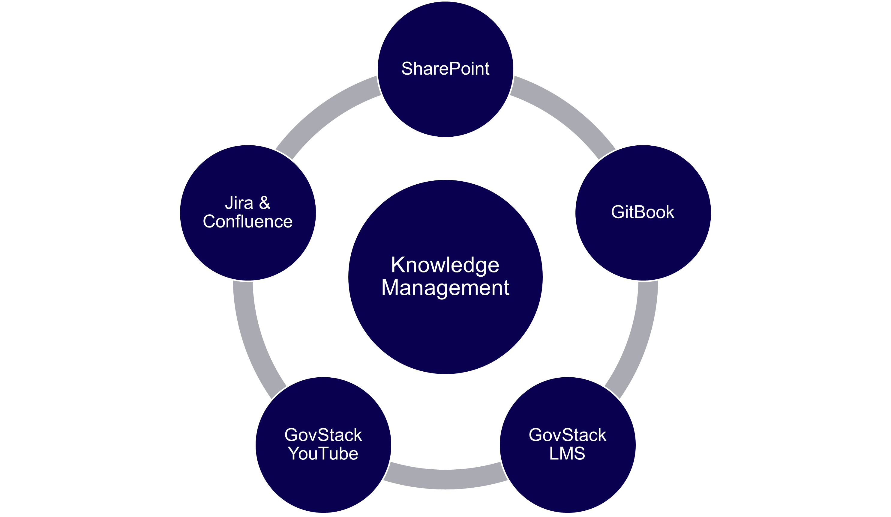

# CB Framework

## Capacity building Framework

### _**Key Definitions and Activities**_

GovStack focuses a lot on process and people within the implementation journey. Capacity building is a process in which individuals, organizations and societies, develop, strengthen and maintain the skills to implement GovStack’s Building Blocks. Capacity development is not a single intervention but an iterative process of design-application-learning-adjustment.&#x20;

Capacity building activities include:

* Conducting training needs assessment
* Engagement of stakeholders on capacity development
* Assessment the capacity needs and assets
* Formulation and implementation of capacity development response
* Evaluation of the capacity development. &#x20;

### **Knowledge Management Ecosystem as a part of Capacity Building**

Digital government services require a robust and active knowledge management cycle. The knowledge management cycle is a continuous where information is identified, created, shared, stored, utilized. GovStack's knowledge management cycle relies on three critical pieces: people, process and technology.&#x20;



The key to knowledge management is sharing of information. Sharing knowledge leads to innovation and improvement of the quality of work. Thus, the result is an efficient learning organization where employees' skill sets are constantly improved.&#x20;

<figure><figcaption>
GovStack Knowledge Management Cycle
</figcaption></figure>



GovStack supports its governments throughout the knowledge management cycle with different resources and tools.  Internally, Teams, Jira and Confluence are the communication channels for co-creating knowledge pieces. On the other hand, [GitBook](https://app.gitbook.com/o/pxmRWOPoaU8fUAbbcrus/c/4Q4PEWGtVCZpBYdPkxe3) and [GovStack LMS](../govlearn.md) are the resources used to disseminate to the public, the Technical Specifications and Training materials that aids the GovStack implementation journey.&#x20;

<figure><figcaption>
GovStack Knowledge Management Eco-System
</figcaption></figure>



### How GovStack Approach can be supported

In its ongoing efforts to improve how governments can reap the benefits of digitalization, the GovStack team frequently asks key questions to guide the development of its activities. These questions include; how can governments become more open and transparent, while simultaneously dealing with various challenges, such as data sensitivity?  Which technologies are available to make governments more open and to use open government data? How can data be turned into smartness? &#x20;

#### Reuse and Improve Principle

The GovStack Initiative strongly believes in the principle to" reuse and improve".  We do not have to reinvent the wheel - when it comes to reusing building blocks, but also regarding education material. Many organizations in the field of government technologies as well as Open Source communities and Governments have published readings, guidelines and training material to support public sector digitization. We would like to make use of all this material and channel it to our partner countries looking into increasing their skills and knowledge. These are a few ways to support GovStack Capacity Building:



_**Creating new training resources**_

There are still training gaps concerning the whole-of-government approach and the development of digital infrastructure&#x20;



_**Sharing e-learnings, guidelines, toolkits or training material**_

Numerous institutions, both from the public and private sectors, have created their own learning materials to increase the skills needed to push the digital transformation of government services forward



_**Knowledge sharing formats**_&#x20;

Participate in Communities of practice and share knowledge and insights into your digitization process. Create forums for exchange within the digital ecosystem in your country or regionally.&#x20;



_**Training centers**_&#x20;

Establish a training center in your country and link GovStack to the institution(s) responsible for capacity building in your country.&#x20;



_**Change management**_&#x20;

Foster openness to change and change management. Digitizing Government Services is not only about creating digital tools and infrastructure, it is also about changing processes, simplifying them, creating citizen-centered services. This new approach means a lot of change for government processes, and therefore change management is a big part of the digitization journey. &#x20;



### Specialized Communities of Practice

The starting point of the GovStack approach was the development Communities of Practice in order to share knowledge and experiences between various stakeholders and countries' focal points.\
&#x20;

<figure><figcaption>
GovStack Communities of Practice
</figcaption></figure>

The GovStack approach relies heavily on best practices, experiences and knowledge sharing. The Communities of Practice (CoPs) are topic-related or regional exchange forums to share knowledge and experiences concerning the GovStack approach. The current CoPs are the following:



Aim: Provide an impartial opinion on results provided by the building block working groups.&#x20;

Opportunities to get involved: &#x20;

* Provide expert guidance to each BB WG&#x20;
* Advise on output formats and mode of work e.g. where to properly document BB specification, suggestion on version control methods/tools, on release and management of end deliverables &#x20;
* Review, validate, approve final deliverables at each milestone&#x20;
* Inform BB WG and Governance Committee of challenges and propose solutions



[CIO Digital Leaders Forum](https://www.govstack.global/govstack-leaders-forum/)&#x20;

Aim: Exchange knowledge to strengthen the global GovStack community &#x20;

Opportunities to get involved: &#x20;

* Participate in [CIO Digital Government Leaders Forum](https://www.govstack.global/govstack-leaders-forum/) events to exchange best practices with other e-government leaders and learn from the experience of other countries.&#x20;
* Share respective country (implementation) experience



GovStack CoP in cooperation with the [Digital Public Goods Alliance (DPGA)](https://digitalpublicgoods.net/)&#x20;

Aim: Map and identify opportunities to collaborate and extend existing work related to facilitating the discovery, development, use of, and investment of digital public goods and digital public infrastructure for the GovStack&#x20;

* Identify potential DPGs that are likely to also comply with building blocks specifications.&#x20;
* Identify existing DPGs that can be used to inform specifications of building blocks – where these specifications are not yet in place/still evolving.&#x20;
* Create alignment and coordination for how to accelerate the discovery of these DPG Building Blocks eg. via a digital marketplace.&#x20;



* Participate in bi-monthly discussion rounds to exchange on DPGs as well as definitions for building blocks and Digital Public Infrastructure (DPI).&#x20;
* Share best practices with and learn from other experts.&#x20;
* Contribute to the publication of GovStack relevant definitions (e.g. building blocks, DPI).&#x20;



See the recent work: [GovStack Definitions: Understanding the Relationship between Digital Public Infrastructure, Building Blocks & Digital Public Goods (GIZ and DPGA 2022).](https://digitalpublicgoods.net/DPI-DPG-BB-Definitions.pdf)



Additionally, the CoPs seek to learn from other countries such as India and Singapore, as described below:

<a href="https://www.india.gov.in/people-groups/community">India</a>

In India, the Department of Administrative Reforms & Public Grievances (DARPG) under the Ministry of Personnel, Public Grievances and Pensions has set-up an “E-Governance Division” that coordinates and supports the implementation of National eGovernance Plan (NeGP) and Digital India programs owned by Ministry of Electronics and Information Technology (MeitY).

The division has conceptualized “[Capacity Building through Master eGovernance Training Plan (MeTP)](https://www.meity.gov.in/dic)” for the years 2013-15. MeTP intends to build the capacity of central government employees for implementing e-Governance projects.

The core areas targeted to be addressed as part of training needs in MeTP are as follows

**Type-1 : Basic ICT Skills** for Office work (office productivity applications, internet, email etc.)

**Type-2: eGovernance related knowledge and skills** (These include topics such as eGovernance life cycle, Government Process Reengineering, Business Models, Public Private Partnerships, Regulatory Frameworks, Information Technology Act, Contract Management, Detailed Project Report (DPR), Request for Proposal (RFP), and Change Management.)

**Type-3: Domain/Sector/Mission Mode Project specific** (for example, Agriculture, Banking)

**Type-4: Soft skills** (Team building, Leadership, effective presentation & communication etc.)

**Type-5: Specialized professional skills** (Project Management, IT Security, IT Audit etc.)

_**The primary objectives of the training are as follows**_

* [ ] Equip the average government employee with the skills required to use the evolving systems and processes_**.**_
* [ ] Aid policy makers in prioritizing eGovernance reform and connecting the dots between various aspects of eGovernance.
* [ ] Support Project Managers by imparting training on modern project and change management techniques and tools.
* [ ] Facilitate transformation in government departments by equipping select teams with skills in process re-engineering and enterprise architecture.

**The delivery models** included are:

Seminar/workshop, Instructor Led Training (ILT), Virtual Classroom (VC), e-Learning, Blended mode of learning.

Subsequently, the National eGovernance Division (NeGD) under the Ministry of Electronics and Information Technology (MeitY), has extensively conducted a research with various key stakeholders and has developed[ “eGovernance Competency Framework (eGCF)](academic-support-to-capacity-development.md#skills-and-competences-to-support-academic-programmes) for Digital India with Implementation Toolkit” in the year 2014. This is a crucial document for conducting all the eGovernance Capacity Building initiatives for the civil servants of federal/state/union territory ministries/departments in India.&#x20;

<a href="https://www.smartnation.gov.sg/community/contribute-to-smart-nation">Singapore</a>

Singapore is committed to becoming a world leader in digitalization. Capitalizing on the huge potential opened up by technology, Singapore is putting forward an overarching [Smart Nation](https://www.smartnation.gov.sg/about-smart-nation/transforming-singapore) vision that is based on three pillars: [Digital Government](https://www.smartnation.gov.sg/about-smart-nation/digital-government), [Digital Economy](https://www.smartnation.gov.sg/about-smart-nation/digital-economy), and [Digital Society](https://www.smartnation.gov.sg/about-smart-nation/digital-society). Taken together, these three pillars are responsible for effecting significant shits across all sectors and policy areas.&#x20;

#### Capacity Building in Singapore

Singapore observes that there are three ways to address the capacity building needs of citizens, civil servants and leaders and professionals, whose details are listed described below.

**Citizens:**.png>)

The Ministry of Communications and Information (MCI), Government of Singapore has a set of portfolios to drive the digital transformation. One such is “Digital Readiness” with four strategic outcomes (a) Digital access (b) Digital Literacy (c) Digital participation and (d) Digital inclusion by design. In regard to “Digital Literacy”, the “[Digital Readiness (MCI n.d.)"](https://www.mci.gov.sg/en/portfolios/digital-readiness/digital-readiness-blueprint) blueprint recommends the following.

* Identify a set of basic digital skills for everyday activities to spur the take-up of digital technology, especially among the less digitally savvy.
* Strengthen focus on information and media literacy, to build resilience in an era of online falsehoods.
* Ensure that our children and youth grow up to form meaningful relationships with people around them and use technology to benefit their communities.

**B. Civil Servants**

The [Digital Government Blueprint](https://www.mci.gov.sg/en/portfolios/digital-readiness/digital-readiness-blueprint) recommends raising digital capabilities to pursue innovation so that the government is able to “think fast, start small and act fast” to seize new opportunities. The Government has been deepening its technical capabilities through a Centre of Excellence (or CentEx) for ICT and Smart Systems, where specialist engineering expertise will be grown to support the WOG. The CentEx will house capability centers such as Data Science and AI, ICT Infrastructure, Application Development, Sensors and IoT, Cybersecurity, and Geospatial. The CentEx may expand into new technology capability areas as the need arises – for example, in robotics, VR/AR, digital twins or blockchain.

The CentEx will support the development of ICT skills and leadership for WOG through:

* Building an in-house reserve of deep technical skills in areas where internal capabilities are needed to deal with highly complex issues on short notice.
* Raising capabilities of ICT practitioners and leaders across the WOG; and
* Equipping public officers with relevant broad-based ICT skills (e.g. basic awareness of data analytics).

**C. Leaders and officials**

In Singapore, the Institute of Systems Science at [National University of Singapore (NUS-ISS)](https://www.iss.nus.edu.sg/) plays a pivotal role in building the capacities of digital leaders and professionals. [NUS-ISS](https://www.iss.nus.edu.sg/) has been appointed as The Digital Academy (TDA) operations partner, established by The Government Technology Agency (GovTech Singapore) for Whole Of Government (WOG). As Operations Partner of The Digital Academy, NUS-ISS is partnering GovTech in developing training roadmaps and managing the enrolment, logistics, publicity and training processes.

The NUS-ISS offers a wide range of programs to build the capacities. They are broadly categorized as follows.

1. Executive Education: AI, Cyber Security, Data Science, Digital Agility, Digital Innovation & Design, Digital Strategy and Leadership, Digital products and platforms, Smart Health leadership, Software systems, Stackup-Startup Tech Talent Development
2. Graduate Programs: Systems Analysis, Enterprise Business Analytics, Digital Leadership, Intelligent Systems, Software engineering
3. eGovernment Leadership Center: Digital Government Transformation, Smart Nation, Public Sector Innovation, Citizen engagement

<a href="https://www.dta.gov.au/help-and-advice/communities-practice">Australia</a>

Communities of practice [(Australia Government n.d.)](https://www.digitalprofession.gov.au/about-digital-profession) are groups of people working in the same field in government. They bring those people together to share ideas, show their work, solve problems and explore best practice. These include:

* [ ] **Agile & Lean Community** - The Agile & Lean Community is an open group for anyone interested in agile, lean, lean start-up, DevOps and more!
* [ ] **Content Community of Practice -** The Content Community of Practice is a place for government content specialists, practitioners and leaders to share ideas, solve problems, connect to peers and work in the open.
* [ ] **Cross-Discipline Community of Practice** - The Cross-Discipline Community of Practice is open to everyone. It’s a place for all people working in government, educational institutions and industry practitioners, leaders, or people interested in design for government to share ideas, solve problems, connect to peers and work in the open.
* [ ] **Cyber Security -** The Cyber Security community is for Digital Profession members interested in Cyber Security.
* [ ] **Visual Scribe (Graphic facilitation)** - The Visual Scribe community is here for Digital profession members interested in visual scribing and storytelling.
* [ ] **Government Architecture community** - This community is for government employees interested in government architecture. A shared understanding of government architecture and capabilities will improve collaboration and cross-disciplinary design, resulting in better government services. Join the Government Architecture community.
* [ ] **Life event communities (GovX)** - The GovX life event communities bring people and organizations together to explore more ways to collaborate, design and prioritize delivery efforts based on the life events of people and their experience.
* [ ] **Research and Design Community of Practice** - The Design and Research Community of Practice is a place for all government practitioners, leaders, or people interested in design for government to share ideas, solve problems, connect to peers and work in the open.
* [ ] **P3M community** - This community is for people involved in portfolio, program and project management (P3M) in any part of government in Australia.
* [ ] **Open data community** - This community is for people who work with public data in the Australian Public Service or who carry out publicly funded research. It's also for people who develop, innovate or carry out research using Australia’s public datasets.

Apart from the above CoP's, the Australian Government has established the [**Digital Profession center (Australian Government n.d.)** ](https://www.digitalprofession.gov.au/about-digital-profession)as part of the Australian Government with the aim to lift the digital capability of the Australian Public Service (APS) to transform government services and build a government fit for the digital age.

<a href="https://www.gov.uk/service-manual/communities">United Kingdom</a>

The UK as part of their Government Digital Service (gov.uk) has created a set of service manuals and several communities of practice. One of these manuals is a handbook for people developing communities of practice in government - [Community Development Handbook (GOV.UK 2017).](https://www.gov.uk/government/publications/community-development-handbook/community-development-handbook)

The [**UK government states that**](https://www.gov.uk/government/publications/community-development-handbook/community-development-handbook) Communities of practice are for people who share common job roles, responsibilities or remits. They do well through regular interaction and common goals.

&#x20;The communities of Practice that the UK government has established CoPs that include:

* [**Accessibility community**](https://www.gov.uk/service-manual/communities/accessibility-community) - For anyone with an interest in accessibility.&#x20;
* [**Agile delivery community** ](https://www.gov.uk/service-manual/communities/agile-delivery-community)- For anyone interested in using agile methods to deliver government projects.&#x20;
* [**Assisted digital and digital take-up community**](https://www.gov.uk/service-manual/communities/assisted-digital-and-digital-take-up-community) - For anyone procuring, designing or managing assisted digital support.&#x20;
* [**Content community**](https://www.gov.uk/service-manual/communities/content-community) - For anyone involved in content or website publishing.&#x20;
* [**Data Engineering community**](https://www.gov.uk/service-manual/communities/data-engineering-community) - For anyone designing and building data products and services.
* [**Data science community**](https://www.gov.uk/service-manual/communities/data-science-community) - For anyone interested in data science best practice and using evidence to make decisions.&#x20;
* [**Design community**](https://www.gov.uk/service-manual/communities/design-community) - For anyone working in interaction design, graphic design, service design or content design.&#x20;
* [**Digital buying community**](https://www.gov.uk/service-manual/communities/digital-buying-community) - For anyone in the public sector buying digital data and technology services.&#x20;
* [**Performance analysis community**](https://www.gov.uk/service-manual/communities/performance-and-data-analysis-community) - For anyone working with data and analytics.
* [**Policy design community**](https://www.gov.uk/service-manual/communities/policy-design-community) - Discuss and learn about the role of policy design in government.&#x20;
* [**Product and service community**](https://www.gov.uk/service-manual/communities/product-and-service-community) - For anyone using product management methods to deliver government products and services .
* [**Standards and assurance community** ](https://www.gov.uk/service-manual/communities/standards-and-assurance-community)- For anyone designing, implementing or assessing government digital or technology standards.&#x20;
* [**Technical writing community** ](https://www.gov.uk/service-manual/communities/technical-writing-community)**-** For anyone interested in writing about technology.
* [**Technology community (backend development)**](https://www.gov.uk/service-manual/communities/technology-community-backend-development) - For anyone working in backend development for services.&#x20;
* [**Technology community (frontend development)**](https://www.gov.uk/service-manual/communities/technology-community-frontend-development) - For anyone working in frontend development for services.&#x20;
* [**Technology community (technical architecture)**](https://www.gov.uk/service-manual/communities/technology-community-technical-architecture) - For anyone working in technical architecture for services.&#x20;
* [**Technology community (web operations)**](https://www.gov.uk/service-manual/communities/technology-community-web-operations) - For anyone working in web operations for services.&#x20;
* [**User research community**](https://www.gov.uk/service-manual/communities/user-research-community) -  For anyone interested in improving user research practices across government.&#x20;
* [**User support community**](https://www.gov.uk/service-manual/communities/user-support-community) - For anyone working in user support for services. &#x20;

### Excellence center and community driven interaction and knowledge sharing

Excellence center, as an umbrella, is a shared facility or an entity that should provide leadership, best practices, research, support and/or training for a focus area to support GovStack approach.&#x20;

Apart from the CoPs, the academia has been involved by involving universities such as [TalTech  ](https://taltech.ee/en/)and Mexico university on board with different research topics in Masters' and doctoral levels. These research gives valuable feedback not only for ongoing projects, but also helps to set a roadmap for future development &#x20;

To complement the practical and theoretical view within knowledge sharing, technical support is also needed. GovStack Tech Community consists of: &#x20;

* Building Block Working Groups (BB WG) &#x20;
* Technical & Operations Group &#x20;
* Technical Committee &#x20;

This ecosystem also contributes in policy making level by giving valuable insights for the further development of the strategic and policy making standards and documents in terms of digital service design and transformation.

