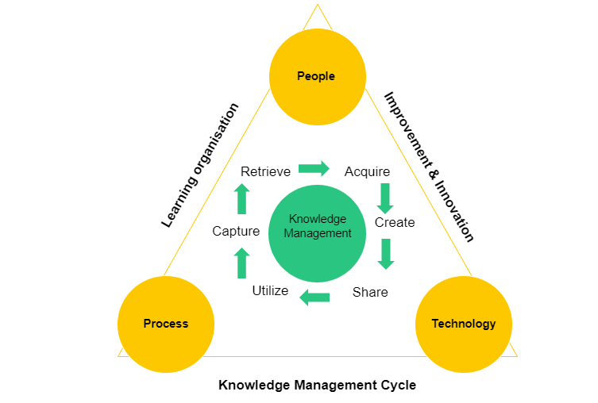
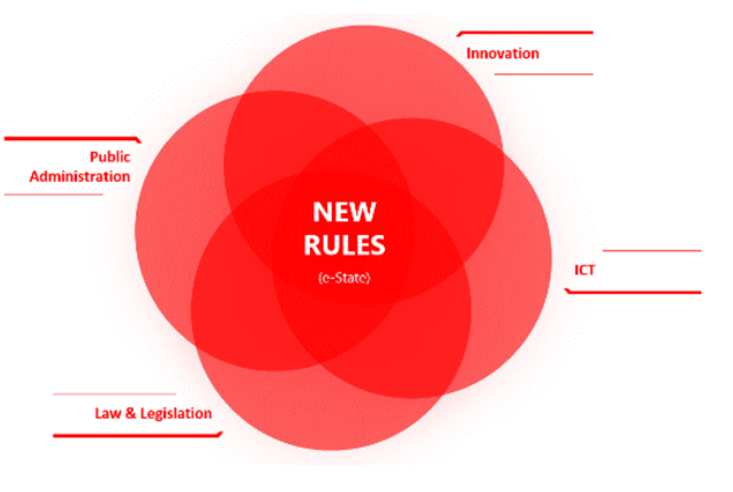
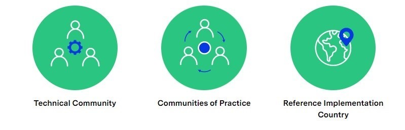

# Capacity building framework

Capacity-building is defined as the process of developing and strengthening the skills, instincts, abilities, processes and resources that organizations and communities need to survive, adapt, and thrive in a fast-changing world. Through capacity building, organizations share knowledge, expertise and good practices to react better and faster to emergencies. GovStack approach is very iterative and co-creation based, through RFI 4 and several workshops the capacity can be assessed and thus needs described. Capacity building includes conducting training needs assessment, engagement of stakeholders on capacity development, assessment the capacity needs and assets, formulation and implementation of capacity development response, and finally evaluation of the capacity development. &#x20;

### **Knowledge Management Ecosystem as a part of Capacity Building**

Digital government services require a robust and active knowledge management cycle. The knowledge management cycle is a continuous where information is identified, created, shared, stored, utilized. GovStack's knowledge management cycle relies on three critical pieces: people, process and technology.&#x20;

The key to knowledge management is sharing of information. Sharing knowledge leads to innovation and improvement of the quality of work. Thus, the result is an efficient learning organization where employees' skill sets are constantly improved.&#x20;

### Knowledge Management Cycle

GovStack supports its governments throughout the knowledge management cycle with different resources and tools.  Internally, Teams, Jira and Confluence are the communication channels for co-creating knowledge pieces. On the other hand, [GitBook](https://app.gitbook.com/o/pxmRWOPoaU8fUAbbcrus/c/4Q4PEWGtVCZpBYdPkxe3) and GovStack LMS are the resources used to disseminate to the public, the Technical Specifications and Training materials that aids the GovStack implementation journey.&#x20;

### &#x20;**** .png>)****

****

### How GovStack Approach can be supported

While we are talking how GovStack approach can be supported then we often ask questions first such as; how can governments become more open and transparent, while simultaneously dealing with various challenges, such as data sensitivity?  Which technologies are available to make governments more open and to use open government data? How can data be turned into smartness? &#x20;

#### **Reuse and Improve Principle**

The GovStack Initiative strongly believes in the principle to" reuse and improve".  We do not have to reinvent the wheel - when it comes to reusing building blocks, but also regarding education material. Many organizations in the field of government technologies as well as Open Source communities and Governments have published readings, guidelines and training material to support public sector digitization. We would like to make use of all this material and channel it to our partner countries looking into increasing their skills and knowledge. These are a few ways to support GovStack Capacity Building:&#x20;

_Sharing e-learnings, guidelines, toolkits or training material_ &#x20;

Numerous institutions, both governmental and private sector, have created their own learning material to increase skills needed around the digital transformation of government services. We don´t have to reinvent the wheel but build on team members' ideas, share them with other governments and initiatives like GovStack.&#x20;

_Creating new training resources_

There are still gaps for trainings around whole of government approach, developing digital infrastructure. The GovStack Initiative is happy to collaborate on the creation of new learning content with our partners.&#x20;

_Knowledge sharing formats_&#x20;

Participate in Communities of practice and share knowledge and insights into your digitization process. Create forums for exchange within the digital ecosystem in your country or regionally. &#x20;

_Training centers_&#x20;

Establish a training center in your country and link GovStack to the institution(s) responsible for capacity building in your country.&#x20;

_Change management_&#x20;

Foster openness to chance and chance management. Digitizing Government Services is not only about creating digital tools and infrastructure, it is also about changing processes, simplifying them, creating citizen-centered services. This new approach means a lot of change for government processes, and therefore change management is a big part of the digitization journey. &#x20;

&#x20; &#x20;

### Capacity Building

Capacity-building is defined as the process of developing and strengthening the skills, instincts, abilities, processes and resources that organizations and communities need to survive, adapt, and thrive in a fast-changing world. Through capacity building, organizations share knowledge, expertise and good practices to react better and faster to emergencies. GovStack approach is very iterative and co-creation based, through [RFI 4](https://gizonline.sharepoint.com/:p:/r/sites/ICTBuildingBlocks-CommondigitalSDGplatformwithguests/\_layouts/15/Doc.aspx?sourcedoc=%7B5E3EDC8E-BC41-478D-9FF7-F6A701D3D8E1%7D\&file=version0.7Country%20Engagement%20Journey.pptx\&action=edit\&mobileredirect=true\&cid=83986c72-9b1b-46c0-99b3-4b4a30a6c1f7) and several workshops the capacity can be assessed and thus needs described. Capacity building includes conducting training needs assessment, engagement of stakeholders on capacity development, assessment the capacity needs and assets, formulation and implementation of capacity development response, and finally evaluation of the capacity development.

### Knowledge Management Ecosystem

Digital government services require a robust and active knowledge management cycle. The knowledge management cycle is a continuous where information is identified, created, shared, stored, utilized. GovStack's knowledge management cycle relies on three critical pieces: people, process and technology.&#x20;

<figure><figcaption></figcaption></figure>

The key to knowledge management is sharing of information. Sharing knowledge leads to innovation and improvement of the quality of work. Thus, the result is an efficient learning organization where employees' skill sets are constantly improved.&#x20;

GovStack supports its governments throughout the knowledge management cycle with different resources and tools.&#x20;

Internally, Teams, Jira and Confluence are the communication channels for co-creating knowledge pieces. On the other hand, [GitBook](https://app.gitbook.com/o/pxmRWOPoaU8fUAbbcrus/c/4Q4PEWGtVCZpBYdPkxe3) and GovStack LMS are the resources used to disseminate to the public, the Technical Specifications and Training materials that aids the GovStack implementation journey.&#x20;

<figure><figcaption></figcaption></figure>

###

Key Definitions&#x20;

GovStack focuses a lot on process and people within the implementation journey. We have defined capacity building as a process in which individuals, organizations and societies, develop, strengthen and maintain the skills to implement GovStack’s BB. Capacity development is not a single intervention but an iterative process of design-application-learning-adjustment.&#x20;

&#x20;

Relevant adult learning concepts:&#x20;

For many years, research and practice has recognized differences between how children and adults learn. Thus, this section highlight high-level adult learning theory along with recommendations to enhance practice for the effective implementation of GovStack's BB. &#x20;

* Adults need to know the reason for learning something, translating into practice, when adapting content is important that trainers clearly describe the learning objectives and provide spaces to understand participant's motivations (e.g., collecting participant's information during pre-planning stage, facilitating the "participant's expectations" at the beginning of capacity building sessions and make connections throughout the sessions). &#x20;
* Adult life experiences are a rich resource for learning (or barrier), over the years, adults have accumulated knowledge and experience that can be leverage as a resource for learning. In fact, cognitive science has shown that adults tend to refer back to past knowledge first. This experiences can be sourced through pairing exercises, group discussion, and problem solving exercises. &#x20;

### &#x20;Specialized Communities of Practice

### How Academia can help to build capacity?

To understand the current state of education in the digital transformation domain, it is useful to take a look through the lens of established competences and qualifications frameworks. These frameworks help to identify the necessary skills in a certain career path related to GovStack Implementation journey. It is useful for education institutions in the process of designing curriculum and ensuring the students get the necessary skills to support GovStack approach. Additionally, when designing the curriculum, several issues need to be addressed, as a first step to supporting the long term development of capacity building in the country [Digital skills](onenote:https://gizonline.sharepoint.com/sites/ICTBuildingBlocks-CommondigitalSDGplatformwithguests/Freigegebene%20Dokumente/General/Country%20Engagement/Country%20Engagement%20Playbook/Chapter%201%20-%20Governance%20and%20Strategy/Chapter%201%20Governance%20and%20Strategy/Readiness%20assessment.one#Digital%20skills\&section-id=882b8633-13a3-4a26-bb96-b683c5fc3937\&page-id=95a6eeaa-8bfd-4cb6-97c7-d574d4e4fb0c\&end) ([Web view](https://gizonline.sharepoint.com/sites/ICTBuildingBlocks-CommondigitalSDGplatformwithguests/\_layouts/15/Doc.aspx?sourcedoc={9e9fdba0-3f52-4af6-8c3c-0bcf9e0b338e}\&action=edit\&wd=target%28Readiness%20assessment.one%7C882b8633-13a3-4a26-bb96-b683c5fc3937%2FDigital%20skills%7C95a6eeaa-8bfd-4cb6-97c7-d574d4e4fb0c%2F%29\&wdorigin=703\&wdpreservelink=1)).&#x20;

The multidisciplinary approach should be considered as it allows students to increase their strengths as well as fill in gaps in their knowledge in the areas of technical skills, service design, ethics, creative problem solving, the regulation of technologies, legislation, and generally in the digital transformation.&#x20;

The university education should help to improve knowledge of public services design with the use of new technologies. Through gaining an understanding of co-creation, the design process, creative problem solving, human-centric approach in public services, and prototyping the graduates should use to apply new ways to design and implement services with along the new technologies and process re-design.&#x20;

GovStack Approach supportive curricula are following the European Qualification framework based on the following stakeholder categories:&#x20;

e-1 Top Management/ Policy Makers&#x20;

e-2 Trainers&#x20;

e-3 Service Designers&#x20;

e-4 IT staff&#x20;

e-5 End Users&#x20;

Table showing the relevant e-competencies recommended for the five stakeholder groups&#x20;

&#x20;(Recommended Curriculum Skills Matrix based on [CEN e-CF Framework](https://itprofessionalism.org/about-it-professionalism/competences/the-e-competence-framework/))&#x20;

### Study Programs Structure

GovStack will be using a descriptive and e-learning approach i.e. module and LMS to train the stakeholders.&#x20;

The main learning outcomes to support the GovStack's approach will give &#x20;

* Understanding of the different competencies need for digital journey &#x20;
* help different co-design techniques and know how to use this knowledge in GovStack approach&#x20;

#### Learning Objectives

Within GovStack approach, it is very important to educate the future leaders of the digital transformation who are able to implement the GovStack vision. As GovStack requires various knowledge in the field of transformation the academic education path should follow the GovStack's standard users profiles:&#x20;

* IT specialist&#x20;
* Service Designers&#x20;
* Top management and Policy makers&#x20;
* Trainers&#x20;

The main areas which should be covered in the masters programmes are the follows:&#x20;

* **Digital Government** where the purpose to get students to recognize what is different about governing in an era filled with pervasive digital technologies.&#x20;
* **The building blocks of the digital government** which is about understanding that government digital systems are made up from components, and that the choice of which components to use is critical. It also lays out the idea of 'Government as a Platform'.&#x20;
* **Service orientation in the public sector** which is about using practices and technologies of the digital era to rapidly and continually improve government services and policies as well move towards proactive life event services.&#x20;
* **Service design** where students learn why public servants need to be focused on users and their needs. Instructors will help students understand when and why they will need to apply design methods to solve problems.
* **Interoperability and next generation government architecture** where students will learn about  single-source governance rules and security protocols to be implemented across all data assets, virtually eliminating the possibility of units within the same organization creating wrinkles in cyber defenses through varied processes&#x20;
* **Data management** is to help understand statistics as well identify opportunities to use data to solve real world government problems. The practical challenges related to data access and privacy/security&#x20;
* **Automatization and data** where purpose is to help students to be aware that digital era governments create and manage data as a function for every activity to allow participatory AI solutions for public service a&#x20;
* **Participatory governance** is to help students understand what it means to ‘work in the open’ in government, and to explain the many different interpretations and manifestations of ‘openness’ that are applied in modern governments.&#x20;
* **Legal framework** to help students to anticipate the most common barriers related to legal acts and standards which government encounter within real government functions &#x20;
* **Identity management and security in networked world** where students learn about identity management in data governance – how it to ensure data quality and security through access controls across critical data systems. The topic sums up the policies, processes, standards, metrics, and roles that ensure that data is used effectively to help an organization realize its objectives&#x20;

### Teaching Techniques

As GovStack approach is very focused on country engagement and involves much collaborative tools and techniques, a teaching strategy should follow a logic as listed below:&#x20;

* Design thinking approach, to stimulate creative problem solving, teamwork and action research, and guide participants to develop human-centered solutions;&#x20;
* Project-based learning and team-working on practical projects and real challenges across different types of public institutions, increasing the confidence of students in adopting/procuring the right technology for the relevant societal needs;&#x20;
* Active learning, encouraging peer exchange, dialogue and debate, to create an extensive ecosystem around the adoption of GovStack approach beyond the duration of the programme, thus aiming in the long run to contribute to a shift in the mindset of public officials and policy makers;&#x20;

The academic study programme should serve as an enabler of providing knowledge and skills at the intersection of technology, business and management, design thinking and policy sides. The reason for such an interdisciplinary approach lies in the needs of the labour market.&#x20;

<figure><figcaption>
An interdisciplinary approach of the study programme
</figcaption></figure>

The **expected learning outcomes** should ensure the programme meets the following: &#x20;

1. Knowing the current potential of technology and data and being able to critically assess their social and ethical impacts,&#x20;

a. Understanding technology that is used in the delivery of the digital state.&#x20;

b. Learning to operate with technology and how to create human centric government e-services. &#x20;

2\. **Understanding** what digital transformation is, what the different applicative domains are with a specific focus on governance and public service transformation, what features it can have and how to convey services to companies and experts, &#x20;

a. Understanding the state-of-the-art of digital transformation and the available market solutions with a level deep enough to start implementation, &#x20;

b. Learning to manage innovative procurement and public-private partnership in public services design and delivery.  &#x20;

3\. **Knowing** to design / plan / implement / evaluate a practical digital transformation project for an up-to-date range of public services, &#x20;

a. Developing strategic management abilities , &#x20;

b. Learning to analyze and propose  digital concepts for governance and public services.  &#x20;

4\. **Making judgements** - ability to think critically and analyze different use cases for digital transformation through public services in society; ability to create public value through innovative design and implement  projects; &#x20;

5\. **Project groupwork and communication skills** - autonomously and in groups, students develop the ability to present and discuss their ideas and the attitude to negotiate in teamwork.&#x20;

&#x20;

[https://www.coloradocollege.edu/other/assessment/how-to-assess-learning/learning-outcomes/blooms-revised-taxonomy.html](https://www.coloradocollege.edu/other/assessment/how-to-assess-learning/learning-outcomes/blooms-revised-taxonomy.html)&#x20;

### Excellence center and community driven interaction and knowledge sharing

Excellence center, as an umbrella, is a shared facility or an entity that should provide leadership, best practices, research, support and/or training for a focus area to support GovStack approach.&#x20;

Within GovStack approach as a starting point we have developed Communities of Practice in order to share knowledge and experiences between various stakeholders and countries' focal points.&#x20;

&#x20;Communities of Practice (CoPs) are topic related or regional exchange forums to share knowledge and experiences related to the GovStack approach. The current CoPs are the following:&#x20;

* Technical Review Committee &#x20;
* Digital Leaders Forum&#x20;
* GovStack CoP in cooperation with the Digital Public Goods Alliance (DPGA)&#x20;

&#x20;Technical Review Committee&#x20;

Aim: Provide an impartial opinion on results provided by the building block working groups.&#x20;

Opportunities to get involved: &#x20;

* Provide expert guidance to each BB WG&#x20;
* Advise on output formats and mode of work e.g. where to properly document BB specification, suggestion on version control methods/tools, on release and management of end deliverables &#x20;
* Review, validate, approve final deliverables at each milestone&#x20;
* Inform BB WG and Governance Committee of challenges and propose solutions&#x20;

[CIO Digital Leaders Forum](https://www.govstack.global/govstack-leaders-forum/)&#x20;

Aim: Exchange knowledge to strengthen the global GovStack community &#x20;

Opportunities to get involved: &#x20;

* Participate in [CIO Digital Government Leaders Forum](https://www.govstack.global/govstack-leaders-forum/) events to exchange best practices with other e-government leaders and learn from the experience of other countries.&#x20;
* Share respective country (implementation) experience

GovStack CoP in cooperation with the [Digital Public Goods Alliance (DPGA)](https://digitalpublicgoods.net/)&#x20;

Aim: Map and identify opportunities to collaborate and extend existing work related to facilitating the discovery, development, use of, and investment of digital public goods and digital public infrastructure for the GovStack&#x20;

* Identify potential DPGs that are likely to also comply with building blocks specifications.&#x20;
* Identify existing DPGs that can be used to inform specifications of building blocks – where these specifications are not yet in place/still evolving.&#x20;
* Create alignment and coordination for how to accelerate the discovery of these DPG Building Blocks eg. via a digital marketplace.&#x20;

**Opportunities to get involved:**&#x20;

* Participate in bi-monthly discussion rounds to exchange on DPGs as well as definitions for building blocks and Digital Public Infrastructure (DPI).&#x20;
* Share best practices with and learn from other experts.&#x20;
* Contribute to the publication of GovStack relevant definitions (e.g. building blocks, DPI).&#x20;

See the recent work: [GovStack Definitions: Understanding the Relationship between Digital Public Infrastructure, Building Blocks & Digital Public Goods](https://digitalpublicgoods.net/DPI-DPG-BB-Definitions.pdf)&#x20;

Additionally to CoP, the academia has been involved by involving universities (Taltech  Mexicon university, …,) on board with the different research topics both in Masters' and doctoral levels. That research gives a valuable feedback not only for ongoing projects, but also helps to set a roadmap for future development &#x20;

Moreover, to complement the practical and theoretical view within knowledge sharing, technical support is also needed. Thus, GovStack Tech Community consists of: &#x20;

* Building Block Working Groups (BB WG) &#x20;
* Technical & Operations Group &#x20;
* Technical Committee &#x20;

That ecosystem should contribute also in policy making level by giving valuable insights for the further development of the strategic and policy making standards and documents in terms of digital service design and transformation.\
&#x20;

<figure><figcaption>
GovStack Communities of Practice
</figcaption></figure>

