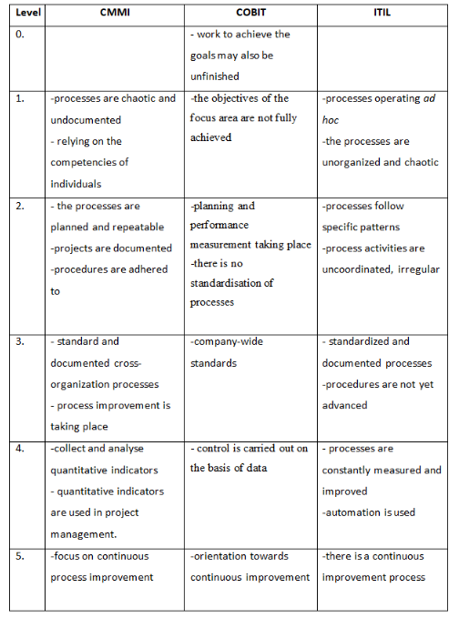
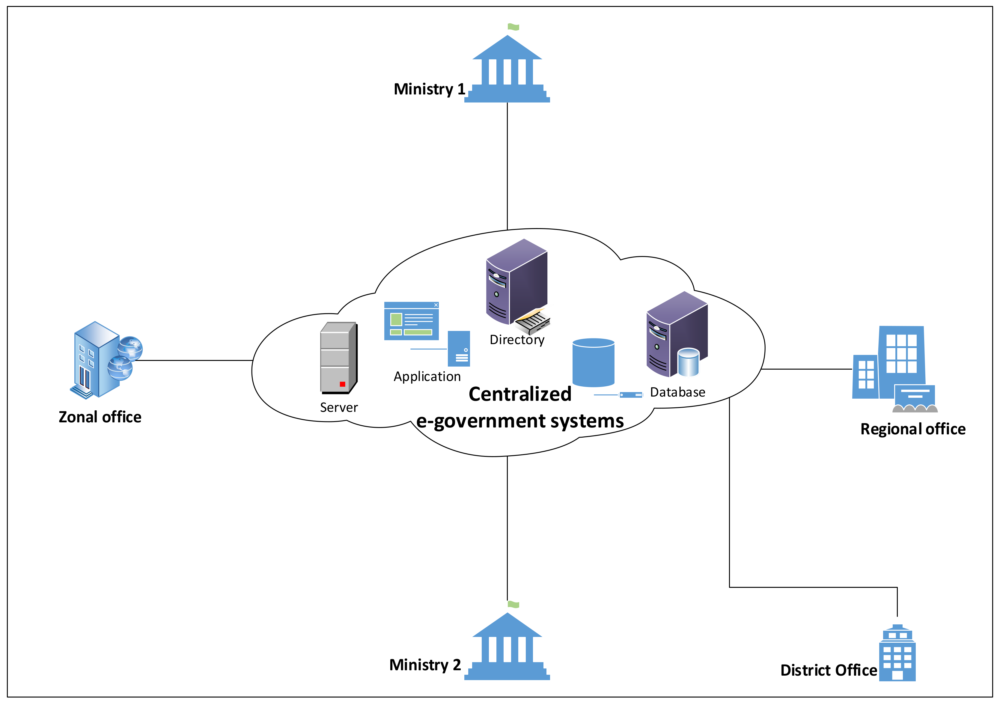

# Maturity assessment

<figure><figcaption></figcaption></figure>

A maturity assessment provides stakeholders with a good understanding of the current digitalization landscape providing clarity to identify strengths and opportunities for improvement. Based on that assessment, governments are better positioned to establish policy priorities to reach higher maturity levels.

This section provides references to different maturity assessment approaches stemming from the public sector, the private sector and academia.

## 1. Government



The [Digital Maturity Assessment](https://www.undp.org/sites/g/files/zskgke326/files/2022-08/UNDP\_LaoPDR\_DMA\_2022.pdf) is designed to help governments worldwide assess their readiness to undertake digital transformation. It defines five maturity levels:

1. **Digitally Nascent**&#x20;
2. **Digitally Emerging**&#x20;
3. **Digitally Agile and Integrated**&#x20;
4. **Digitally transformed**&#x20;
5. **Digitally Innovative**

The UNDP Digital Maturity Assessment can be used to evaluate the current potential for digital government across six key pillars that include: Technology and Solutions, Policy and Regulations, Skills and Capacity Building, User Centricity, Service Definition and Delivery, Institutional Framework, and Collaboration.

As in the case of Lao PDR, it was used to evaluate how ICT solutions in government can continue to improve operational efficiency and user satisfaction.

<figure><figcaption></figcaption></figure>



The [GovTech Maturity Index (GTMI)](https://openknowledge.worldbank.org/handle/10986/36233) (Dener et al. 2021) measures the key aspects of four GovTech focus areas: supporting core government systems, enhancing service delivery, mainstreaming citizen engagement, and fostering GovTech enablers. It assists advisers and practitioners in the design of new digital transformation projects, putting an emphasis on the whole-of-government approach and citizen centricity.

Encompassing consistent data sources across 198 countries, the GTMI complements the existing tools and diagnostics by providing a baseline and a benchmark for GovTech maturity and by offering insights to those areas that have room for improvement.



The [Digital Government Index (DGI)](https://www.oecd-ilibrary.org/sites/2bed4623-en/index.html?itemId=/content/component/2bed4623-en) is an assessment and benchmarking tool that can be employed to gauge the maturity of digital government policies and their implementation under a coherent and whole-of-government approach. The DGI can help governments gain a more solid understanding of their ability to operate in an increasingly digital and globalized context.



The [Digital Maturity Self-Assessment](https://www.england.nhs.uk/digitaltechnology/connecteddigitalsystems/maturity-index/) adopts a sectoral approach to measure how well secondary providers in England are using digital technologies to achieve a paper-free healthcare system. The Digital Maturity Self-Assessment helps individual organizations identify key strengths and service delivery gaps. Taken together, these individual self-assessments provide an overview of digital maturity progress across the country.



The [Digital Transformation Maturity Model ](https://www.oecd.org/tax/forum-on-tax-administration/publications-and-products/digital-transformation-maturity-model.pdf)contained in this report covers the Tax Administration 3.0 building block paths of growth and transformation. The aim of the Digital Transformation Maturity Model is to:

* Allow tax administrations to self-assess through internal discussions as to how they see their currently level of digital maturity. There is not a prescribed optimal level of maturity for tax administrations. The level of maturity will depend on each organisation’s circumstances, broader objectives, and priorities.
* Provide staff and senior leadership of the tax administration with a good overview of the level of maturity based on input from stakeholders across the organisation. This can help in deciding strategy and identifying areas for further improvement, including areas that require support from other parts of the tax administration or external stakeholders, including other parts of government. A number of administrations have reported that cross-organisational conversations when self-assessing can be useful in joining-up different business areas, helping people see the scope for synergies and identify areas for mutual support.
* Allow tax administrations to compare their level of digital maturity with their peer organisations. An administration will know its own level and will be able to compare itself to other tax administrations. It is also possible for tax administrations to reach out, through the Secretariat, to other tax administrations at different levels of maturity for peer-to-peer discussion and learning purposes.



[IMAPS](https://joinup.ec.europa.eu/collection/interoperability-assessment-tools-iats-digital-public-services/about) is an online survey that helps public officials evaluate and improve all key interoperability aspects of their digital public service (legal, semantic, organisational, or technical). IMAPS also allows public officials to monitor service’s compliance with the New European Interoperability Framework (EIF).

IMAPS is a versatile tool that can be used to assess the interoperability of any public service – from open data portals, and e-voting platforms, to public procurement services, and much more – and applied at all levels of government (international, national, regional and local).

IMAPS looks at three different service areas

IMAPS (European Commission 2022) looks at three different service areas (see IMAPS conceptual model below):

* Service Delivery (D) – Delivery of the digital public service;
* Service Consumption (C) – Consumption of reusable machine-to-machine services from other public administrations and businesses. This can include the consumption of functionalities, base registry information and security services;
* Service Management (B) – Controlling and monitoring the process flow related to service interactions with the external domain from trigger to outcome. This area includes Service Management aspects such as enterprise architecture, procurement, and service level management.

<figure><figcaption>
<a href="https://joinup.ec.europa.eu/sites/default/files/inline-images/Picture1_13.png">IMAPS conceptual model</a>
</figcaption></figure>

IATs define five (or four for GIQAT) levels of interoperability maturity

* **Ad hoc** _(level 1)_: Poor interoperability – the digital public service cannot be considered interoperable
* **Opportunistic** _(level 2)_: Fair interoperability – the digital public service implements some elements of interoperability best practices
* **Essential** _(level 3)_: Essential interoperability – the digital public service implements the essential best practices for interoperability
* **Sustainable** _(level 4)_: Good interoperability – all relevant interoperability best practices are implemented by the digital public service
* **Seamless** _(level 5)_: Interoperability leading practice – the digital public service is a leading interoperability practice example for others

<figure><figcaption></figcaption></figure>



## 2. Private Sector



[Gartner (2017) assesses digital government maturity](https://www.gartner.com/smarterwithgartner/5-levels-of-digital-government-maturity) by examining the extent to which organizations use data effectively to redesign services and deliver new ones, as well as to transform and manage operations.

Gartner’s 5 level maturity model includes:

Level 1: Initial (E-Government) 

### Initial (E-Government)&#x20;

At this level, the focus is on moving services online for user convenience and cost savings, but data and its uses are siloed and extremely limited. “If the organizational view is that a high percentage of online services or mobile access represents a modern digital government, then more education and advocacy is needed to show what real digital government looks like, and its benefits,” said Di Maio. “To make the case for advancement, create case studies explaining how digital transformation will ease or remove high-priority pain points for the organization.”&#x20;

Level 2: Developing (Open) 

### Developing (Open)&#x20;

Level 2 is not necessarily subsequent to level 1. E-government and open government programs often coexist, with different leadership and priorities. Open government often takes the form of public-facing programs intended to promote transparency, citizen engagement and the data economy. Examples we see today are nascent open data initiatives, often in the context of [smart city programs](https://www.gartner.com/newsroom/id/3545018) such as the [Copenhagen Data Exchange](https://www.citydataexchange.com/#/home).&#x20;

Level 3: Defined (Data-Centric) 

### Defined (Data-Centric)&#x20;

At this level the focus shifts from simply listening to citizen or user needs to proactively exploring the new possibilities inherent in strategically collecting and leveraging data. The key performance indicators here are “how much of our data is open?” and “how many of our applications are built on open data?” It’s tempting at this point to engage in vanity projects or skip ahead before the proper groundwork is laid; it’s paramount to remain focused on designing and implementing data-centric strategies and processes.&#x20;

Level 4: Managed (Fully Digital) 

### Managed (Fully Digital)&#x20;

By this level, the organization, agency or department has fully committed to a data-centric approach to improving government, and the preferred approach to innovation is based on open data principles. Data flows regularly across organizational boundaries, leading to easier interactions and better services for constituents. It’s possible at this stage to encounter privacy-related backlashes, as citizens can be uncomfortable with how their data is being collected and used. Therefore, it is important to ensure that data is used within existing norms and regulations, and that this is clearly communicated.&#x20;

Stage 5: Optimizing (Smart) 

### Optimizing (Smart)&#x20;

At this point, the process of digital innovation using open data is embedded deeply across the entire government, with buy in and leadership from the top tier of policymakers. The innovation process is predictable and repeatable, even in the face of disruptions or sudden events that require rapid responses.




Comparison of mainstream frameworks used in IT

The CMMI and ITIL frameworks use a 5-point maturity scale, and COBIT adds another step to the scale, also describing the 0-level in the model. A summary of the maturity scale of the frameworks examined and the keywords corresponding to the maturity levels is given in the Table below:

<figure><figcaption></figcaption></figure>

For maturity models fod ITSM see also: [https://www.bmc.com/blogs/maturity-model-itsm/](https://www.bmc.com/blogs/maturity-model-itsm/) (based on ITIL)



## 3. Academia



[Comparing and Contrasting e-Government Maturity Models: A Qualitative-Meta Synthesis](https://bura.brunel.ac.uk/bitstream/2438/13415/1/Fulltext.pdf) (Almuftah, Weerakkody, and Sivarajah 2016) article compares 17 different e-government models. It emphasizes that most models have three main stages that capture the following dimensions: presence, communication, and integration. The table below shows the mapping of each model’s stage to the three proposed main stages (presence, communication, and integration).

<figure><figcaption></figcaption></figure>



The article titled [“E-Government Maturity Model for Sustainable E-Government Services from the Perspective of Developing Countries 2018”](https://www.researchgate.net/publication/325578351\_E-Government\_Maturity\_Model\_for\_Sustainable\_E-Government\_Services\_from\_the\_Perspective\_of\_Developing\_Countries) (Joshi and Islam 2018) discusses main hurdles in the effective implementation of e-Government services.

The authors propose a new e-government maturity model that addresses the limitations of existing e-government maturity models and supports governments in developing countries to achieve sustainable e-government services. They have considered five determinants — a detailed process, streamlined services, agile accessibility, use of state-of-the-art technology, and trust and awareness. The proposed model was validated by employing an empirical investigation through case study and survey methods. The study finds that both the implementers (government) and adopters (users) of the e-government services benefited from the proposed model, resulting in increased sustainability of e-government services.

<figure><figcaption></figcaption></figure>

This model considered four implementation stages and emphasized the integration of e-government systems before invoking the transaction stage. The stages and the tasks under those stages were identified and are discussed below to provide a detailed plan for e-government implementation.&#x20;



### Basic Services

The initial stage proposed by the maturity model was to introduce basic e-government services. Unlike existing e-government maturity models, the proposed model emphasized using social media and establishing a web presence to communicate with stakeholders. The use of social media (i.e., Facebook, Twitter, YouTube, LinkedIn, etc.) is great to reach out to masses of people. This stage explained how governments could gain citizens' trust by addressing their queries through a web presence. Furthermore, this stage supported governments in developing awareness among stakeholders in relation to e-government services. The activities needed to be performed to achieve this stage were identified by the maturity model and are listed below.&#x20;

Activity 1: Computerization of the government departments

### Computerization of the government departments

The first step of the initial stage of e-government implementation was to computerize government departments. Governments are to provide appropriate training to their employees in order to operate computers and basic computer applications used in government offices. Along with computers, other hardware devices, such as printers, scanners, and storage devices are also to be installed. Government departments and offices are also to connect to the internet.&#x20;

Activity 2: Cataloguing the information

### Cataloguing the information

Once governments have computerized their departments, they are to start cataloguing data they hold in paper format. Governments are to then transfer hardcopies of the data held by government offices into a digital format.&#x20;

Activity 3: Website development &#x26; social media presence 

### Website development & social media presence&#x20;

Along with the cataloguing of information, governments are to start developing websites and establishing social media presence. Social media, such as Facebook, Twitter, YouTube, and LinkedIn are suggested as effective approaches to reaching an increased number of stakeholders.&#x20;

Activity 4: Building awareness 

### Building awareness&#x20;

Along with all the above activities, governments are to emphasize a program for the development of awareness. Governments are to have the responsibility of developing the skill and expertise of government employees, and of educating stakeholders about e-government initiatives.&#x20;




### Streamlined Services

The maturity model emphasized streamlining e-government services for their sustainability. Streamlined services were defined as complete and integrated services, where stakeholders could acquire specific government services without having to visit relevant government offices. This would require the integration of e-government systems into various government departments. Integration is to be done along with the establishment of the electronic government infrastructure in order to save government resources, and to avoid the risk of data duplication, as shown in the figure. Without horizontal integration, governments could end up with several individual fragmented electronic government applications and data repositories. Horizontal integration would interconnect government departments that shared similar interests in order to avoid data duplication and to enhance service delivery. Furthermore, streamlined government services would eliminate the manual data processing layers from various government departments. This has high implications in the context of developing countries, where citizens have poor access to ICT tools, integrated databases, and authentication systems which would allow local government officials to better serve them. Therefore, we emphasized the integration of disparate and individual databases and applications before moving to the transaction stage.&#x20;

<figure><figcaption></figcaption></figure>

The tasks required to achieve streamlined e-government services were identified by the maturity model and are listed below.&#x20;

Activity 1: Enhance networking and connectivity

### Enhance networking and connectivity

The primary task for the government to establish interconnection between government departments would be to build effective networking for reliable connectivity. Governments are to establish wired (fiber-optic or cable) and wireless connectivity to achieve this interconnection.

Activity 2: Establish an interoperability framework

### Establish an interoperability framework

An interoperability framework is to be developed allowing systems in various government departments to communicate effectively.&#x20;

Activity 3: Identify integration platforms 

### &#x20;Identify integration platforms&#x20;

It would be challenging for developing countries to achieve interconnectivity as it would require an excellent and reliable networking infrastructure. Therefore, developing countries could consider cloud-based integration as a potential solution of government integration at various levels without the need of a physical networking infrastructure.&#x20;




### Transaction Services

While most e-government maturity models place transactional services at the second stage, our proposed framework puts it at the third stage, right after the integration phase. Our choice is based on the understanding that, without achieving integration, transactional services cannot be delivered efficiently. The tasks required to achieve the transactional stage were identified and are listed below.&#x20;

Activity 1: Government legislation for electronic data processing 

### Government legislation for electronic data processing&#x20;

Governments should introduce legislations and regulations over electronic data processing and the validity of electronic transactions in order to make electronic transactions legitimate and to build trust among stakeholders.

Activity 2: Establish a verification mechanism 

### Establish a verification mechanism&#x20;

To provide real-time e-government services, governments must have mechanisms in place to verify data and users’ identity. Such verification process could be fully automated or partially automated according to the level of complexity of the information at hand.

User identity documents (IDs), voter IDs, driving licenses, or passports could be used for identity verification.

Activity 3: Establish a payment gateway

### Establish a payment gateway&#x20;

This is one of the most important activities that governments should undertake to provide fully functional e-government services. Governments in developing countries could establish partnerships with the private sector to enable online payment processing. In this regard, integrating online or mobile banking to government services would be a good strategy to allow users to make financial transactions when requesting services or fulfilling obligations like paying government fees.

Activity 4: Roll out online services 

### Roll out online services&#x20;

Once governments have established online documents, transaction verification services, and payment gateways, they are ready to offer online services.




### Automated Services (One-Stop Shops and E-Democracy)

Automation is at the apex of e-government maturity. At this level, users are proactively involved in government activities. Government services are transformed from a push to a pull (demand-driven) format. E-government services also become smarter, synchronize with user accounts, and provide automated services, such as text reminders regarding unpaid bills, license and ID renewals. The tasks required to achieve this stage are described below.

Activity 1: High-level integration

### High-level integration&#x20;

Governments are to establish high-level integration where departments are vertically (the same department at different hierarchical levels) and horizontally (different departments at various hierarchical levels) integrated. All government departments are to share data, avoiding any middle layers, and, as such, make the system smarter.

Activity 2: One-stop shop 

### One-stop shop&#x20;

Governments are to develop single-window government portals, allowing stakeholders to access all available government services in one single platform. Governments should provide unique IDs so that registered users can access online services.

Activity 3: Synchronization 

### Synchronization&#x20;

Governments are to synchronize user data with government systems to provide tailored services to stakeholders. User accounts are to be synchronized with calendars to provide important dates that users are to act on (for example, permit renewals, tax payments, and social security payments).





