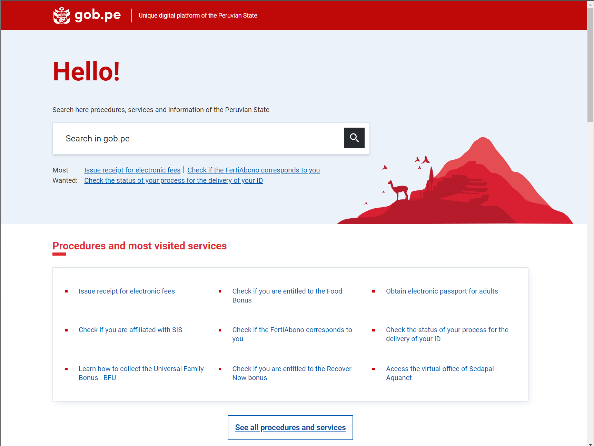

# One-stop-shop

## Citizen/business one-stop-shop

Information about government services is often complicated to access and understand for citizens. Lack of homogeneity in terms of location, format, language, and level of detail results in a lack of understanding of actions and procedures users must undertake to obtain services.

A citizen/business one-stop shop facilitates access to information on government services (Service Catalog), entities, and citizen participation mechanisms, among other resources (open data), in one place in a user-centric way.&#x20;

<figure><figcaption>
Representation of a service catalog under a Citizen/business one-stop shop
</figcaption></figure>

How does a good citizen/business one-stop shop benefit its users?

It allows its user to easily:

* Find the service/information they need by identifying the event that triggered the need. Example: Registering a newborn.
* Find the required information and actions to obtain the service.
* Understand the provided information and actions without any assistance.
* Obtain services in a uniform, simple, standardized way.
* Seek support from competent authority when needed.

How does a good citizen/business one-stop shop benefit s digital teams?

A good citizen/business one-stop shop allows:

* Analysis of the entire catalog of services to easily identify redundancies in requirements, sequencing of services according to life events, and opportunities for simplification
* One-time creation of machine-readable service information that can be accessed by users through various channels;
* User centricity leading to elevated user experience;
* Democratize accessibility and improve usage rate;
* Better management of services portfolio.

<figure><figcaption>
Example of a Content Management Structure to manage citizen/business one-stop shop
</figcaption></figure>



* Standardise information presentation to citizens/businesses:
  * Develop a Service Information Sheet Standard (SISS). This sheet would contain standardized fields such as: service name; requirements; cost for the user; the location where the service can be obtained; concrete actions required from the user; and outcome of the service.&#x20;
  * Government Entity Information Standard (GEIS): This sheet would contain standardized fields such as the mandate of the entity, the programs it manages, and the services it provides.
  * Citizen Feedback/Participation Standard (CFPS): A standard for the government to seek input from citizens through surveys, discussion forums, and comments on laws.
* The following is applicable in cases of countries following a centralized CMS-based approach.
  * Set up a Content Management System (CMS) to create, populate, update, and maintain the service catalog.
  * Designate a focal point in each Government entity to comprehensively capture the information of services corresponding to the agency according to SISS.
  * Establish a ticketing system to allow the incorporation of citizens' feedback on the service information sheets.
  * Continuously train focal points on UX writing to ensure that service information sheets are easily understandable by their users.
  * Structure services within the service catalog according to business and life events, enabling end-users to find what they need by simply identifying the event that triggered the search for service.
* Maintain and improve the service catalog.

The following are a few examples of Service Catalogs:

*   Landing page of Gob.pe that presents the most demanded services.

    <figure><figcaption>
<a href="https://www.gob.pe/">Gob.pe</a> Finalist of GovStack WSIS Special Prize 2023
</figcaption></figure>

    * Each service has its own dedicated service information sheet that presents requirements, citizen feedback on the quality of information on the service sheet, and the date on which the service sheet was last updated.

<figure><figcaption>
<a href="https://www.gob.pe/">Gob.pe</a>, Peru, Finalist of GovStack WSIS Special Prize 2023
</figcaption></figure>

* Tina is a transactional chatbot that retrieves information from Argentina's digital service catalog and presents it over chat to its users. This demonstrates the possibility to share the machine-readable content of services with users via multiple channels.


[Tina](https://www.argentina.gob.ar/tina), Argentina, Finalist of GovStack WSIS Special Prize 2023




* Shared service team: Develop and maintain the CMS
* Digital communications team: Develop UX guidelines and training focal points and perform random auditing on quality of service sheets to ensure they meet the service sheet standards.
* Focal point designates: Create service sheets, update them according to citizens' feedback, and implement regulation changes regarding services.



* Content Management System (CMS)
* Service catalog on CMS
* Service Information Sheet Standard
* Ticketing system
* Training material on UX writing



