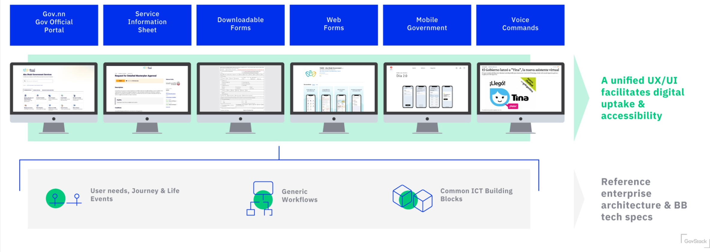

# Conception et livraison

Un guide étape par étape pour la co-conception et la fourniture d'une nouvelle génération de services gouvernementaux numériques basés sur la [compréhension des besoins des utilisateurs](https://govstack.gitbook.io/implementation-playbook/govstack-implementation-playbook/digital-service-design-standard-and-delivery-protocol/understand-user-needs-and-identiry-as-is-user-journey), [des événements de la vie ](https://govstack.gitbook.io/implementation-playbook/govstack-implementation-playbook/digital-service-design-standard-and-delivery-protocol/understand-user-needs-and-identiry-as-is-user-journey)et des parcours des utilisateurs en utilisant une approche Building Block. L'image suivante représente le processus de conception utilisant UX/UI pour créer une expérience numérique unifiée dans tous les services gouvernementaux.

<figure><figcaption>
UX/UI Desing process 
</figcaption></figure>

Livrables pour chaque étape de la norme de conception de service numérique et du protocole de livraison, comme indiqué dans l'image suivante.

<figure><figcaption>
Digital Service Design Standard and Delivery Protocol
</figcaption></figure>
