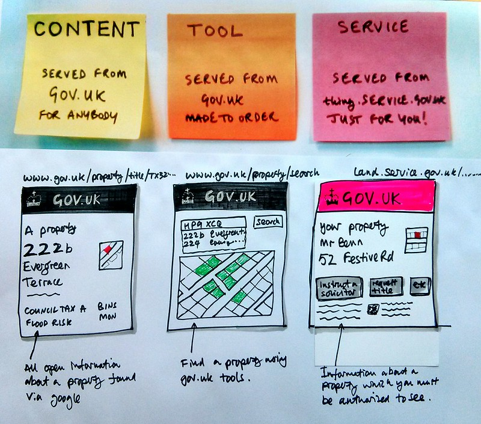

# Maquettes

**Faire des wireframes et/ou des flux de commandes vocales**

Au cours de cette étape, nous créons une conception testable basée sur une compréhension approfondie des attentes des utilisateurs et du parcours utilisateur "futur". Les esquisses, les wireframes et/ou le flux de commandes vocales vous aideront à vous assurer que votre service reflète les besoins de vos utilisateurs. C'est une représentation d'une forme réaliste et d'un service fonctionnel.

<figure><figcaption>
Gov.uk sketch example
</figcaption></figure>

Les wireframes et/ou le flux de commandes vocales permettent un examen direct de la viabilité d'un concept de conception avec les utilisateurs. Il est utile d'obtenir des commentaires sur les intentions des utilisateurs et divers éléments de conception et d'observer l'interaction des utilisateurs avec le produit.&#x20;

Voici les structures filaires développées pour le service de responsabilité élargie des producteurs au Rwanda.






Un bon flux de wireframes et/ou de commandes vocales nécessite :

* S'appuyer sur des structures filaires [Lo-Fi ](http://localhost:5000/o/pxmRWOPoaU8fUAbbcrus/s/zdXe8NbIMZIv5sydPBf6/)préliminaires et/ou un flux de commandes vocales qui montrent la structure, le placement et la hiérarchie de votre service.
* Évitez les choix de polices, de couleurs ou d'autres éléments qui pourraient distraire à la fois le chercheur et l'examinateur. Les conceptions légères sont conceptuellement plus faciles à reconfigurer. Profitez de cette occasion pour commencer à répertorier les modèles UX/UI dont vous aurez besoin.
* Examiner les structures [filaires et/ou les flux de commandes ](https://govstack.gitbook.io/implementation-playbook/govstack-implementation-playbook/learning-and-exchange/artefacts#wireframes-and-or-voice-command-flow)vocales en fonction du parcours utilisateur spécifique "To-be" pour s'assurer que les utilisateurs accomplissent leurs tâches et que leurs besoins sont satisfaits.
* Utiliser les [wireframes et/ou le flux de commandes vocales ](https://govstack.gitbook.io/implementation-playbook/govstack-implementation-playbook/learning-and-exchange/artefacts#wireframes-and-or-voice-command-flow)pour obtenir les commentaires de l'équipe sur la faisabilité et la structure.
* Utiliser des [wireframes et/ou un flux de commandes vocales](https://govstack.gitbook.io/implementation-playbook/govstack-implementation-playbook/learning-and-exchange/artefacts#wireframes-and-or-voice-command-flow)[#scope-of-work](maquettes.md#scope-of-work "mention") pour tester en toute sécurité des idées plus radicales.



Les actions suivantes sont recommandées pour développer un prototype.

* Créer une version[ préliminaire du service à l'aide d'un filaire et/ou d'un flux de commande vocale](../../govstack-implementation-playbook/learning-and-exchange/artefacts.md#wireframes-and-or-voice-command-flow)
* Donnez les [wireframes et/ou le flux de commandes vocales ](../../govstack-implementation-playbook/learning-and-exchange/artefacts.md#wireframes-and-or-voice-command-flow)à l'utilisateur (citoyen/serveur public/entreprise) et à l'utilisateur officiel public pour observer leurs interactions sans instruction.
* Après cette observation, demandez-leur d'effectuer une tâche précise.
* Posez des questions de clarification sur les raisons pour lesquelles ils font ce qu'ils font. Laissez le comportement de l'utilisateur guider les questions que vous posez. Il peut être utile de leur demander de raconter leur processus de pensée au fur et à mesure.



Who does what&#x20;

* [Service designers](../../govstack-implementation-playbook/annex/govstack-user-profiles-taxonomy.md#service-designer)/ Responsable de la conception - Dirigez les activités dans l'onglet "Activités".
* [User needs researchers](broken-reference) – Préparer et appliquer des entretiens utilisateurs, des groupes de discussion, anime des ateliers de parcours utilisateur
* [Legal policy officer](../../govstack-implementation-playbook/annex/govstack-user-profiles-taxonomy.md#legal-policy-officer)– Clarifier les réglementations applicables au service
* [UX/IU Designers](broken-reference) – Si le service en cours d'analyse est déjà en ligne, les concepteurs UX/UI peuvent rejoindre les sessions de co-conception pour avoir une interaction de première main avec les utilisateurs
* [Product/Tech experts](../../govstack-implementation-playbook/annex/govstack-user-profiles-taxonomy.md#back-end-developers)  -Si le service en cours d'analyse est déjà en ligne, les membres de l'équipe Produit/Tech peuvent participer à la session d'itération avec les utilisateurs pour voir la réaction au prototype de cadre blanc



* [Wireframes and/or voice command flow](../../govstack-implementation-playbook/learning-and-exchange/artefacts.md#wireframes-and-or-voice-command-flow) &#x20;
* Appliquer les normes nationales de conception des services numériques. Cela inclut les normes pour :
  * [Service information sheet](https://govstack.gitbook.io/implementation-playbook/govstack-implementation-playbook/learning-and-exchange/artefacts#information-service-sheets)
  * [Downloadable forms](broken-reference)
  * [Web forms](broken-reference)
  * [Electronic documents](broken-reference)
  * [Notifications](broken-reference)
  * [Performance analytics](broken-reference)
  * [Citizen satisfaction survey](broken-reference)
  * [Accessibility ](broken-reference)



Que faire ensuite&#x20;

* Répéter! Les wireframes et/ou le flux de commandes vocales doivent être rapides et indolores à créer, et encore plus rapides et indolores à supprimer.
* Obtenir l'approbation du propriétaire du service pour procéder au prototype fonctionnel
* Commencer à travailler sur un prototype fonctionnel.



* LMS Modules: [1](../../govstack-implementation-playbook/learning-and-exchange/govlearn.md#awareness-building-and-expression-of-interest),[2](../../govstack-implementation-playbook/learning-and-exchange/govlearn.md#agreement-of-cooperation),[3](../../govstack-implementation-playbook/learning-and-exchange/govlearn.md#govstack-internal-kick-off) &#x20;
* [Gov.uk Design system](https://design-system.service.gov.uk/community/resources-and-tools/)&#x20;
* [Be creative and think out of the box. Feel free to use Gov.uk sketches template](https://designnotes.blog.gov.uk/2014/05/22/gov-uk-sketching-templates/)&#x20;
* [Beginner's Guide | Mockitt Tutorial](https://www.youtube.com/watch?v=X5HVZQ9Nii4)&#x20;


