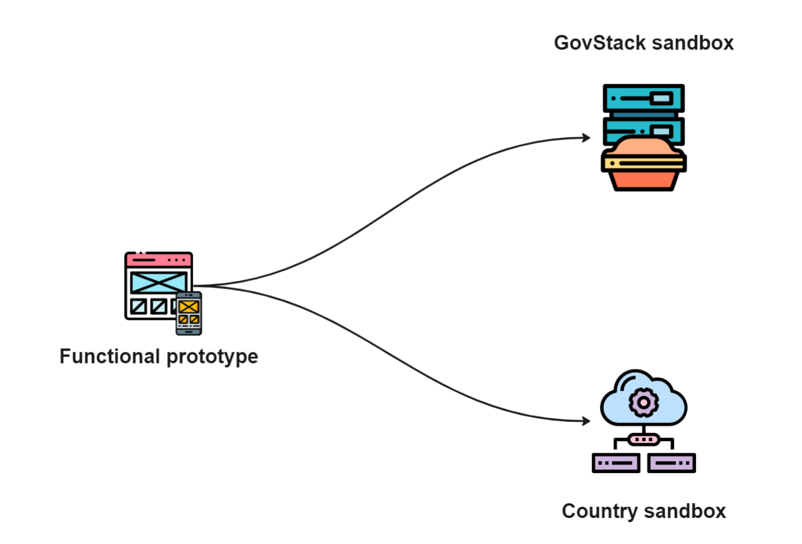

# Prototype

Une[ fois le filaire ](https://govstack.gitbook.io/implementation-playbook/govstack-implementation-playbook/design-and-delivery/wireframes)et/ou le flux de [commandes vocales approuvés](https://govstack.gitbook.io/implementation-playbook/govstack-implementation-playbook/design-and-delivery/wireframes), nous sommes prêts à commencer à développer et à orchestrer un prototype fonctionnel du service. Les équipes numériques peuvent soit utiliser le bac à sable GovStack, soit leur propre infrastructure. Étant donné que GovStack est actuellement en train de développer le bac à sable, les futures versions du playbook décriront les processus d'utilisation du bac à sable GovStack pour déployer le prototype fonctionnel.

Le prototype est développé de manière itérative. Chaque itération successive ajoute de nouvelles fonctionnalités et affine le prototype en fonction des retours des utilisateurs. Il en résulte un service qui répond au niveau de fonctionnalité et de convivialité souhaité. Voici les étapes de prototypage d'un service numérique de l'administration, de la version α à la version Launch :

| Alpha                                                                                                                                                                                                                                                                                                                                                                                                                                                           | Beta                                                                                                                                                                                                                                                                                                                                                                                                                                                                                                                                                       | Pilote                                                                                                                                                                                                                                                                                                                                                     |
| --------------------------------------------------------------------------------------------------------------------------------------------------------------------------------------------------------------------------------------------------------------------------------------------------------------------------------------------------------------------------------------------------------------------------------------------------------------- | ---------------------------------------------------------------------------------------------------------------------------------------------------------------------------------------------------------------------------------------------------------------------------------------------------------------------------------------------------------------------------------------------------------------------------------------------------------------------------------------------------------------------------------------------------------- | ---------------------------------------------------------------------------------------------------------------------------------------------------------------------------------------------------------------------------------------------------------------------------------------------------------------------------------------------------------- |
| La version α est un prototype fonctionnel brut utilisé pour tester le concept initial et obtenir les commentaires d'un nombre limité d'utilisateurs et de parties prenantes. La durée de la version α doit être convenue entre les propriétaires de services et les parties prenantes. Elle dure généralement entre quelques semaines et quelques mois. La version α peut être hébergée dans un environnement de test qui peut ou non être le GovStack Sandbox. | Une fois la version α testée et les commentaires recueillis, la version β est développée. Ce prototype est plus raffiné et se rapproche du service numérique final. Il comprend plus de fonctionnalités et est testé par un plus grand groupe d'utilisateurs ou de parties prenantes pour identifier les problèmes finaux avant de lancer la prochaine itération. Dans le cas où la version β est hébergée sur GovStack Sandbox, des préparations doivent être faites pour la déployer sur l'infrastructure cloud / l'environnement de production du pays. | La version de lancement est la première version du service rendue publique. Il comprend les caractéristiques et fonctionnalités de base qui répondent aux besoins des utilisateurs et itérées en fonction des futurs commentaires des utilisateurs. Il est déployé, exploité et maintenu sur l'infrastructure cloud/l'environnement de production du pays. |

<figure><figcaption></figcaption></figure>

S'il est décidé de déployer la version de lancement sur le cloud et l'environnement d'infrastructure/de production du pays, elle peut être configurée selon l'architecture d'entreprise GovStack.

<figure><figcaption>
Options for countries to delpoy the functional prototype.
</figcaption></figure>



Comment aller là:

* Élaborer des spécifications produit et techniques pour le service.
* Développer le front-end et le back-end du service conformément aux spécifications produit et techniques et aux wireframes et/ou flux de commande vocale approuvés.
* Développer un script de test prenant en compte toutes les branches du parcours utilisateur "to-be".
* Préparer et mettre en œuvre des scripts de test
* Préparer la liste de contrôle de sécurité et d'assurance qualité
* Préparer le plan de lancement du service numérique
* Préparer la routine de stabilisation et d'entretien
* Lancez les versions α, β pour un ensemble limité de citoyens/utilisateurs professionnels, d'administrateurs et d'agents publics.
* Recueillez leurs retours sur le prototype fonctionnel et identifiez des étapes concrètes pour l'améliorer.
* Développé et livré de manière itérative la version de lancement qui répond aux exigences et aux besoins des citoyens/utilisateurs professionnels, des administrateurs et des fonctionnaires.
* Préparer et mettre en œuvre un plan de transition.
* Prochaines étapes:&#x20;
  * Préparer le plan de migration pour la version de lancement dans l'environnement de cloud et d'infrastructure/de production du pays.&#x20;
  * Préparer le lancement du service.&#x20;
  * Stabiliser le service&#x20;



Qui fait quoiv

* [Service designer](https://govstack.gitbook.io/implementation-playbook/govstack-implementation-playbook/annex/govstack-user-profiles-taxonomy#service-designer) – Diriger le parcours de co-conception de services
* Product Owner – Diriger le développement de produits logiciels conformément au plan de service &#x20;
* [Front-end developer](https://govstack.gitbook.io/implementation-playbook/govstack-implementation-playbook/annex/govstack-user-profiles-taxonomy#front-end-developer) – Développe des applications frontales en suivant le guide de style UX/UI  &#x20;
* [Solution architect](https://govstack.gitbook.io/implementation-playbook/govstack-implementation-playbook/annex/govstack-user-profiles-taxonomy#solution-architect) – Architecte le service selon le plan d'intégration BB &#x20;
* [Back-end developer](https://govstack.gitbook.io/implementation-playbook/govstack-implementation-playbook/annex/govstack-user-profiles-taxonomy#back-end-developers) –  Ajustez BB, connectez les systèmes hérités et testez l'application
* [Digital security manager](https://govstack.gitbook.io/implementation-playbook/govstack-implementation-playbook/annex/govstack-user-profiles-taxonomy#digital-security-manager) - valide le respect de la politique de sécurité numérique
* [Cloud architect](https://govstack.gitbook.io/implementation-playbook/govstack-implementation-playbook/annex/govstack-user-profiles-taxonomy#cloud-architect) - Conçoit une stratégie cloud et une architecture de microservices qui prennent en charge la numérisation des services gouvernementaux



Étant donné que GovStack commence ses implémentations de référence dans les pays, les ressources suivantes seront liées dès qu'elles seront générées&#x20;

* Référentiel GitHub avec code documenté selon le pays
* Norme de service numérique
* Manuel de conception frontale
* Manuel d'administration
* Manuel de l'Utilisateur
* Manuel d'architecture de la solution
* Plan de test et rapport de résultats
* Listes de contrôle de sécurité et d'assurance qualité et rapport de résultats
* Plan de formation et stratégie d'accompagnement par fonction
* Plan de publication
* Routine de stabilisation et d'entretien

Un bon prototype fonctionnel du service…

* Conforme au 'To-be user journey' approuvé et au flux de commandes filaires et/ou vocales
* Conforme aux normes nationales de conception de services numériques. Cela inclut des normes pour :
  * [Service information sheet](https://govstack.gitbook.io/implementation-playbook/govstack-implementation-playbook/learning-and-exchange/artefacts#information-service-sheets)
  * [Downloadable forms](broken-reference)
  * [Web forms](broken-reference)
  * [Electronic documents](broken-reference)
  * [Notifications](broken-reference)
  * [Performance analytics](broken-reference)
  * [Citizen satisfaction survey](broken-reference)
  * [Accessibility ](broken-reference)
* Conforme à l'architecture d'entreprise du pays, y compris les protocoles de sécurité numérique approuvés par l'équipe technique du pays&#x20;



