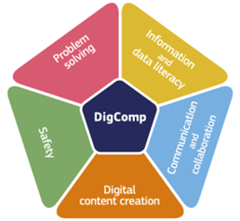
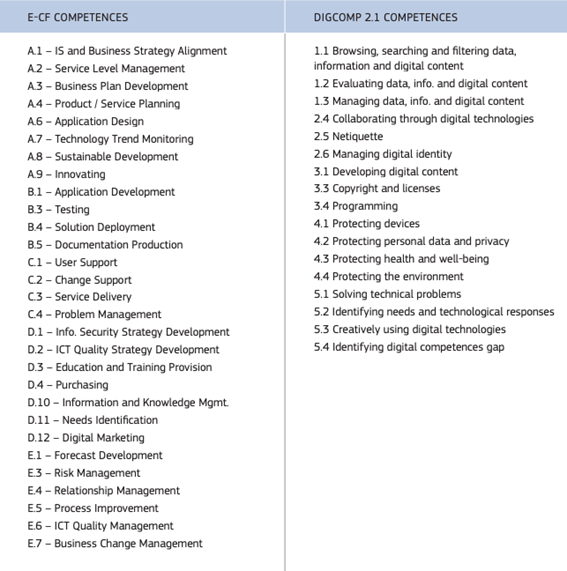

# Aptitudes et compétences

Comme détaillé dans le [GovStack Competence Building Module](../../govstack-implementation-playbook/learning-and-exchange/capacity-development/academic-support-to-capacity-development.md), la mise en œuvre réussie de l'approche GovStack exige que les pays envisagent une stratégie à long terme qui intègre le soutien académique nécessaire pour atteindre leurs objectifs de numérisation.&#x20;

La dernière parution de [DigComp 2.2](https://publications.jrc.ec.europa.eu/repository/handle/JRC128415), présente le cadre consolidé des compétences numériques utilisées en Europe, y compris des exemples de connaissances, de compétences et d'attitudes (dimension 4) ainsi que des cas d'utilisation (dimension 5) qui traitent de la gestion du changement. Ceux-ci sont équivalents à [e-CF](../../govstack-implementation-playbook/learning-and-exchange/capacity-development/academic-support-to-capacity-development.md) E7 Business Change Management L.4-5, et (presque généralisé) Change support

<figure><figcaption>
DigComp 2.2
</figcaption></figure>

<table data-view="cards"><thead><tr><th></th><th></th><th></th></tr></thead><tbody><tr><td>
<strong>Profils de rôle de professionnel des TIC (soft)</strong>

Apprendre à apprendre l'attitude Compétences collaboratives Compétences en communication Connaissance des affaires Conscience de la situation Compétences en innovation Esprit critique Compréhension globale Leadership/persuasion
</td><td></td><td></td></tr><tr><td><strong>Profils numériques (poste et formation)</strong></td><td>

Consultant numérique Enseignement supérieur, de préférence Diplôme d'école de commerce

</td><td></td></tr><tr><td><strong>Activités à réaliser</strong></td><td>

Consultant numérique Enseignement supérieur, de préférence Diplôme d'école de commerce
</td><td></td></tr></tbody></table>

<figure><figcaption>
E-CF - DIGCOMP 2.1 Competences Comparision Table
</figcaption></figure>

CEN/CENELC e-Competences Framework

