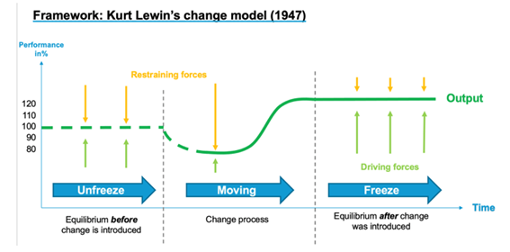
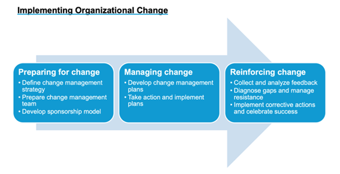

# Modèles de gestion du changement

### Changement de modèles et changement numérique

Au niveau conceptuel, il y a peu de nouveautés sur la manière dont les gouvernements adoptent le changement numérique, par rapport à d'autres types de changement. Différents modèles théoriques ont été développés pour comprendre différents types de changement, du modèle de changement de Kurt Lewin (1947) au triangle stratégique de Mark Moore (1995) et au modèle de John Kotter (1995). L'étude de la gestion du changement a commencé entre 1900 et 1945, et de 1945 à 1990, les études se sont améliorées pour comprendre les mécanismes associés au changement. Entre 1990 et 2000, la gestion du changement a été établie en tant que discipline académique. Cette discipline a progressé vers l'approfondissement et la modélisation des concepts et des outils de 2000 à 2010, et actuellement, l'accent est mis sur l'amélioration des capacités internes des individus, des équipes et des organisations.

De nombreuses études ont examiné les tentatives d'introduction d'un changement d'ère numérique dans les gouvernements du monde entier. À ce jour, il existe des outils puissants qui peuvent être déployés pour tenter de surmonter l'éventail des obstacles au changement. Cependant, l'utilisation efficace de ces outils nécessite des compétences pour [digital team](../../govstack-implementation-playbook/annex/sample-digital-team-composition.md), en particulier pour ceux qui occupent des postes de direction, d'innovation et de gestion du changement.

Il n'existe pas de modèle universel pour la mise en œuvre d'un changement numérique significatif dans les gouvernements. Même s'il existe des idées concurrentes sur «ce qui compte le plus», nous sommes encore loin d'avoir une idée claire des «gagnants». Néanmoins, certaines idées généralisables telles que les intérêts géographiques, culturels ou sectoriels peuvent toujours être appliquées dans des contextes similaires.

Le gouvernement à l'ère numérique ne consiste pas seulement à développer de nouvelles pratiques et capacités. Cela implique une question plus large de savoir si les nouvelles pratiques et technologies conduiront à repenser la façon dont les institutions gouvernementales sont structurées et gérées. Les théories du changement vers une approche « gouvernement numérique en tant que plateforme » sont pertinentes pour la transformation numérique que les gouvernements cherchent à mettre en œuvre, et cette approche fait partie intégrante du parcours de numérisation.

### Modèles de gestion stratégique du changement

Diverses théories ont été développées concernant la gestion du changement, y compris celles proposées par Kotter, Prosci et Lewis, entre autres. Ces théories ont contribué à fournir une compréhension globale de la nature du changement et à permettre aux organisations de gérer efficacement le changement sans perturber leurs opérations. Ils aident les organisations à identifier le besoin de changement et à évaluer les facteurs moteurs qui le sous-tendent.



Le programme de Lewin pour le changement planifié et l'amélioration des performances implique un processus en trois phases de modification du comportement.

Le cadre propose que les organisations et leurs routines doivent être « dégelées » dans la première phase, ce qui implique de réduire les forces qui maintiennent le comportement dans sa forme actuelle et de reconnaître le besoin de changement et d'amélioration.

La deuxième phase, le mouvement, implique le développement de nouvelles attitudes ou comportements et la mise en œuvre du changement. Cependant, il peut y avoir des forces de retenue qui s'opposent aux forces motrices du changement.

Dans la phase finale, après la mise en œuvre du processus de changement, les nouvelles routines et procédures sont à nouvelles figées, stabilisant idéalement le changement au nouveau niveau et le renforçant (Hardy, 1996).

<figure><figcaption>
<em>Kurt Lewin's change model (1947)</em>
</figcaption></figure>



Le deuxième cadre de changement fait référence aux trois phases du changement (préparer, gérer et renforcer le changement). Ce cadre est étroitement aligné sur le cadre précédent et est souvent utilisé dans la pratique :

<figure><figcaption>
<em>Implementing organizational change: preparing, managing, and reinforcing change</em>
</figcaption></figure>



Les recherches de Kotter ont présenté une nouvelle approche de la gestion du changement. Il a suggéré que les organisations devraient créer une nouvelle culture où les managers considèrent le changement comme une opportunité et modifient leurs systèmes d'entreprise pour répondre aux conditions émergentes en permanence.[(Hussey, D.E. (2000). How to Manage Organisational Change (Vol. 28). Kogan Page Publishers: London).](https://books.google.ee/books?hl=en\&lr=\&id=vpJLQHlN-BQC\&oi=fnd\&pg=PA108\&dq=\(Hussey,+D.E.+\(2000\).+How+to+Manage+Organisational+Change+\(Vol.+28\).+Kogan+Page+Publishers:+London\).\&ots=ma7aLM5GH\_\&sig=BpXyijIiHFIyaR\_EWlZSvsHGKfw\&redir\_esc=y#v=onepage\&q\&f=false)

Les huit étapes suivantes du processus de changement sont sa contribution..

> * Établir un sentiment d'urgence
> * Former une puissante coalition directrice
> * Créer une vision
> * Communiquer la vision
> * Donner aux autres les moyens d'agir selon la vision
> * Planifier et créer des gains à court terme
> * Consolider les améliorations et produire encore plus de changement
> * Institutionnaliser de nouvelles approches



Une gestion efficace du changement exige cinq objectifs clés pour former le modèle ADKAR de base :

> * Prise de conscience de la nécessité de changer
> * Volonté de participer et d'accompagner le changement&#x20;
> * Savoir comment changer (et à quoi ressemble le changement)
> * Capacité à mettre en œuvre le changement au quotidien
> * Renforcement pour maintenir le changement en place (Hiatt 2003)

5 principes émergent du modèle ADKAR et des outils d'évaluation de Prosci :

> * Principe 1 : Nous changeons pour une raison&#x20;
> * Principe 2 : Le changement organisationnel nécessite un changement individuel&#x20;
> * Principe 3 : Les résultats organisationnels sont le résultat collectif du changement individuel&#x20;
> * Principe 4 : La gestion du changement est un cadre habilitant pour gérer le côté humain du changement&#x20;
> * Principe 5 : Nous appliquons la gestion du changement pour réaliser les avantages et les résultats souhaités du changement



Comme résultat pratique, notre approche modèle GovStack de la gestion du changement comprend 6 étapes clés :

> 1. Fixer des objectifs&#x20;
> 2. Faire un diagnostic&#x20;
> 3. Identifier les profils&#x20;
> 4. Définir la stratégie&#x20;
> 5. Piloter le changement&#x20;
> 6. Consolider le changement



