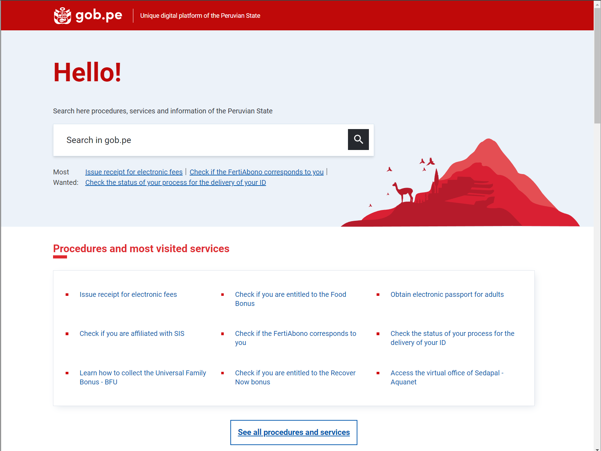

# One-stop-shop

## Citoyen/entreprise one-stop-shop

L'information sur les services gouvernementaux est souvent compliquée d'accès et de compréhension pour les citoyens. Le manque d'homogénéité en termes d'emplacement, de format, de langue et de niveau de détail entraîne un manque de compréhension des actions et des procédures que les utilisateurs doivent entreprendre pour obtenir des services.

Un guichet unique citoyen/entreprise facilite l'accès aux informations sur les services gouvernementaux (Catalogue de services), les entités et les mécanismes de participation citoyenne, entre autres ressources (données ouvertes), en un seul endroit et de manière centrée sur l'utilisateur.

<figure><figcaption>
Représentation d'un catalogue de services sous un Guichet Unique Citoyen/Entreprise
</figcaption></figure>

Comment un bon guichet unique citoyen/entreprise profite-t-il à ses utilisateurs ?

Il permet à son utilisateur de facilement :

*   Trouvez le service/l'information dont ils ont besoin en identifiant l'événement qui a déclenché le besoin. Exemple : Enregistrement d'un nouveau-né.

*   Trouvez les informations et les actions requises pour obtenir le service.

*   Comprendre les informations fournies et les actions sans aucune assistance.

*   Obtenez des services de manière uniforme, simple et standardisée.

* Demander l'aide de l'autorité compétente en cas de besoin.

Comment un bon guichet unique citoyen/entreprise profite-t-il aux équipes digitales ?

Un bon guichet unique citoyen/entreprise permet :

* Analyse de l'ensemble du catalogue de services pour identifier facilement les redondances dans les besoins, l'enchaînement des services selon les événements de la vie, et les opportunités de simplification
* Création unique d'informations de service lisibles par machine auxquelles les utilisateurs peuvent accéder via différents canaux ;
* Centré sur l'utilisateur menant à une expérience utilisateur élevée ;
* Démocratiser l'accessibilité et améliorer le taux d'utilisation ;
* Meilleure gestion du portefeuille de services .

<figure><figcaption>
Exemple d'une structure de gestion de contenu pour gérer le guichet unique citoyen/entreprise
</figcaption></figure>



* Standardiser la présentation des informations aux citoyens/entreprises :
  * Élaborer une norme de fiche d'information sur les services (SISS). Cette feuille contiendrait des champs normalisés tels que : nom du service ; exigences; coût pour l'utilisateur ; le lieu où le service peut être obtenu ; les actions concrètes demandées à l'utilisateur ; et le résultat du service.
  * Norme d'information sur les entités gouvernementales (GEIS) : cette feuille contiendrait des champs normalisés tels que le mandat de l'entité, les programmes qu'elle gère et les services qu'elle fournit.
  * Norme de rétroaction/participation des citoyens (CFPS) : une norme permettant au gouvernement de solliciter les commentaires des citoyens par le biais d'enquêtes, de forums de discussion et de commentaires sur les lois.
* Ce qui suit est applicable dans les cas de pays suivant une approche centralisée basée sur le CMS.
  * Configurez un système de gestion de contenu (CMS) pour créer, remplir, mettre à jour et gérer le catalogue de services.
  * Désigner un point focal dans chaque entité gouvernementale pour saisir de manière exhaustive les informations des services correspondant à l'agence selon le SISS.
  * Établir un système de billetterie pour permettre l'incorporation des commentaires des citoyens sur les fiches d'information du service.
  * Former en continu les points focaux à la rédaction UX pour s'assurer que les fiches services sont facilement compréhensibles par leurs utilisateurs.
  * Structurez les services au sein du catalogue de services en fonction des événements professionnels et de la vie, permettant aux utilisateurs finaux de trouver ce dont ils ont besoin en identifiant simplement l'événement qui a déclenché la recherche de service.
* Maintenir et améliorer le catalogue de services.

Voici quelques exemples de catalogues de services :

*   Landing page de Gob.pe qui présente les services les plus demandés.

    <figure><figcaption>
<a href="https://www.gob.pe/">Gob.pe</a> Finaliste du prix spécial GovStack WSIS 2023
</figcaption></figure>

    * Chaque service a sa propre fiche service dédiée qui présente les besoins, les retours des citoyens sur la qualité des informations de la fiche service, et la date de la dernière mise à jour de la fiche service.

<figure><figcaption>
<a href="https://www.gob.pe/">Gob.pe</a>, Pérou, finaliste du prix spécial GovStack WSIS 2023
</figcaption></figure>

* Tina est un chatbot transactionnel qui récupère les informations du catalogue de services numériques argentins et les présente par chat à ses utilisateurs. Cela démontre la possibilité de partager le contenu lisible par machine des services avec les utilisateurs via plusieurs canaux.


[Tina](https://www.argentina.gob.ar/tina), Argentine, finaliste du prix spécial GovStack WSIS 2023




* Équipe de service partagé : développer et maintenir le CMS
* Équipe de communication numérique : Élaborer des directives UX et des points focaux de formation et effectuer des audits aléatoires sur la qualité des feuilles de service pour s'assurer qu'elles respectent les normes de la feuille de service.
* Le point focal désigne : Créer des fiches de services, les mettre à jour en fonction des retours des citoyens et mettre en œuvre les évolutions réglementaires concernant les services.



* Système de gestion de contenu (CMS)
* Catalogue de services sur CMS
* Norme de fiche d'information sur le service
* Système de billetterie
* Matériel de formation sur l'écriture UX



