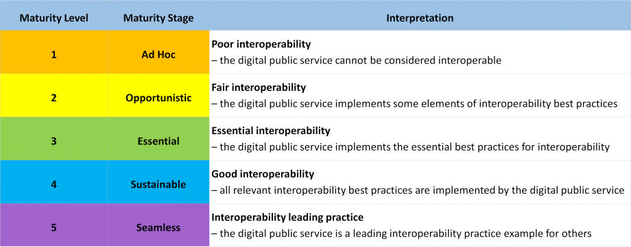
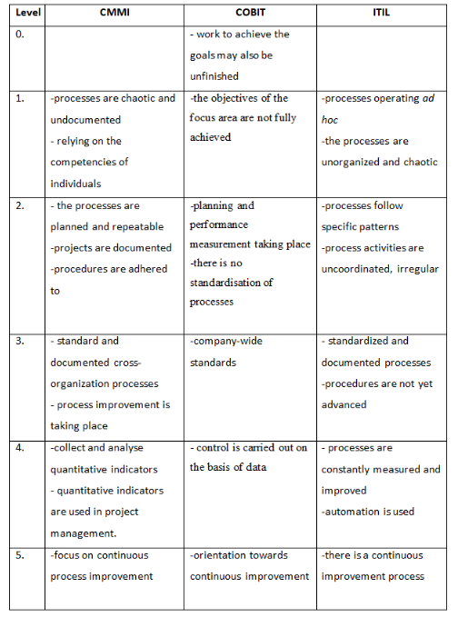
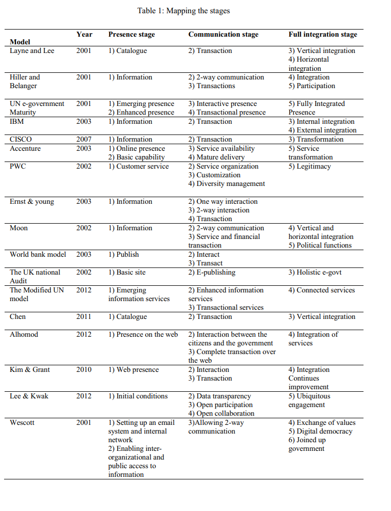
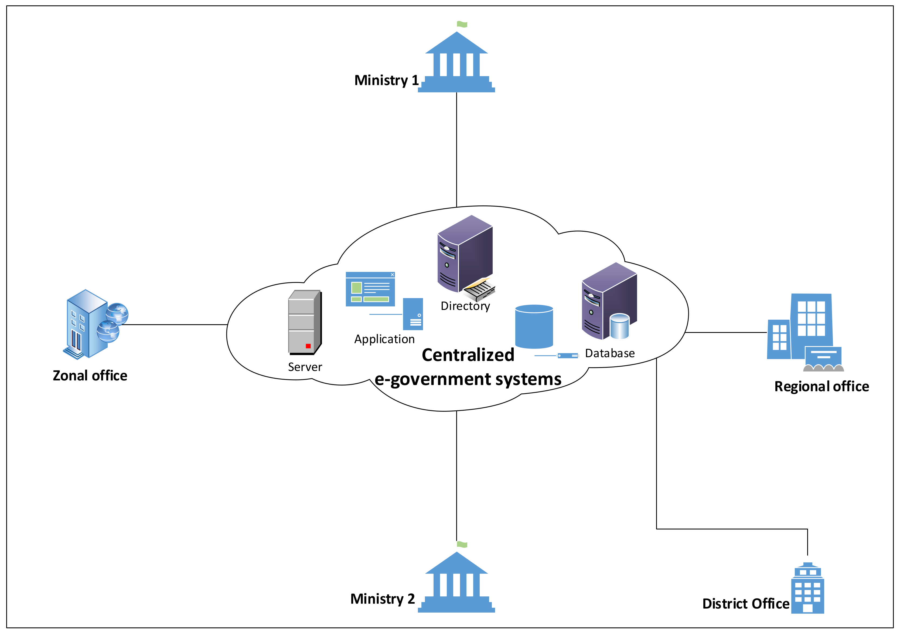

# Évaluation de la maturité

Le PNUD définit l'évaluation de la maturité numérique (DMA) comme un outil stratégique pour évaluer la préparation numérique des systèmes, des services et des capacités numériques afin de développer un gouvernement numérique innovant, ouvert, agile et accessible. Son objectif principal est d'aider les gouvernements à analyser les principales lacunes dans les opérations internes et la prestation de services.

Une évaluation de la maturité peut être utilisée pour mesurer le niveau de maturité actuel d'un certain aspect d'un service ou d'une organisation de manière significative, permettant aux parties prenantes d'identifier clairement les forces et les opportunités d'amélioration. Sur la base de cette évaluation, les gouvernements sont mieux placés pour établir des priorités politiques afin d'atteindre des niveaux de maturité plus élevés.

Cette section fournit des références à différentes approches d'évaluation de la maturité issues du secteur public, du secteur privé et du milieu universitaire.

## 1. Gouvernement



[L'évaluation de la maturité numérique](https://www.undp.org/sites/g/files/zskgke326/files/2022-08/UNDP\_LaoPDR\_DMA\_2022.pdf) est conçue pour aider les gouvernements du monde entier à évaluer leur degré de préparation à entreprendre la transformation numérique. Il définit cinq niveaux de maturité :

1. **Numériquement naissant**
2. **Émergence numérique**
3. **Digitalement Agile et Intégré**
4. **Transformé numériquement**
5. **Innovant numériquement**

L'évaluation de la maturité numérique du PNUD peut être utilisée pour évaluer le potentiel actuel du gouvernement numérique à travers six piliers clés qui comprennent : la technologie et les solutions, la politique et la réglementation, le renforcement des compétences et des capacités, l'orientation utilisateur, la définition et la prestation des services, le cadre institutionnel et la collaboration.

Comme dans le cas de la RDP lao, il a été utilisé pour évaluer comment les solutions TIC au sein du gouvernement peuvent continuer à améliorer l'efficacité opérationnelle et la satisfaction des utilisateurs.

<figure><figcaption></figcaption></figure>



[L'indice de maturité GovTech (GTMI) ](https://openknowledge.worldbank.org/handle/10986/36233)(Dener et al. 2021) mesure les aspects clés de quatre domaines d'intervention GovTech : soutenir les systèmes gouvernementaux de base, améliorer la prestation de services, intégrer l'engagement des citoyens et favoriser les catalyseurs GovTech. Il assiste les conseillers et les praticiens dans la conception de nouveaux projets de transformation numérique, en mettant l'accent sur l'approche pangouvernementale et l'orientation citoyenne.

Englobant des sources de données cohérentes dans 198 pays, le GTMI complète les outils et diagnostics existants en fournissant une ligne de base et une référence pour la maturité GovTech et en offrant des informations sur les domaines qui peuvent être améliorés.



[L'indice de gouvernement numérique (DGI)](https://www.oecd-ilibrary.org/sites/2bed4623-en/index.html?itemId=/content/component/2bed4623-en) est un outil d'évaluation et d'analyse comparative qui peut être utilisé pour évaluer la maturité des politiques de gouvernement numérique et leur mise en œuvre dans le cadre d'une approche cohérente et pangouvernementale. La DGI peut aider les gouvernements à mieux comprendre leur capacité à opérer dans un contexte de plus en plus numérique et mondialisé.



[L'auto-évaluation de la maturité numérique](http://localhost:5000/o/pxmRWOPoaU8fUAbbcrus/s/zdXe8NbIMZIv5sydPBf6/) adopte une approche sectorielle pour mesurer dans quelle mesure les prestataires secondaires en Angleterre utilisent les technologies numériques pour parvenir à un système de santé sans papier. L'auto-évaluation de la maturité numérique aide les organisations individuelles à identifier les principales forces et les lacunes en matière de prestation de services. Ensemble, ces auto-évaluations individuelles donnent un aperçu des progrès de la maturité numérique à travers le pays.



Le[ modèle de maturité de la transformation numérique](https://www.oecd.org/tax/forum-on-tax-administration/publications-and-products/digital-transformation-maturity-model.pdf) contenu dans ce rapport couvre les voies de croissance et de transformation de l'administration fiscale 3.0. L'objectif du modèle de maturité de la transformation numérique est de :

* Permettre aux administrations fiscales de s'auto-évaluer par le biais de discussions internes sur la façon dont elles perçoivent leur niveau actuel de maturité numérique. Il n'y a pas de niveau optimal de maturité prescrit pour les administrations fiscales. Le niveau de maturité dépendra des circonstances, des objectifs plus larges et des priorités de chaque organisation.
* Fournir au personnel et à la haute direction de l'administration fiscale un bon aperçu du niveau de maturité sur la base des contributions des parties prenantes de l'ensemble de l'organisation. Cela peut aider à décider de la stratégie et à identifier les domaines à améliorer, y compris les domaines qui nécessitent le soutien d'autres parties de l'administration fiscale ou de parties prenantes externes, y compris d'autres parties du gouvernement. Un certain nombre d'administrations ont signalé que les conversations interorganisationnelles lors de l'auto-évaluation peuvent être utiles pour relier différents domaines d'activité, aider les gens à voir l'étendue des synergies et à identifier les domaines de soutien mutuel.
* Permettre aux administrations fiscales de comparer leur niveau de maturité numérique avec leurs homologues. Une administration connaîtra son propre niveau et pourra se comparer aux autres administrations fiscales. Il est également possible pour les administrations fiscales de contacter, par l'intermédiaire du Secrétariat, d'autres administrations fiscales à différents niveaux de maturité à des fins de discussion et d'apprentissage entre pairs.



[IMAPS](https://joinup.ec.europa.eu/collection/interoperability-assessment-tools-iats-digital-public-services/about) is an online survey that helps public officials evaluate and improve all key interoperability aspects of their digital public service (legal, semantic, organisational, or technical). IMAPS also allows public officials to monitor service’s compliance with the New European Interoperability Framework (EIF).

IMAPS is a versatile tool that can be used to assess the interoperability of any public service – from open data portals, and e-voting platforms, to public procurement services, and much more – and applied at all levels of government (international, national, regional and local).

IMAPS looks at three different service areas

IMAPS (European Commission 2022) looks at three different service areas (see IMAPS conceptual model below):

* Service Delivery (D) – Delivery of the digital public service;
* Service Consumption (C) – Consumption of reusable machine-to-machine services from other public administrations and businesses. This can include the consumption of functionalities, base registry information and security services;
* Service Management (B) – Controlling and monitoring the process flow related to service interactions with the external domain from trigger to outcome. This area includes Service Management aspects such as enterprise architecture, procurement, and service level management.

<figure><figcaption>
<a href="https://joinup.ec.europa.eu/sites/default/files/inline-images/Picture1_13.png">IMAPS conceptual model</a>
</figcaption></figure>

IATs define five (or four for GIQAT) levels of interoperability maturity

* **Ad hoc** _(level 1)_: Poor interoperability – the digital public service cannot be considered interoperable
* **Opportunistic** _(level 2)_: Fair interoperability – the digital public service implements some elements of interoperability best practices
* **Essential** _(level 3)_: Essential interoperability – the digital public service implements the essential best practices for interoperability
* **Sustainable** _(level 4)_: Good interoperability – all relevant interoperability best practices are implemented by the digital public service
* **Seamless** _(level 5)_: Interoperability leading practice – the digital public service is a leading interoperability practice example for others

<figure><figcaption></figcaption></figure>



## 2. Secteur privé



[Gartner (2017) évalue la maturité du gouvernement numérique](https://www.gartner.com/smarterwithgartner/5-levels-of-digital-government-maturity) en examinant dans quelle mesure les organisations utilisent efficacement les données pour reconcevoir les services et en fournir de nouveaux, ainsi que pour transformer et gérer les opérations.

Le modèle de maturité à 5 niveaux de Gartner comprend :

Niveau 1 : Initial (E-Gouvernement)

### Initiale (e-gouvernement)

À ce niveau, l'accent est mis sur la mise en ligne des services pour la commodité des utilisateurs et les économies de coûts, mais les données et leurs utilisations sont cloisonnées et extrêmement limitées. "Si l'opinion de l'organisation est qu'un pourcentage élevé de services en ligne ou d'accès mobile représente un gouvernement numérique moderne, alors plus d'éducation et de plaidoyer sont nécessaires pour montrer à quoi ressemble un véritable gouvernement numérique et ses avantages", a déclaré Di Maio. "Pour plaider en faveur de l'avancement, créez des études de cas expliquant comment la transformation numérique atténuera ou supprimera les points faibles prioritaires pour l'organisation."

Niveau 2 : Développement (Ouvert)

### Développement (Ouvert)

Le niveau 2 n'est pas nécessairement postérieur au niveau 1. Les programmes de gouvernement électronique et de gouvernement ouvert coexistent souvent, avec un leadership et des priorités différents. Le gouvernement ouvert prend souvent la forme de programmes publics destinés à promouvoir la transparence, l'engagement des citoyens et l'économie des données. Les exemples que nous voyons aujourd'hui sont les initiatives naissantes de données ouvertes, souvent dans le contexte de [programmes de villes intelligentes](https://www.gartner.com/newsroom/id/3545018) tels que le [Copenhagen Data Exchange](https://www.citydataexchange.com/#/home).

Niveau 3 : défini (centré sur les données)

### Défini (centré sur les données)

À ce niveau, l'accent passe de la simple écoute des besoins des citoyens ou des utilisateurs à l'exploration proactive des nouvelles possibilités inhérentes à la collecte et à l'exploitation stratégiques des données. Les indicateurs de performance clés ici sont « combien de nos données sont ouvertes ? » et "combien de nos applications sont construites sur des données ouvertes ?" Il est tentant à ce stade de s'engager dans des projets de vanité ou d'aller de l'avant avant que les bases appropriées ne soient posées; il est primordial de rester concentré sur la conception et la mise en œuvre de stratégies et de processus centrés sur les données.

Niveau 4 : Géré (entièrement numérique)

### Géré (entièrement numérique)

À ce niveau, l'organisation, l'agence ou le ministère s'est pleinement engagé dans une approche centrée sur les données pour améliorer le gouvernement, et l'approche privilégiée en matière d'innovation est basée sur les principes des données ouvertes. Les données circulent régulièrement au-delà des frontières organisationnelles, ce qui facilite les interactions et améliore les services pour les électeurs. Il est possible à ce stade de rencontrer des réactions négatives liées à la vie privée, car les citoyens peuvent être mal à l'aise avec la manière dont leurs données sont collectées et utilisées. Par conséquent, il est important de s'assurer que les données sont utilisées dans le cadre des normes et réglementations existantes, et que cela est clairement communiqué.

Étape 5 : Optimisation (intelligente)

### Optimisation (intelligente)

À ce stade, le processus d'innovation numérique utilisant des données ouvertes est profondément ancré dans l'ensemble du gouvernement, avec l'adhésion et le leadership du plus haut niveau des décideurs. Le processus d'innovation est prévisible et reproductible, même face à des perturbations ou des événements soudains qui nécessitent des réponses rapides.




Comparaison des frameworks traditionnels utilisés en informatique

Les cadres CMMI et ITIL utilisent une échelle de maturité en 5 points, et COBIT ajoute une autre étape à l'échelle, décrivant également le niveau 0 du modèle. Un résumé de l'échelle de maturité des cadres examinés et des mots-clés correspondant aux niveaux de maturité est donné dans le tableau ci-dessous :

<figure><figcaption></figcaption></figure>

Pour les modèles de maturité pour l'ITSM, voir également :[https://www.bmc.com/blogs/maturity-model-itsm/](https://www.bmc.com/blogs/maturity-model-itsm/) (basé sur ITIL)



## 3. Milieu universitaire



[Comparing and Contrasting e-Government Maturity Models: A Qualitative-Meta Synthesis](https://bura.brunel.ac.uk/bitstream/2438/13415/1/Fulltext.pdf) (Almuftah, Weerakkody et Sivarajah 2016) compare 17 modèles différents d'e-gouvernement. Il souligne que la plupart des modèles comportent trois étapes principales qui capturent les dimensions suivantes : présence, communication et intégration. Le tableau ci-dessous montre le mappage de l'étape de chaque modèle aux trois étapes principales proposées (présence, communication et intégration).

<figure><figcaption></figcaption></figure>



L'article intitulé ["Modèle de maturité du gouvernement électronique pour des services de gouvernement électronique durables du point de vue des pays en développement 2018"](https://bura.brunel.ac.uk/bitstream/2438/13415/1/Fulltext.pdf) (Joshi et Islam 2018) examine les principaux obstacles à la mise en œuvre efficace des services de gouvernement électronique.

Les auteurs proposent un nouveau modèle de maturité d'e-gouvernement qui répond aux limites des modèles de maturité d'e-gouvernement existants et aide les gouvernements des pays en développement à mettre en place des services d'e-gouvernement durables. Ils ont pris en compte cinq déterminants : un processus détaillé, des services rationalisés, une accessibilité agile, l'utilisation d'une technologie de pointe, ainsi que la confiance et la sensibilisation. Le modèle proposé a été validé en employant une enquête empirique à travers des études de cas et des méthodes d'enquête. L'étude révèle que les exécutants (gouvernement) et les utilisateurs (utilisateurs) des services d'administration en ligne ont bénéficié du modèle proposé, ce qui a entraîné une durabilité accrue des services d'administration en ligne.

<figure><figcaption></figcaption></figure>

Ce modèle envisageait quatre étapes de mise en œuvre et mettait l'accent sur l'intégration des systèmes d'administration en ligne avant d'invoquer l'étape de la transaction. Les étapes et les tâches sous ces étapes ont été identifiées et sont discutées ci-dessous pour fournir un plan détaillé pour la mise en œuvre de l'e-gouvernement.



### Basic Services

L'étape initiale proposée par le modèle de maturité consistait à introduire des services de base d'administration en ligne. Contrairement aux modèles de maturité du gouvernement électronique existants, le modèle proposé mettait l'accent sur l'utilisation des médias sociaux et l'établissement d'une présence sur le Web pour communiquer avec les parties prenantes. L'utilisation des médias sociaux (c'est-à-dire Facebook, Twitter, YouTube, LinkedIn, etc.) est idéale pour atteindre des masses de personnes. Cette étape expliquait comment les gouvernements pouvaient gagner la confiance des citoyens en répondant à leurs questions via une présence sur le Web. En outre, cette étape a aidé les gouvernements à sensibiliser les parties prenantes aux services d'administration en ligne. Les activités nécessaires pour atteindre cette étape ont été identifiées par le modèle de maturité et sont énumérées ci-dessous.

Activité 1 : Informatisation des administrations

### Informatisation des administrations&#x20;

La première étape de l'étape initiale de la mise en œuvre de l'e-gouvernement consistait à informatiser les services gouvernementaux. Les gouvernements doivent fournir une formation appropriée à leurs employés afin de faire fonctionner les ordinateurs et les applications informatiques de base utilisées dans les bureaux gouvernementaux. Outre les ordinateurs, d'autres périphériques matériels, tels que des imprimantes, des scanners et des périphériques de stockage, doivent également être installés. Les ministères et les bureaux du gouvernement doivent également se connecter à Internet.

Activité 2 : Catalogage des informations

### Catalogage des informations

Une fois que les gouvernements ont informatisé leurs services, ils doivent commencer à cataloguer les données qu'ils détiennent en format papier. Les gouvernements doivent ensuite transférer des copies papier des données détenues par les bureaux gouvernementaux dans un format numérique.

Activité 3 : Développement de sites Web et présence sur les réseaux sociaux

### Développement du site internet et présence sur les réseaux sociaux&#x20;

Parallèlement au catalogage des informations, les gouvernements doivent commencer à développer des sites Web et à établir une présence sur les réseaux sociaux. Les médias sociaux tels que Facebook, Twitter, YouTube et LinkedIn sont suggérés comme des approches efficaces pour atteindre un nombre accru de parties prenantes.

Activité 4 : Sensibiliser

### Sensibilisation

Parallèlement à toutes les activités ci-dessus, les gouvernements doivent mettre l'accent sur un programme de développement de la sensibilisation. Les gouvernements doivent avoir la responsabilité de développer les compétences et l'expertise des employés du gouvernement et d'éduquer les parties prenantes sur les initiatives d'e-gouvernement.




### Services rationalisés

Le modèle de maturité a mis l'accent sur la rationalisation des services d'administration en ligne pour leur durabilité. Les services simplifiés ont été définis comme des services complets et intégrés, où les parties prenantes pouvaient acquérir des services gouvernementaux spécifiques sans avoir à se rendre dans les bureaux gouvernementaux concernés. Cela nécessiterait l'intégration des systèmes d'administration en ligne dans divers ministères. L'intégration doit se faire parallèlement à la mise en place de l'infrastructure gouvernementale électronique afin d'économiser les ressources gouvernementales et d'éviter le risque de duplication des données, comme le montre la figure. Sans intégration horizontale, les gouvernements pourraient se retrouver avec plusieurs applications gouvernementales électroniques fragmentées et plusieurs référentiels de données. L'intégration horizontale relierait les ministères gouvernementaux partageant des intérêts similaires afin d'éviter la duplication des données et d'améliorer la prestation de services. En outre, des services gouvernementaux rationalisés élimineraient les couches de traitement manuel des données de divers ministères. Cela a de fortes implications dans le contexte des pays en développement, où les citoyens ont un accès limité aux outils TIC, aux bases de données intégrées et aux systèmes d'authentification qui permettraient aux autorités locales de mieux les servir. Par conséquent, nous avons mis l'accent sur l'intégration de bases de données et d'applications disparates et individuelles avant de passer à l'étape de la transaction.

<figure><figcaption></figcaption></figure>

Les tâches requises pour obtenir des services d'administration en ligne rationalisés ont été identifiées par le modèle de maturité et sont énumérées ci-dessous.

Activité 1 : Améliorer le réseautage et la connectivité

### Améliorez la mise en réseau et la connectivité

La tâche principale du gouvernement pour établir l'interconnexion entre les ministères serait de construire un réseau efficace pour une connectivité fiable. Les gouvernements doivent établir une connectivité filaire (fibre optique ou câble) et sans fil pour réaliser cette interconnexion.

Activité 2 : Établir un cadre d'interopérabilité

### Établir un cadre d'interopérabilité

Un cadre d'interopérabilité doit être développé pour permettre aux systèmes de divers ministères gouvernementaux de communiquer efficacement.

Activité 3 : Identifier les plateformes d'intégration

### &#x20;Identifier les plateformes d'intégration

Il serait difficile pour les pays en développement de parvenir à l'interconnectivité car cela nécessiterait une infrastructure de mise en réseau excellente et fiable. Par conséquent, les pays en développement pourraient considérer l'intégration basée sur le cloud comme une solution potentielle d'intégration gouvernementale à différents niveaux sans avoir besoin d'une infrastructure de réseau physique.




### Services de transactions

Alors que la plupart des modèles de maturité de l'e-gouvernement placent les services transactionnels à la deuxième étape, notre cadre proposé les place à la troisième étape, juste après la phase d'intégration. Notre choix est basé sur la compréhension que, sans intégration, les services transactionnels ne peuvent pas être fournis efficacement. Les tâches requises pour atteindre l'étape transactionnelle ont été identifiées et sont énumérées ci-dessous.

Activité 1 : Législation gouvernementale pour le traitement électronique des données

### Législation gouvernementale sur le traitement électronique des données

Les gouvernements devraient introduire des législations et des réglementations sur le traitement électronique des données et la validité des transactions électroniques afin de rendre les transactions électroniques légitimes et de renforcer la confiance entre les parties prenantes.

Activité 2 : Mettre en place un mécanisme de vérification

### Establish a verification mechanism&#x20;

Pour fournir des services d'administration en ligne en temps réel, les gouvernements doivent mettre en place des mécanismes pour vérifier les données et l'identité des utilisateurs. Un tel processus de vérification pourrait être entièrement automatisé ou partiellement automatisé selon le niveau de complexité des informations disponibles.

User identity documents (IDs), voter IDs, driving licenses, or passports could be used for identity verification.

Activité 3 : Établir une passerelle de paiement

### Establish a payment gateway&#x20;

This is one of the most important activities that governments should undertake to provide fully functional e-government services. Governments in developing countries could establish partnerships with the private sector to enable online payment processing. In this regard, integrating online or mobile banking to government services would be a good strategy to allow users to make financial transactions when requesting services or fulfilling obligations like paying government fees.

Activité 4 : Déployer les services en ligne

### Roll out online services&#x20;

Once governments have established online documents, transaction verification services, and payment gateways, they are ready to offer online services.




### Services automatisés (guichets uniques et démocratie électronique)

L'automatisation est au sommet de la maturité de l'e-gouvernement. À ce niveau, les utilisateurs sont impliqués de manière proactive dans les activités gouvernementales. Les services gouvernementaux passent d'un format push à un format pull (axé sur la demande). Les services d'e-gouvernement deviennent également plus intelligents, se synchronisent avec les comptes d'utilisateurs et fournissent des services automatisés, tels que des rappels par SMS concernant les factures impayées, les renouvellements de licence et d'identité. Les tâches requises pour atteindre cette étape sont décrites ci-dessous.

Activité 1 : Intégration de haut niveau

### Intégration de haut niveau

Les gouvernements doivent établir une intégration de haut niveau où les départements sont intégrés verticalement (le même département à différents niveaux hiérarchiques) et horizontalement (différents départements à différents niveaux hiérarchiques). Tous les ministères doivent partager des données, en évitant toute couche intermédiaire et, ainsi, rendre le système plus intelligent.

Activité 2 : Guichet unique

### Guichet unique

Les gouvernements doivent développer des portails gouvernementaux à guichet unique, permettant aux parties prenantes d'accéder à tous les services gouvernementaux disponibles sur une seule plateforme. Les gouvernements devraient fournir des identifiants uniques afin que les utilisateurs enregistrés puissent accéder aux services en ligne.

Activité 3 : Synchronisation

### Synchronisation

Les gouvernements doivent synchroniser les données des utilisateurs avec les systèmes gouvernementaux pour fournir des services sur mesure aux parties prenantes. Les comptes d'utilisateurs doivent être synchronisés avec des calendriers pour fournir des dates importantes auxquelles les utilisateurs doivent agir (par exemple, les renouvellements de permis, les paiements d'impôts et de sécurité sociale).






##
